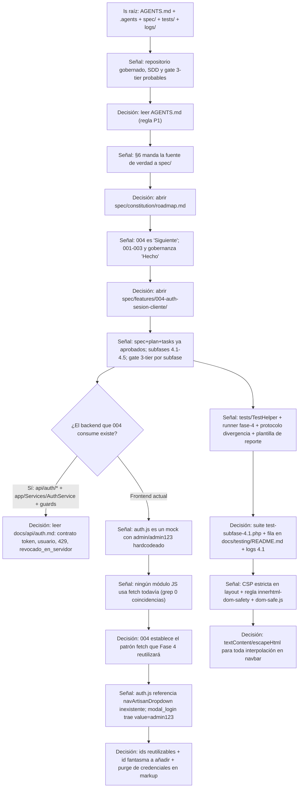

# Reporte de Auditoría de Flujo — Feature 004 · Autenticación Bearer, Logout Seguro y Navbar Reactivo

**Fecha:** 2026-09-14 · **Agente:** opencode (big-pickle) · **Estado del encargo:** documentación de flujo, sin implementar código.

---

## 1. Descubrimiento autónomo del proyecto

### 1.1 Narrativa del proceso (en primera persona)

**Paso 1 — Miré la raíz del repositorio antes que cualquier instrucción.** Hice `ls` de la raíz y lo que vi fue revelador: conviven `AGENTS.md`, `.agents/`, `spec/`, `tests/`, `docs/`, `api/`, `app/`, `src/`, `views/`, `database/`, `logs/`. Tres señales saltaron de inmediato: (a) existe un `AGENTS.md`, que en este tipo de repositorios es la regla operativa de primer nivel (P1); (b) existe `spec/`, lo que sugiere Spec-Driven Development con fuente de verdad canónica; (c) existe `logs/`, lo que sugiere un gate de testing con salida a log. **Decisión:** leer `AGENTS.md` completo — es la norma de cómo se trabaja aquí, y cualquier cosa que haga después debe ser compatible con ella.

**Paso 2 — `AGENTS.md` me dio el mapa normativo.** Confirmó: separación física por capas (`app/` backend PHP, `api/` controladores delgados, `src/` solo frontend, `views/` presentación, `tests/` suites CLI), una jerarquía de fuentes de verdad P1–P6 con `spec/` como fuente canónica, invariantes R-01…R-10, y —crítico— el **3-Tier Testing Gate** y el **mandato de HALT** al final de cada subfase. **Decisión:** antes de tocar nada, ir a donde el propio repositorio dice que está la fuente de verdad: `spec/`.

**Paso 3 — Leí el roadmap de la constitución (`spec/constitution/roadmap.md`).** Esto me dijo que 001 (BD), 002 (UI) y 003 (backend) están "Hecho", que hay una sección de gobernanza también en verde, y que **004 es el siguiente** y 005–008 están en backlog. **Decisión:** abrir `spec/features/004-auth-sesion-cliente/`. El número de carpeta confirma que el encargo coincide con una feature ya planificada.

**Paso 4 — Leí `spec.md`, `plan.md` y `tasks.md` de la 004.** Información decisiva: la feature **NO es backend**. Es cablear el frontend al backend de autenticación que ya existe y está "blindado" por gobernanza (Acción 2: `login_intentos` con lockout 5/cuenta + 20/IP → HTTP 429, revocación server-side del `jti` en `logout.php`, CSP estricto, rotación de secretos con claim `ver`). El `tasks.md` descompone 004 en subfases 4.1–4.5 con gate de testing 3‑tier **por subfase**, y la 4.1 es exactamente "Auth & Sesión de Cliente". También exige prerrequisitos de seguridad verificables en la suite (429, `revocado_en_servidor=true`, `me.php` → 401 tras logout, CSP presente). **Decisión:** el alcance real de mi trabajo es: módulo JS cliente + ajustes de vistas + nueva suite CLI 4.1 + logs + reporte + actualización de spec/tasks/roadmap. Y **debo detenerme** (HALT) al terminar 4.1.

**Paso 5 — Verifiqué que el backend que 004 consume existe de verdad.** Leí los tres controladores `api/auth/login.php`, `api/auth/logout.php` y `api/auth/me.php`: son delgados (<60 líneas), con `Response::handleCors()` arriba, restricción de método 405 y envelope estándar. Coinciden con el estándar de `AGENTS.md §4`. **Decisión:** leer `docs/api/auth.md` para el contrato exacto: el login devuelve `datos.token`, `datos.tipo_token`, `datos.expira_en` y `datos.usuario`; `me.php` devuelve el perfil denegando expuestos; `logout.php` responde `revocado_en_servidor`. Ese contrato fija lo que el cliente debe consumir sin inventar nada.

**Paso 6 — Inspeccioné el estado real del frontend.** El hallazgo más importante: `src/js/modules/auth.js` es un **mock simulado** — valida credenciales hardcodeadas (`admin`/`admin123`), escribe claves falsas `crochet_session_active` en localStorage y hace redirects de mentira. Además, un `grep` de `fetch(` y `/api/` sobre `src/js/` devolvió **cero coincidencias**: ningún módulo habla todavía con el backend. **Decisión:** 004/4.1 no es solo "implementar una feature"; es **establecer el patrón de integración `fetch` que toda la Fase 4 reutilizará** (4.2 catálogo, 4.3 creaciones, 4.4 pedidos, 4.5 usuarios). Eso eleva el estándar de calidad exigido a `auth.js`.

**Paso 7 — Leí las vistas que 004 debe volver reactivas.** `views/components/navbar.php` ya tiene los ids `#btnNavLogin`, `#navUserBadge`, `#navArtisanBadge` pero con texto fijo `@admin (Artesano / Creador)`. `views/components/modal_login.php` trae **credenciales prefijadas en los `value`** (`admin`/`admin123`). `views/components/panel_sidebar.php` tiene `@admin` fijo y un botón logout con clase `.btn-nav-logout`. Crucial: `auth.js` referencia `getElementById('navArtisanDropdown')`, **id que no existe en el navbar** → hay un hueco de marcado que 4.1 debe cerrar. **Decisión:** los ids que ya existen se reutilizan; el id fantasma se añade; los valores hardcodeados se eliminan (el prefijo `admin/admin123` en el `value` es además una fuga de credenciales de seed en el markup).

**Paso 8 — Localicé la infraestructura de validación que define cómo se aprueba aquí.** `tests/TestHelper.php` (aserciones tipadas + cliente curl contra `localhost:8000`), `tests/test-subfase-3.2.php` como precedente de suite de auth, `tests/test-fase-4-acumulado.php` que **descubre dinámicamente `test-subfase-4.*.php` y exige que cada suite tenga fila en `docs/testing/README.md`**, y `docs/testing/protocolo-divergencia-cli-http.md` para el triaje CLI/HTTP. **Decisión:** mi suite debe llamarse exactamente `tests/test-subfase-4.1.php`, acompañarse de la fila correspondiente en el índice del README, ejecutarse con la redirección a `logs/subfase-4.1-cli.log`, verificarse por curl en `logs/subfase-4.1-http.log` y cerrarse en `docs/testing/subfase-4.1-auth-sesion.md` siguiendo la plantilla del README.

**Paso 9 — Confirmé la condición de seguridad que legitima el diseño.** `views/layouts/main.php` emite la CSP estricta del plan (H-004), y `.agents/rules/innerhtml-dom-safety.md` + `src/js/modules/dom-safe.js` (`escapeHtml`) fijan la única vía para interpolar datos. **Decisión:** toda inserción de nombre de usuario/rol en el navbar irá por `textContent`/`createElement` o `escapeHtml`, nunca por `innerHTML` interpolado; cualquier violación invalida la decisión de gobernanza que aprobó `localStorage`.

### 1.2 Diagrama del proceso de descubrimiento



---

## 2. Skills y herramientas que lanzaría

El repositorio vende sus propias skills (`.agents/skills.json` + `skills-lock.json` en raíz, y `.agents/skills/*` físicas). Esa es la señal de que debo preferir las copias ancladas al proyecto. Activaría estas, en este orden:

| Skill | Momento | Señal en el repositorio que la dispara | Por qué es relevante al 004 |
| :--- | :--- | :--- | :--- |
| `spec-driven-development` (proyecto) | Antes de tocar cualquier código | `AGENTS.md §6`, `.agents/workflows/sdd-feature.md`, la existencia misma de `spec/features/004/*` | El ciclo es Spec→Plan→Tasks→Loop→Cierre. En 004 los dos primeros ya están aprobados; la skill me obliga a no saltarme la validación de `spec.md`/`plan.md` y a respetar los gates de "para y valida con el humano" (`sdd-feature.md` paso 1.3/2.3/3.3). |
| `clean-code-architect` (proyecto) | Durante la implementación y el refactor de `auth.js` y de la suite | `AGENTS.md §4` (Clean Architecture, SRP, cero SQL en servicios, controladores delgados), presencia de la skill en `.agents/skills/` | 004 escribe un módulo ES6 nuevo y una suite CLI; la skill fija nombres, responsabilidad única (auth.js no debe mezclarse con catálogo), y el refactor verificado después del verde. |
| `frontend-design` (proyecto) | Al tocar `navbar.php`, `modal_login.php`, `panel_sidebar.php` | `.agents/rules/ui-ux-design-system.md`, tokens "Algodón Nórdico" (`--craft-primary #8E5B74`, Fraunces/Outfit/Plus Jakarta), `plan.md` pide "spinner sutil" y mitigación de FOUC | La reactividad del navbar no debe romper el lenguaje visual (badges pespunteados, sello artesano) ni caer en plantillas Bootstrap por defecto. Guía el estado de carga/invitado/autenticado con intencionalidad. |
| `design-auditor` (`ui-ux-reviewer`) | En la etapa de verificación, sobre el feedback del modal y del navbar | La espec exige "feedback visual de error **accesible**"; el repo ya tiene auditorías a11y (`auditoria-context7-fase-2`, `qa-audit-report`) | Auditar contraste de los estados logueado/invitado, `aria-live`/`role=alert` en `#loginAlert` (mensajes 429 vs 401), foco tras cerrar el modal y `prefers-reduced-motion` sobre el spinner. |
| `micro-interaction` (global, opcional) | Solo si el "spinner sutil" del login requiere movimiento | `plan.md`: "deshabilita el botón durante la petición y muestra spinner sutil" | Estados de carga discretos y feedback no brusco; al ser menor en 4.1, lo trato como opcional y no bloqueante. |

**Qué NO lanzaría:** `brand-identity`, `logo-generator`, `glassmorphism`, `svg-animation`, `ascii-animation`, `lottie-animation`, `gsap-web`, `page-transition-animation`, `60fps-animation`. Señal: 004 no crea activos de marca ni mueve librerías de animación; el sistema de diseño ya existe y el cambio es funcional (conmutar estados del DOM), no visual nuevo.

---

## 3. Ruta de implementación que elegiría

### 3.1 Razonamiento de arquitectura

El principio rector: **no toco `app/`, `api/` ni `database/`** — el backend de auth ya está implementado y testeado (Fase 3 + gobernanza Acción 2) y el contrato está fijado en `docs/api/auth.md`. 004/4.1 es capa de presentación + estrategia de cliente + verificación. Cualquier defecto que observe en el backend lo **reporto**, no lo "arreglo" en silencio (regla de discrepancia P6).

**Crear (de nuevo):**

- **`src/js/modules/auth.js`** — reescritura completa del mock actual. Métodos orientados a la singularidad de responsabilidad: `getToken`, `getUser`, `isAuthenticated`, `setSession`, `clearSession` (claves `crochet_auth_token` / `crochet_auth_user`), `login(username, password)` → `POST /api/auth/login.php` con manejo diferenciado de **429** (bloqueo) frente a **401** (credenciales) y **422** (campos), `checkSession()` → `GET /api/auth/me.php` con limpieza silenciosa en 401/403, `logout()` → `POST /api/auth/logout.php` con cabecera `Authorization: Bearer`, descarte local best-effort y redirección defensiva, `updateNavbars(user)` que conmuta estado invitado/autenticado según `rol` (admin → además enlace "Usuarios"; artesano/accesos a Creaciones y Pedidos), y `attachLoginModalListeners()` que previene el submit clásico de `#loginForm`, desactiva el botón y muestra el spinner. **Todo nombre de usuario/rol se inserta con `textContent`/`escapeHtml` desde `dom-safe.js`** — sin `innerHTML` interpolado (regla H-004).
- **`tests/test-subfase-4.1.php`** — suite CLI nativa siguiendo el patrón de `tests/test-subfase-3.2.php` y `TestHelper`. Cubre los criterios de aceptación de `spec.md` y los prerrequisitos de seguridad de `tasks.md` (429 con envelope `{"codigo":429}`, `revocado_en_servidor=true`, `me.php` → 401 tras logout, CSP presente en página y API, pattern del módulo: sin `crochet_session_active`, con las claves nuevas y las tres rutas `/api/auth/*`).
- **`docs/testing/subfase-4.1-auth-sesion.md`** — reporte ejecutivo con la plantilla de `docs/testing/README.md`.
- **Logs efímeros** (no versionados): `logs/subfase-4.1-cli.log` y `logs/subfase-4.1-http.log`.

**Modificar (con razón):**

- **`views/components/navbar.php`** — añadir el `id="navArtisanDropdown"` que `auth.js` ya espera, envolver el sello autenticado para conmutación limpia, y **eliminar el texto fijo `@admin (Artesano / Creador)`** dejando contenedores que `updateNavbars()` llena por DOM (rol-dependiente).
- **`views/components/modal_login.php`** — **purga del `value="admin"` / `value="admin123"`** en los inputs (fuga de credenciales de seed en markup), mantener ids `#loginForm`/`#loginAlert`/`#loginUsername`/`#loginPassword`, añadir `aria-live` al alert y estados de carga/accesible para el feedback 429/401.
- **`views/components/panel_sidebar.php`** — sustituir `@admin` fijo por elementos con id (`#sidebarUsername`, `#sidebarRoleBadge`) que sincroniza `updateNavbars()`; el botón `.btn-nav-logout` ya está presente → lo captura el mismo handler del navbar.
- **`src/js/main.js`** — mantener `initAuth()` en `DOMContentLoaded` y añadir el guard de rutas privadas (best-effort): en `creaciones.php`, `pedidos.php`, `usuarios.php` sin sesión → redirigir a `index.php`. El frontend guard es **UX**, nunca la frontera de seguridad (la autoridad real es `AuthGuard`/`RoleGuard`, invariant R-04).
- **`docs/testing/README.md`** — añadir la fila 4.1 al índice. **Obligatorio**: el runner `test-fase-4-acumulado.php` verifica que cada suite descubierta tenga fila en el README y que cada fila tenga script físico; crearlos sin el otro = rojo.
- **`spec/features/004-auth-sesion-cliente/tasks.md`**, **`spec.md`**, **`spec/constitution/roadmap.md`** — marcar tareas de 4.1, verificar criterios de aceptación y avanzar el roadmap.
- **`src/css/`** — solo si la conmutación requiere estados que el sistema de diseño no cubre (p.ej. `.is-authenticated`); en primera instancia los estilos ya existen (`badge-artisan-seal`, `btn-craft-logout`, utilidades `d-none`/`d-flex` de Bootstrap).

**No toco:** `api/auth/*`, `app/**`, `database/seed.sql`, `setup.php`, `uploads/`, módulos `catalog.js`/`checkout.js`/`creaciones.js`/`orders.js`/`users.js` (son 4.2–4.5).

### 3.2 Riesgos y guardrails autodetectados

| Riesgo | Guardrail detectado | Resolución |
| :--- | :--- | :--- |
| Token Bearer en `localStorage` → superficie XSS | CSP estricta ya emitida por `views/layouts/main.php` (`script-src 'self'` + CDN, `connect-src 'self'`) + regla `innerhtml-dom-safety` | Persistir solo bajo esas condiciones; toda interpolación con `escapeHtml`; no añadir script-src nuevos sin pasar por el humano (invalida decisión ADR-016). |
| La prueba de lockout 429 contamina la cuenta de seed | `login_intentos` (5/cuenta, 20/IP, ventana 15 min) | Ordenar aserciones: flujo 200/401/422 antes del bloqueo; hacer el test de 429 con una cuenta desechable o al final y **regenerar la BD con `php setup.php`** (CLI-only) entre fases del gate (precedente: `tests/cuenta-aserciones.php` ya resetea a semilla). Documentar la decisión en el reporte. |
| Frontera de seguridad aparente en el frontend | Guard de rutas en `main.js` es solo navegación | No vender el guard como seguridad; la autorización real queda en `RoleGuard`/`AuthGuard` (R-04). |
| Logout con red caída | `logout.php` responde `revocado_en_servidor` | Best-effort según `plan.md`: descarte local incluso si el `fetch` falla; actualizar navbar y redirigir solo desde vistas privadas. |
| FOUC de autenticación al cargar | Sesión reactiva vs. HTML servido | Estado inicial prudente: contenedor autenticado oculto hasta que `checkSession()` confirme (o placeholder no invasivo), conforme al riesgo declarado en `plan.md`. |
| Credenciales del seed expuestas en markup | `value="admin"` / `value="admin123"` en `modal_login.php` | Cero prefijos en el HTML final; la contraseña del seed en `seed.sql` es un ítem de gobernanza → **reportar al humano, no cambiarla en 004** (fuera de alcance). |
| Envelope estándar roto | `{exito, datos/error}` + `paginacion` | `auth.js` lee `json.datos`, nunca claves inventadas; si falta un campo, parar y reportar, no parchear backend. |
| DoS de la propia cuenta de admin | 429 durante los curls de verificación | Nada de intentos anónimos a `admin` más allá de la prueba de bloqueo explícita; reseed antes de la regresión. |

### 3.3 Pipeline Red–Green–Refactor con cierre 3-tier

```mermaid
flowchart LR
    A["Plan: validar spec/plan/tasks 4.1"] --> B["Red: escribir tests/test-subfase-4.1.php contra el mock actual"]
    B --> C{"¿Falla la suite nueva?"}
    C -->|"Sí (comportamiento mock queda expuesto)"| D["Green: auth.js real + ids en navbar/modal/sidebar + purga de credenciales"]
    D --> E["Refactor: extraer helpers, SRP, dom-safe en toda interpolación"]
    E --> F["Regresión: test-fase-4-acumulado + 3.6.5 global + cuenta-aserciones (1,287)"]
    F --> G["Canal HTTP: php -S localhost:8000 + curl -> logs/subfase-4.1-http.log"]
    G --> H{"¿CLI == HTTP?"}
    H -->|"Sí (Escenario A)"| I["Reporte ejecutivo docs/testing/subfase-4.1-auth-sesion.md"]
    H -->|"Divergencia"| J["Triaje protocolo-divergencia-cli-http: entorno vs código"]
    J -->|"Defecto de entorno"| I
    J -->|"Defecto de código (C2/D)"| D
    I --> K["Check criterios spec.md + tareas tasks.md + fila roadmap"]
    K --> M["HALT: presentar reporte y esperar aprobación humana antes de 4.2"]
```



---

## 4. Verificación hasta completar

### 4.1 Métodos de validación autodescubiertos

- **Syntax (AGENTS.md §2):** `find app api views *.php -name "*.php" -exec php -l {} +` y `find src/js -name "*.js" -exec node --check {} +`. Es un repo PHP nativo sin Composer y JS ES Module sin build → estos dos son los linters reales.
- **Suite CLI (Tier 1):** `php tests/test-subfase-4.1.php > logs/subfase-4.1-cli.log 2>&1` → 100% en verde. Estilo heredado de `test-subfase-3.2.php`: secciones, `TestHelper::*`, `Response::setExitOnSend(false)` para llamadas en memoria.
- **Regresión acumulada (H-020):** `php tests/test-fase-4-acumulado.php > logs/fase-4-acumulado.log 2>&1` — el runner descubre `test-subfase-4.1.php` **automáticamente** y exige su fila en `docs/testing/README.md`. Además, la global de Fase 3 (`test-subfase-3.6.5.php`) y el contador canónico `php tests/cuenta-aserciones.php` (verdad regenerable, H-006) para confirmar que el total 1,287 no se ha alterado.
- **Canal HTTP (Tier 2):** levantar `php -S localhost:8000`, registrar en `logs/subfase-4.1-http.log` el flujo: login 200 (extraer token), `me.php` con Bearer 200, logout 200 (`revocado_en_servidor=true`) → `me.php` ahora 401, 5 fallos → 429 con envelope, cabeceras CSP en página y en respuestas JSON, preflight OPTIONS 204. Comparación final CLI vs HTTP; ante divergencia, aplicar el protocolo (`protocolo-divergencia-cli-http.md`): reproducir 2×, aislar variable, clasificar entorno/código, registrar con escenario B/C/D.
- **Cómo sé que es el método correcto para ESTE repo:** lo dicen tres fuentes que convergen — `AGENTS.md §3`, `.agents/rules/general.md` (gate 3-tier + H-020) y `docs/testing/README.md` (plantilla e índice). La suite esperada se llama exactamente `test-subfase-4.1.php` porque el runner la descubre por glob `test-subfase-4.*.php`. No hay otro marco: ni PHPUnit, ni Composer, ni runners JS.

### 4.2 Diagrama de estados de la subfase

```mermaid
stateDiagram-v2
    [*] --> Descubrimiento: todo lo de la sección 1, sin escribir código
    Descubrimiento --> ValidacionSpecPlan: fuentes P1-P4 localizadas
    state "Valida spec.md + plan.md (aprobación humana)" as ValidacionSpecPlan
    ValidacionSpecPlan --> Red: aprobado
    Red --> Green: suite 4.1 100% en verde
    Green --> Refactor: sin fallos y sin innerHTML interpolado
    Refactor --> Regresion: fase-4 acumulado + 3.6.5 + cuenta-aserciones 1,287
    Regresion --> CanalHTTP: regresión en verde
    CanalHTTP --> Reporte: CLI == HTTP (Escenario A)
    CanalHTTP --> Triaje: divergencia B/C/D
    Triaje --> Reporte: defecto de entorno documentado
    Triaje --> Green: defecto de código -> bloqueo, re-plan, HALT
    Reporte --> RevisionHumana: reporte + criterios + roadmap listos
    state "Aprobación explícita del humano (HALT)" as RevisionHumana
    RevisionHumana --> [*]: aprobada subfase 4.1
    RevisionHumana --> [*]: solicita ajustes (se reabre en estado previo)
    note right of RevisionHumana: No iniciar 4.2 sin orden explícita; nunca empaquetar subfases
    note right of ValidacionSpecPlan: Si el plan debe desviarse de lo aprobado: parar y re-validar con el humano
```

**Puntos donde esperaría aprobación del humano:** uno al inicio si el plan necesitara enmendarse (no es el caso: `spec.md`/`plan.md` ya están aprobados y el `tasks.md` está listo), y **obligatoriamente al cierre de 4.1** (Reporte → RevisionHumana), por el HALT del gate. En el camino, el protocolo de divergencia introduce paradas intermedias solo si se dispara un defecto de código.

---

## 5. Límites y paradas consideradas

- **Al terminar 4.1:** paro por completo y presento el reporte. No paso a 4.2 (catálogo) ni aunque "se parezca" — el gate de `.agents/rules/general.md` lo prohíbe de forma explícita y el `tasks.md` lo repite ("**HALT:** esperar aprobación explícita").
- **Antes de tocar backend:** `api/auth/*` y `app/**` están fuera del mapa de 004. Si durante las pruebas observo un defecto del contrato (envelope roto, 429 ausente, CSP faltante), **reporto el hallazgo** y espero decisión; no lo corrijo en silencio (regla de discrepancia P6: el código manda, pero la re-ancla la decide el humano).
- **Si la implementación choca con `plan.md`:** p.ej. si el navbar no admite la conmutación sin rediseñar ids, o si `localStorage` dejara de ser legítimo por un cambio de CSP — **paro** y consulto. Modificar spec/plan/tasks sin re-validación viola el ciclo SDD.
- **Si hiciera falta una nueva decisión de arquitectura** (p.ej. un ADR-017 sobre manejo de sesión en el cliente): **paro**; crear ADRs es decisión humana, solo un ADR nuevo supera a uno existente (P3).
- **Cifras no verificables:** no afirmo conteos de aserciones que no pueda regenerar (H-006). Si debo citar el total, ejecuto `tests/cuenta-aserciones.php` y reporto lo que produzca; nunca copio cifras a mano.
- **Ante divergencia CLI/HTTP:** aplico el protocolo; escenario C2 o D = **bloqueo** y HALT con reporte. Nunca silencio una divergencia para "no molestar".
- **Cuentas de seed y lockout:** no disparo el 429 contra `admin` de forma que contamine el resto del gate sin plan de reseed (`php setup.php`, CLI-only); si el estado irreversible persistiera, consulto antes de continuar.
- **Hallazgos de seguridad fuera de alcance:** las credenciales prefijadas en `modal_login.php` son del frontend de 4.1 y **sí** las corrijo; el hash de `admin123` en `database/seed.sql` es gobernanza de datos de seed → lo reporto y dejo que el humano decida (está fuera de 004).
- **Git:** no hago commits salvo orden explícita; si la hay, mensaje convencional (`feat(auth): ...` en español/inglés) y jamás incluyo `*.sqlite`, `logs/*.log`, `.DS_Store`.

---

**Veredicto del flujo:** el repositorio ya había tomado muchas decisiones por mí — backend listo, spec aprobada, gates definidos, patrón de suite fijado y runner que me descubre solos. Mi trabajo de auditoría consistió en leer esas señales en el orden correcto (regla → fuente de verdad → espec → backend/frontend → infra de testing → seguridad), identificar que **004/4.1 es además quien establece el patrón `fetch` de toda la Fase 4**, y encajar la implementación en la única forma que este repo aprueba: suite CLI propia + regresión acumulada + canal HTTP + reporte ejecutivo + **HALT**.

> Nota: como el encargo era documentar el flujo, no se ha modificado ningún archivo de producto del repositorio.