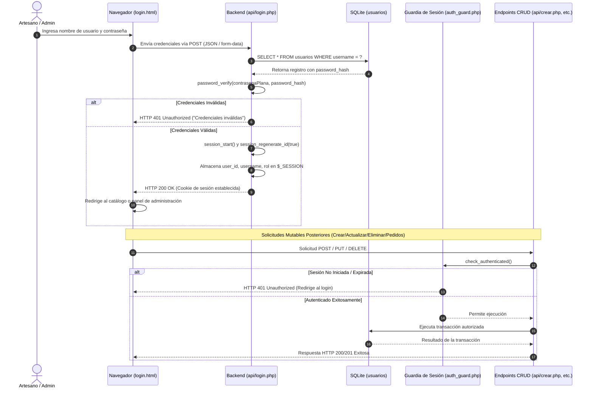

# Arquitectura de Autenticación y Seguridad de Sesiones

Este documento describe el ciclo de vida de autenticación de usuarios, la estrategia de cifrado de contraseñas y el control de acceso basado en sesiones de PHP para el sistema Micro-ERP.

---

## 1. Diagrama del Ciclo de Vida de Autenticación



---

## 2. Estrategia de Cifrado de Contraseñas
- **Algoritmo:** Función nativa de PHP `password_hash($password, PASSWORD_DEFAULT)`, que implementa hashing seguro bcrypt/Argon2 con salting criptográfico automatizado.
- **Verificación:** Comparación resistente a ataques de temporización mediante `password_verify($password, $stored_hash)`.
- **Semilla Inicial (Seeder):** En `setup.php`, se insertará el usuario administrador por defecto con un hash generado dinámicamente:
  ```php
  <?php
  $adminHash = password_hash('admin123', PASSWORD_DEFAULT);
  $stmt = $pdo->prepare("INSERT OR IGNORE INTO usuarios (username, password_hash, rol) VALUES (?, ?, 'admin')");
  $stmt->execute(['admin', $adminHash]);
  ```

---

## 3. Configuración de Seguridad de Sesiones
Todo script que valide sesiones debe inicializarlas aplicando directivas de seguridad para cookies:
```php
<?php
if (session_status() === PHP_SESSION_NONE) {
    session_set_cookie_params([
        'lifetime' => 86400, // 24 horas de vigencia
        'path' => '/',
        'domain' => '',
        'secure' => false,   // Cambiar a true al desplegar en HTTPS
        'httponly' => true,  // Previene robo de sesión mediante ataques XSS
        'samesite' => 'Lax'  // Protección contra solicitudes falsificadas (CSRF)
    ]);
    session_start();
}
```

---

## 4. Matriz de Endpoints Públicos vs. Protegidos

| Recurso / Endpoint | Nivel de Acceso | Requisito de Autenticación | Propósito |
| :--- | :--- | :--- | :--- |
| `index.html` (Vista de Catálogo) | **Público** | Ninguno | Permite a clientes y visitantes explorar creaciones. |
| `detalle.html` (Detalle de Pieza) | **Público** | Ninguno | Muestra especificaciones completas e inventario. |
| `api/leer.php` | **Público** | Ninguno | Retorna el catálogo o una pieza en formato JSON. |
| `api/login.php` | **Público** | Solo invitados | Valida credenciales e inicia la sesión del usuario. |
| `api/logout.php` | **Protegido** | Autenticado | Destruye la sesión activa y limpia las cookies. |
| `formulario.html` (Crear / Editar) | **Protegido** | Sesión requerida | Impide que visitantes no autorizados modifiquen el catálogo. |
| `api/crear.php` | **Protegido** | Sesión requerida (`admin` o `artesano`) | Registra un nuevo amigurumi. |
| `api/actualizar.php` | **Protegido** | Sesión requerida (`admin` o `artesano`) | Modifica datos, costos e inventario del catálogo. |
| `api/eliminar.php` | **Protegido** | Sesión requerida (`admin`) | Elimina una pieza (sujeto a la restricción de pedidos). |
| `pedidos.html` y `api/pedidos.php`| **Protegido** | Sesión requerida | Gestión integral de pedidos, cambios de estado y encargos. |
