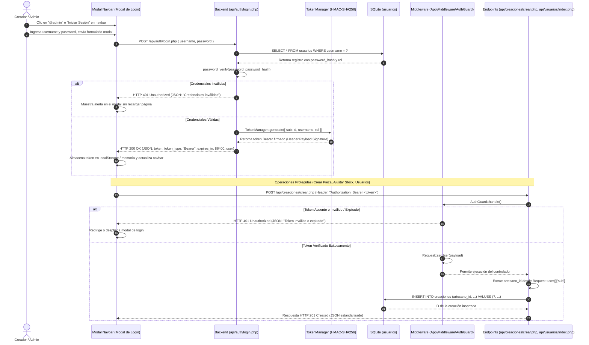

# Arquitectura de Autenticación y Seguridad de Sesiones

Este documento describe el ciclo de vida de autenticación de usuarios, la emisión de tokens Bearer criptográficos HMAC-SHA256, el control de acceso desacoplado mediante `App\Middleware\AuthGuard`, y la vinculación de autoría para la plataforma colaborativa Crochet Manager.

---

## 1. Diagrama del Ciclo de Vida de Autenticación Stateless (Bearer Token)



---

## 2. Estrategia de Cifrado y Seguridad de Contraseñas
- **Algoritmo:** Función nativa de PHP `password_hash($password, PASSWORD_DEFAULT)`, que implementa hashing seguro bcrypt/Argon2 con salting criptográfico automatizado.
- **Verificación:** Comparación resistente a ataques de temporización mediante `password_verify($password, $stored_hash)`.
- **Semilla Inicial (Seeder):** En `setup.php`, se inserta el usuario administrador por defecto con un hash generado dinámicamente:
  ```php
  <?php
  $adminHash = password_hash('admin123', PASSWORD_DEFAULT);
  $stmt = $pdo->prepare("INSERT OR IGNORE INTO usuarios (username, password_hash, rol) VALUES (?, ?, 'admin')");
  $stmt->execute(['admin', $adminHash]);
  ```

---

## 3. Emisión y Verificación de Tokens Bearer (`App\Core\TokenManager`)

La autenticación de la API opera de forma desacoplada y sin estado (stateless):

1. **Estructura Ligera del Token (`Header.Payload.Signature`):**
   - **Header:** `{"alg":"HS256","typ":"JWT"}` codificado en Base64URL.
   - **Payload:** Datos del usuario autenticado con vigencia de 24 horas (`iat` y `exp`).
     ```json
     {
       "sub": 1,
       "username": "admin",
       "rol": "admin",
       "iat": 1789178000,
       "exp": 1789264400
     }
     ```
   - **Firma:** `hash_hmac('sha256', "$header.$payload", Config::get('auth.jwt_secret'))`.
2. **Validación Inmune a Ataques de Temporización:**
   - La verificación compara la firma calculada contra la firma enviada utilizando `hash_equals()`.
   - Se comprueba estrictamente que `payload.exp > time()`.
3. **Paso de Cabecera en Apache / FastCGI:**
   - Configurado en `.htaccess` para evitar que servidores HTTP descarten la cabecera:
     ```apache
     RewriteCond %{HTTP:Authorization} .
     RewriteRule .* - [E=HTTP_AUTHORIZATION:%{HTTP:Authorization}]
     ```

### Regla de Atribución de Identidad:
- Al registrar una creación mediante `POST /api/creaciones/crear.php`, el backend extrae obligatoriamente el `artesano_id` desde el token validado (`Request::user()['sub']`).
- El cliente **no puede manipular** el `artesano_id` en el cuerpo de la solicitud JSON; cualquier valor enviado es ignorado para salvaguardar la autoría del creador.

---

## 4. Matriz de Endpoints Públicos vs. Protegidos

| Recurso / Endpoint | Método | Nivel de Acceso | Requisito de Autenticación | Propósito |
| :--- | :---: | :--- | :--- | :--- |
| `index.php` (Catálogo) | `GET` | **Público** | Ninguno | Explorar creaciones de creadores independientes y filtrar. |
| `detalle.php` (Ficha Técnica) | `GET` | **Público** | Ninguno | Muestra especificaciones, autoría, stock y modal de pedido. |
| `api/creaciones/index.php` | `GET` | **Público** | Ninguno | Retorna catálogo paginado (12 ítems por defecto) y filtros. |
| `api/creaciones/detalle.php` | `GET` | **Público** | Ninguno | Ficha técnica pública detallada por ID con formato dual. |
| `api/pedidos/solicitar.php` | `POST` | **Público** | Ninguno | Checkout transaccional de clientes con reserva atómica de stock. |
| `api/auth/login.php` | `POST` | **Público** | Invitados | Valida credenciales y emite el Bearer Token con 24h TTL. |
| `api/auth/logout.php` | `POST` | **Protegido** | Bearer Token | Invalida el estado de autenticación en cliente/servidor. |
| `api/auth/me.php` | `GET` | **Protegido** | Bearer Token | Retorna el perfil y rol del usuario autenticado en sesión. |
| `creaciones.php` (Inventario) | `GET` | **Protegido** | Bearer / Sesión | Panel de gestión de piezas, stock y toggle de encargos. |
| `formulario.php` (Crear / Editar) | `GET` | **Protegido** | Bearer / Sesión | Formulario con upload de imágenes y simulador de margen. |
| `api/creaciones/crear.php` | `POST` | **Protegido** | `AuthGuard` (`admin`, `artesano`) | Registra pieza, procesa foto o fallback SVG temático. |
| `api/creaciones/actualizar.php` | `POST` | **Protegido** | `AuthGuard` (`admin` o autor) | Modifica catálogo, costos y elimina foto anterior con `unlink()`. |
| `api/creaciones/eliminar.php` | `POST` | **Protegido** | `AuthGuard` (`admin` o autor) | Borrado de pieza (protegido por `ON DELETE RESTRICT`). |
| `api/creaciones/ajustar-stock.php` | `POST` | **Protegido** | `AuthGuard` (`admin`, `artesano`) | Incremento/decremento rápido in-situ (`+1` / `-1`). |
| `api/creaciones/toggle-encargo.php` | `POST` | **Protegido** | `AuthGuard` (`admin`, `artesano`) | Alternar modalidad de confección bajo encargo. |
| `pedidos.php` (Control Pedidos) | `GET` | **Protegido** | Bearer / Sesión | Dashboard de pedidos con cards 3x/2x y WhatsApp. |
| `api/pedidos/index.php` | `GET` | **Protegido** | `AuthGuard` (`admin`, `artesano`) | Listado paginado (20 ítems por defecto) con filtros. |
| `api/pedidos/crear.php` | `POST` | **Protegido** | `AuthGuard` (`admin`, `artesano`) | Registro de encargo manual acordado con el cliente. |
| `api/pedidos/cambiar-estado.php` | `POST` | **Protegido** | `AuthGuard` (`admin`, `artesano`) | Actualización de estado de producción o pago. |
| `api/pedidos/cancelar.php` | `POST` | **Protegido** | `AuthGuard` (`admin`, `artesano`) | Cancelación con restitución física de inventario. |
| `usuarios.php` (Comunidad) | `GET` | **Protegido** | Exclusivo rol `admin` | Directorio de creadores, colaboradores y roles RBAC. |
| `api/usuarios/index.php` | `GET` | **Protegido** | `AuthGuard` + `RoleGuard: admin` | Directorio con métricas y conteo de creaciones. |
| `api/usuarios/crear.php` | `POST` | **Protegido** | `AuthGuard` + `RoleGuard: admin` | Alta de nuevo creador o asistente. |
| `api/usuarios/cambiar-rol.php` | `POST` | **Protegido** | `AuthGuard` + `RoleGuard: admin` | Modificación de rol con salvaguarda de cuenta raíz ID #1. |

---

## 5. Salvaguarda de Acceso y No Democión del Administrador Titular

Para evitar condiciones de pérdida de gobierno del sistema (*admin lockout*):
- **Regla Inviolable:** La cuenta principal con `id = 1` (`@admin`) bajo ninguna circunstancia puede ser degradada a rol `artesano` o `asistente`, ni eliminada del sistema.
- **Validación en Cliente y Servidor:** Tanto el modal interactivo de edición de roles (`modal_editar_rol_usuario.php` y `users.js`) como el servicio `UsuarioService.php` interceptan cualquier intento de modificar el rol del ID #1, rechazando la operación con error HTTP 403 y una alerta de salvaguarda de seguridad.

