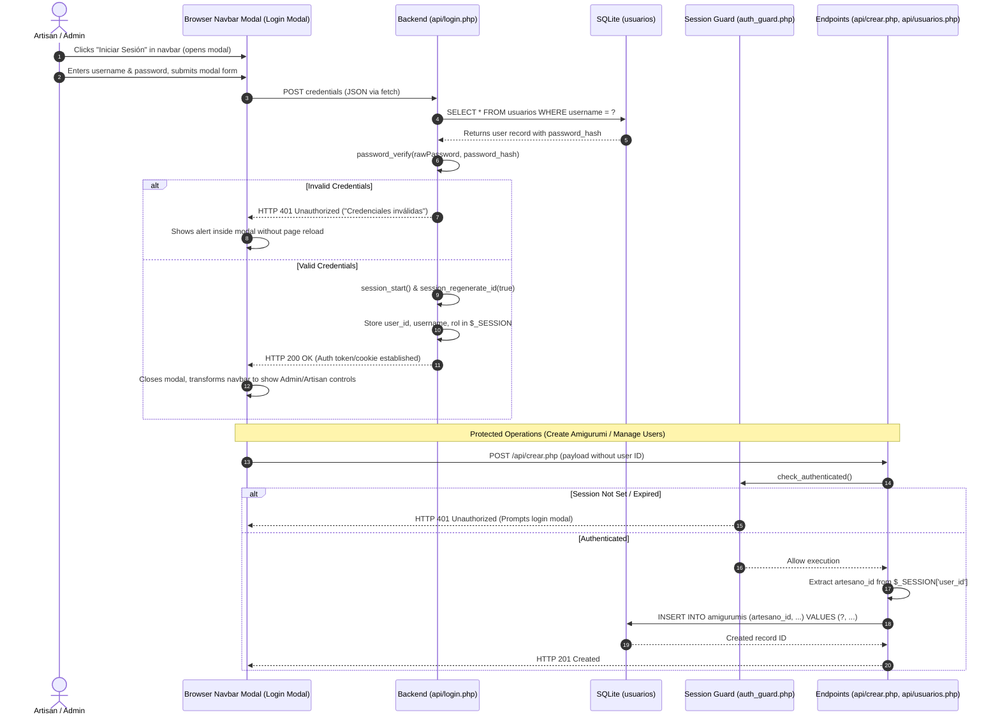

# Authentication & Session Security Architecture

This document details the user authentication lifecycle, password hashing strategy, session access control, and identity attribution for the Micro-ERP system.

---

## 1. Authentication Lifecycle Diagram



---

## 2. Password Hashing Strategy
- **Algorithm:** Native PHP `password_hash($password, PASSWORD_DEFAULT)` utilizing strong bcrypt/Argon2 hashing with random automated salting.
- **Verification:** Secure timing-attack resistant `password_verify($password, $stored_hash)`.
- **Default Seeding:** In `setup.php`, default administrative credentials will be automatically generated with a secure hash:
  ```php
  <?php
  $adminHash = password_hash('admin123', PASSWORD_DEFAULT);
  $stmt = $pdo->prepare("INSERT OR IGNORE INTO usuarios (username, password_hash, rol) VALUES (?, ?, 'admin')");
  $stmt->execute(['admin', $adminHash]);
  ```

---

## 3. Session Security & Identity Binding
Every script requiring session verification must initialize sessions with strict security flags:
```php
<?php
if (session_status() === PHP_SESSION_NONE) {
    session_set_cookie_params([
        'lifetime' => 86400, // 24 hours
        'path' => '/',
        'domain' => '',
        'secure' => false,   // Set to true in HTTPS production
        'httponly' => true,  // Protect against XSS session theft
        'samesite' => 'Lax'  // CSRF protection
    ]);
    session_start();
}
```

### Identity Attribution Rule:
- When a user creates a new creation via `POST /api/crear.php`, the backend reads `$_SESSION['user_id']` and directly sets `artesano_id`.
- The client cannot supply `artesano_id` in the request body; any client-provided ID is discarded to prevent privilege escalation.

---

## 4. Protected vs. Public Endpoints Matrix

| Resource / Endpoint | Access Tier | Authentication Requirement | Purpose |
| :--- | :--- | :--- | :--- |
| `index.php` (Catalog View) | **Public** | None | Allows potential customers to browse and filter amigurumi creations. |
| `detalle.php` (Item Details) | **Public** | None | Displays detailed specifications, availability, and public checkout trigger. |
| `api/solicitar_pedido.php` | **Public** | None | Public client checkout; deducts stock and locks price atomically. |
| `api/leer.php` | **Public** | None | Returns JSON catalog list or single item with artisan attribution. |
| `api/login.php` | **Public** | Guest only (Navbar Modal) | Authenticates credentials and starts user session. |
| `api/logout.php` | **Protected** | Authenticated | Destroys current session and clears cookies. |
| `formulario.php` (Add / Edit) | **Protected** | Session required | Creation and editing interface with image uploads. |
| `api/crear.php` | **Protected** | Session required (`admin` or `artesano`) | Inserts new amigurumi, saves image to `/uploads`, binds `artesano_id`. |
| `api/actualizar.php` | **Protected** | Session required (`admin` or creator) | Modifies catalog details, costs, stock, and local image file. |
| `api/eliminar.php` | **Protected** | Session required (`admin`) | Deletes an amigurumi (subject to SQLite `ON DELETE RESTRICT`). |
| `usuarios.php` & `api/usuarios.php` | **Protected** | Session required (`admin` strictly) | Full User Management CRUD (view, create, role edit, delete artisans). |
| `pedidos.php` & `api/pedidos.php` | **Protected** | Session required (`admin`, `artesano`) | Full order dashboard, manual commissions, filters, and delivery log. |
| `api/actualizar_pedido.php` | **Protected** | Session required (`admin`, `artesano`) | Updates order state; restocks units if marked `'Cancelado'`. |

---

## 5. Root Administrator Lockout Prevention Safeguard

To guarantee system governance and prevent accidental administrative lockout:
- **Inviolable Rule:** The primary administrator account with `id = 1` (`@admin`) can under no circumstances be demoted to `artesano` or `asistente`, nor deleted from the system.
- **Client and Server Enforcement:** Both the interactive role-editing modal (`modal_editar_rol_usuario.php` and `users.js`) and backend controllers reject role modifications targeting user ID #1, presenting an informative security safeguard alert.

