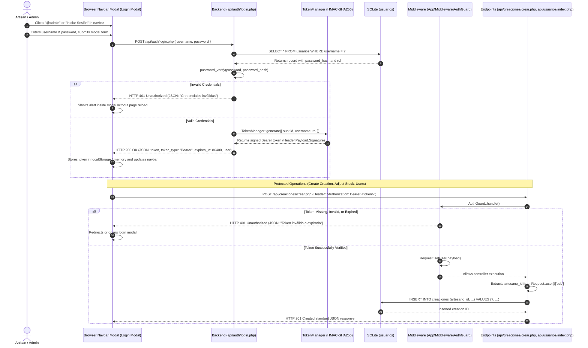

# Authentication & Session Security Architecture

This document details the user authentication lifecycle, cryptographic HMAC-SHA256 Bearer Token issuance, decoupled access control via `App\Middleware\AuthGuard`, and artisan identity attribution for the collaborative Crochet Manager platform.

---

## 1. Stateless Authentication Lifecycle Diagram (Bearer Token)



---

## 2. Password Hashing Strategy
- **Algorithm:** Native PHP `password_hash($password, PASSWORD_DEFAULT)` utilizing strong bcrypt/Argon2 hashing with random automated salting.
- **Verification:** Secure timing-attack resistant `password_verify($password, $stored_hash)`.
- **Default Seeding:** In `setup.php`, default administrative credentials will be automatically generated with a secure hash:
  ```php
  <?php
  $adminHash = password_hash('admin123', PASSWORD_DEFAULT);
  $stmt = $pdo->prepare("INSERT OR IGNORE INTO usuarios (username, password_hash, rol) VALUES (?, ?, 'admin')");
  $stmt->execute(['admin', $adminHash]);
  ```

---

## 3. Bearer Token Issuance & Verification (`App\Core\TokenManager`)

API authentication operates completely decoupled and stateless:

1. **Lightweight Token Structure (`Header.Payload.Signature`):**
   - **Header:** `{"alg":"HS256","typ":"JWT"}` encoded in Base64URL.
   - **Payload:** Authenticated user claims with 24-hour expiration (`iat` and `exp`):
     ```json
     {
       "sub": 1,
       "username": "admin",
       "rol": "admin",
       "iat": 1789178000,
       "exp": 1789264400
     }
     ```
   - **Signature:** `hash_hmac('sha256', "$header.$payload", Config::get('auth.jwt_secret'))`.
2. **Timing-Attack Resistant Validation:**
   - Verification compares the computed signature against the provided signature using `hash_equals()`.
   - Strictly enforces that `payload.exp > time()`.
3. **Apache / FastCGI Header Forwarding:**
   - Explicitly configured in root `.htaccess` to prevent HTTP servers from dropping the header:
     ```apache
     RewriteCond %{HTTP:Authorization} .
     RewriteRule .* - [E=HTTP_AUTHORIZATION:%{HTTP:Authorization}]
     ```

### Identity Attribution Rule:
- When creating a creation via `POST /api/creaciones/crear.php`, the backend strictly extracts `artesano_id` from the verified token (`Request::user()['sub']`).
- The client **cannot tamper with** `artesano_id` in the request body; any client-supplied ID is ignored to protect creator attribution.

---

## 4. Protected vs. Public Endpoints Matrix

| Resource / Endpoint | Method | Access Tier | Authentication Requirement | Purpose |
| :--- | :---: | :--- | :--- | :--- |
| `index.php` (Catalog) | `GET` | **Public** | None | Browse independent creator pieces and filter catalog. |
| `detalle.php` (Technical Sheet) | `GET` | **Public** | None | Displays detailed specifications, artisan attribution, stock, and order modal. |
| `api/creaciones/index.php` | `GET` | **Public** | None | Returns paginated catalog (default 12 items) and filters. |
| `api/creaciones/detalle.php` | `GET` | **Public** | None | Detailed technical sheet by ID with dual currency formatting. |
| `api/pedidos/solicitar.php` | `POST` | **Public** | None | Public customer checkout with atomic stock reservation. |
| `api/auth/login.php` | `POST` | **Public** | Guests | Authenticates credentials and issues Bearer Token with 24h TTL. |
| `api/auth/logout.php` | `POST` | **Protected** | Bearer Token | Invalidates client/server session state. |
| `api/auth/me.php` | `GET` | **Protected** | Bearer Token | Returns profile and role of the currently authenticated user. |
| `creaciones.php` (Inventory) | `GET` | **Protected** | Bearer / Session | Workshop management panel for pieces, stock, and on-demand toggles. |
| `formulario.php` (Create / Edit) | `GET` | **Protected** | Bearer / Session | Form with image upload and profit margin simulator. |
| `api/creaciones/crear.php` | `POST` | **Protected** | `AuthGuard` (`admin`, `artesano`) | Registers creation, processes photo or assigns thematic SVG fallback. |
| `api/creaciones/actualizar.php` | `POST` | **Protected** | `AuthGuard` (`admin` or author) | Updates catalog details, costs, and removes previous photo via `unlink()`. |
| `api/creaciones/eliminar.php` | `POST` | **Protected** | `AuthGuard` (`admin` or author) | Deletes creation (protected by SQLite `ON DELETE RESTRICT`). |
| `api/creaciones/ajustar-stock.php` | `POST` | **Protected** | `AuthGuard` (`admin`, `artesano`) | In-situ quick stock increment/decrement (`+1` / `-1`). |
| `api/creaciones/toggle-encargo.php` | `POST` | **Protected** | `AuthGuard` (`admin`, `artesano`) | Toggles on-demand commission status. |
| `pedidos.php` (Order Tracking) | `GET` | **Protected** | Bearer / Session | Orders dashboard with responsive 3x/2x cards and WhatsApp contact. |
| `api/pedidos/index.php` | `GET` | **Protected** | `AuthGuard` (`admin`, `artesano`) | Paginated orders list (default 20 items) with filters. |
| `api/pedidos/crear.php` | `POST` | **Protected** | `AuthGuard` (`admin`, `artesano`) | Manual commission order agreed upon directly with client. |
| `api/pedidos/cambiar-estado.php` | `POST` | **Protected** | `AuthGuard` (`admin`, `artesano`) | Production or payment status update. |
| `api/pedidos/cancelar.php` | `POST` | **Protected** | `AuthGuard` (`admin`, `artesano`) | Order cancellation with physical inventory restitution. |
| `usuarios.php` (Community) | `GET` | **Protected** | Strict `admin` role | Registered creator and team directory with RBAC roles. |
| `api/usuarios/index.php` | `GET` | **Protected** | `AuthGuard` + `RoleGuard: admin` | User directory with metrics and associated creations count. |
| `api/usuarios/crear.php` | `POST` | **Protected** | `AuthGuard` + `RoleGuard: admin` | Registers a new creator or platform assistant. |
| `api/usuarios/cambiar-rol.php` | `POST` | **Protected** | `AuthGuard` + `RoleGuard: admin` | Role modification with root admin ID #1 safeguard. |

---

## 5. Root Administrator Lockout Prevention Safeguard

To guarantee platform governance and prevent administrative lockout:
- **Inviolable Rule:** The primary administrator account with `id = 1` (`@admin`) can under no circumstances be demoted to `artesano` or `asistente`, nor deleted from the system.
- **Client and Server Enforcement:** Both the interactive role-editing modal (`modal_editar_rol_usuario.php` and `users.js`) and backend service (`UsuarioService.php`) reject role modifications targeting user ID #1, presenting an informative security safeguard alert and HTTP 403 status.
