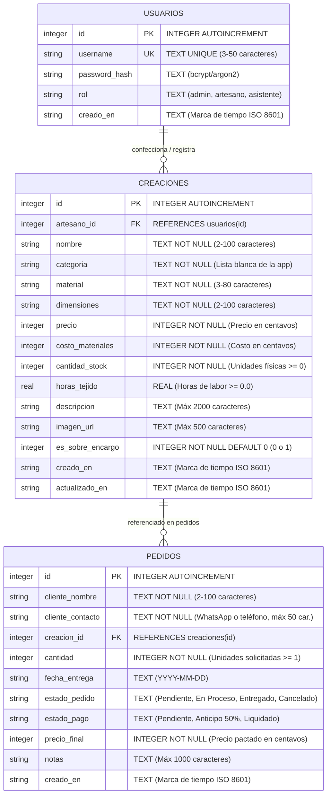

# Micro-ERP de Creaciones en Crochet: Índice Maestro de Datos y Arquitectura

Este directorio contiene la documentación modular de la arquitectura del sistema Micro-ERP para Catálogo, Inventario y Gestión de Pedidos de Creaciones en Crochet Artesanal.

---

## 1. Índice de Documentación Modular

- **[database-schema.es.md](file:///Users/angelzaragoza/Desktop/proyecto-web/docs/database-schema.es.md):** Esquema relacional completo de 3 tablas (`usuarios`, `creaciones`, `pedidos`), DDL detallado con claves foráneas, diccionarios de datos, índices y reglas de integridad referencial. (Versión en inglés: [database-schema.md](file:///Users/angelzaragoza/Desktop/proyecto-web/docs/database-schema.md))
- **[auth-flow.es.md](file:///Users/angelzaragoza/Desktop/proyecto-web/docs/auth-flow.es.md):** Ciclo de vida de autenticación, hashing de contraseñas con PHP nativo `password_hash()`, control de sesiones y matriz de protección de endpoints. (Versión en inglés: [auth-flow.md](file:///Users/angelzaragoza/Desktop/proyecto-web/docs/auth-flow.md))
- **[api-design.es.md](file:///Users/angelzaragoza/Desktop/proyecto-web/docs/api-design.es.md):** Contratos de endpoints REST, formato estándar de respuestas JSON, gestión de errores y operaciones CRUD para catálogo y pedidos. (Versión en inglés: [api-design.md](file:///Users/angelzaragoza/Desktop/proyecto-web/docs/api-design.md))
- **[database-testing.es.md](file:///Users/angelzaragoza/Desktop/proyecto-web/docs/database-testing.es.md):** Guía de verificación CLI y consultas reproducibles en terminal con `sqlite3` para validar claves foráneas, cálculo de precios y límites de inventario. (Versión en inglés: [database-testing.md](file:///Users/angelzaragoza/Desktop/proyecto-web/docs/database-testing.md))

---

## 2. Diagrama Entidad-Relación Central (ERD)



---

## 3. Especificación DDL de SQLite

```sql
PRAGMA foreign_keys = ON;

-- 1. Tabla: usuarios (Autenticación y Roles)
CREATE TABLE IF NOT EXISTS usuarios (
    id INTEGER PRIMARY KEY AUTOINCREMENT,
    username TEXT UNIQUE NOT NULL CHECK(length(trim(username)) >= 3 AND length(username) <= 50),
    password_hash TEXT NOT NULL,
    rol TEXT NOT NULL DEFAULT 'admin' CHECK(rol IN ('admin', 'artesano', 'asistente')),
    creado_en TEXT NOT NULL DEFAULT (datetime('now', 'localtime'))
);

-- 2. Tabla: creaciones (Catálogo e Inventario de Productos)
CREATE TABLE IF NOT EXISTS creaciones (
    id INTEGER PRIMARY KEY AUTOINCREMENT,
    artesano_id INTEGER NOT NULL,
    nombre TEXT NOT NULL CHECK(length(trim(nombre)) >= 2 AND length(nombre) <= 100),
    categoria TEXT NOT NULL CHECK(length(trim(categoria)) >= 2 AND length(categoria) <= 50),
    material TEXT NOT NULL CHECK(length(trim(material)) >= 3 AND length(material) <= 80),
    dimensiones TEXT NOT NULL CHECK(length(trim(dimensiones)) >= 2 AND length(dimensiones) <= 100),
    precio INTEGER NOT NULL CHECK(precio >= 1 AND precio <= 9999999),
    costo_materiales INTEGER NOT NULL DEFAULT 0 CHECK(costo_materiales >= 0 AND costo_materiales <= 9999999),
    cantidad_stock INTEGER NOT NULL DEFAULT 0 CHECK(cantidad_stock >= 0 AND cantidad_stock <= 10000),
    horas_tejido REAL DEFAULT 0.0 CHECK(horas_tejido IS NULL OR (horas_tejido >= 0.0 AND horas_tejido <= 500.0)),
    descripcion TEXT CHECK(descripcion IS NULL OR length(descripcion) <= 2000),
    imagen_url TEXT CHECK(imagen_url IS NULL OR length(trim(imagen_url)) <= 500),
    es_sobre_encargo INTEGER NOT NULL DEFAULT 0 CHECK(es_sobre_encargo IN (0, 1)),
    creado_en TEXT NOT NULL DEFAULT (datetime('now', 'localtime')),
    actualizado_en TEXT DEFAULT NULL,
    FOREIGN KEY (artesano_id) REFERENCES usuarios(id) ON DELETE RESTRICT ON UPDATE CASCADE
);

-- 3. Tabla: pedidos (Encargos y Ventas Personalizadas)
CREATE TABLE IF NOT EXISTS pedidos (
    id INTEGER PRIMARY KEY AUTOINCREMENT,
    cliente_nombre TEXT NOT NULL CHECK(length(trim(cliente_nombre)) >= 2 AND length(cliente_nombre) <= 100),
    cliente_contacto TEXT NOT NULL DEFAULT '' CHECK(length(trim(cliente_contacto)) <= 50),
    creacion_id INTEGER NOT NULL,
    cantidad INTEGER NOT NULL DEFAULT 1 CHECK(cantidad >= 1 AND cantidad <= 1000),
    fecha_entrega TEXT CHECK(fecha_entrega IS NULL OR length(trim(fecha_entrega)) = 10),
    estado_pedido TEXT NOT NULL DEFAULT 'Pendiente' CHECK(estado_pedido IN (
        'Pendiente', 
        'En Proceso', 
        'Entregado', 
        'Cancelado'
    )),
    estado_pago TEXT NOT NULL DEFAULT 'Pendiente' CHECK(estado_pago IN (
        'Pendiente',
        'Anticipo 50%',
        'Liquidado'
    )),
    precio_final INTEGER NOT NULL CHECK(precio_final >= 1 AND precio_final <= 9999999),
    notas TEXT CHECK(notas IS NULL OR length(notas) <= 1000),
    creado_en TEXT NOT NULL DEFAULT (datetime('now', 'localtime')),
    FOREIGN KEY (creacion_id) REFERENCES creaciones(id) ON DELETE RESTRICT ON UPDATE CASCADE
);

-- Índices para Optimización de Consultas
CREATE INDEX IF NOT EXISTS idx_usuarios_username ON usuarios(username);
CREATE INDEX IF NOT EXISTS idx_creaciones_artesano ON creaciones(artesano_id);
CREATE INDEX IF NOT EXISTS idx_creaciones_categoria ON creaciones(categoria);
CREATE INDEX IF NOT EXISTS idx_creaciones_stock ON creaciones(cantidad_stock);
CREATE INDEX IF NOT EXISTS idx_pedidos_creacion ON pedidos(creacion_id);
CREATE INDEX IF NOT EXISTS idx_pedidos_estado ON pedidos(estado_pedido);
```

---

## 4. Estructura Física del Proyecto (Clean Architecture)

```
proyecto-web/
├── views/                          # Plantillas y componentes modulares PHP
│   ├── layouts/main.php            # Layout maestro (<head>, nav, modals, footer)
│   ├── components/                 # Modales, navbar, tarjetas y footer
│   └── pages/                      # Vistas de contenido (catálogo, detalle, formulario, pedidos, usuarios, creaciones)
├── src/                            # Código fuente modular protegido
│   ├── css/                        # Estilos modulares ITCSS (01-settings a 04-components)
│   ├── js/                         # JavaScript nativo en ES Modules (main.js y modules/)
│   └── Utils/                      # Utilidades compartidas (CurrencyHelper.php, SvgHelper.php)
├── api/                            # Controladores JSON livianos (Fase 3/4)
├── database/                       # Base de datos SQLite y seed.sql
├── uploads/                        # Archivos de imágenes reales
└── docs/                           # Documentación técnica centralizada
```

