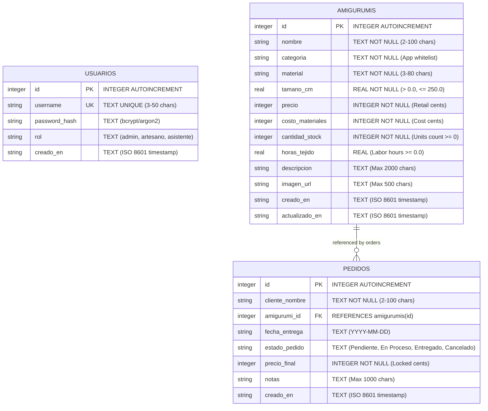

# Amigurumi Micro-ERP: Master Data & Architecture Index

This directory contains the modular architectural documentation for the Handmade Amigurumi Micro-ERP and Inventory Management System.

---

## 1. Modular Documentation Index

- **[database-schema.md](file:///Users/angelzaragoza/Desktop/proyecto-web/.docs/database-schema.md):** Complete 3-table relational schema (`usuarios`, `amigurumis`, `pedidos`), full DDL with foreign keys, data dictionaries, indexes, and referential integrity constraints.
- **[auth-flow.md](file:///Users/angelzaragoza/Desktop/proyecto-web/.docs/auth-flow.md):** Authentication lifecycle, password hashing via native PHP `password_hash()`, PHP session guards, and role-based endpoint protection matrix.
- **[api-design.md](file:///Users/angelzaragoza/Desktop/proyecto-web/.docs/api-design.md):** REST-like endpoint contracts, standard JSON payload format, error handling rules, and CRUD specifications.

---

## 2. Core Relational ERD



---

## 3. SQLite DDL Summary

```sql
PRAGMA foreign_keys = ON;

-- 1. Table: usuarios
CREATE TABLE IF NOT EXISTS usuarios (
    id INTEGER PRIMARY KEY AUTOINCREMENT,
    username TEXT UNIQUE NOT NULL CHECK(length(trim(username)) >= 3 AND length(username) <= 50),
    password_hash TEXT NOT NULL,
    rol TEXT NOT NULL DEFAULT 'admin' CHECK(rol IN ('admin', 'artesano', 'asistente')),
    creado_en TEXT NOT NULL DEFAULT (datetime('now', 'localtime'))
);

-- 2. Table: amigurumis
CREATE TABLE IF NOT EXISTS amigurumis (
    id INTEGER PRIMARY KEY AUTOINCREMENT,
    nombre TEXT NOT NULL CHECK(length(trim(nombre)) >= 2 AND length(nombre) <= 100),
    categoria TEXT NOT NULL CHECK(length(trim(categoria)) >= 2 AND length(categoria) <= 50),
    material TEXT NOT NULL CHECK(length(trim(material)) >= 3 AND length(material) <= 80),
    tamano_cm REAL NOT NULL CHECK(tamano_cm > 0.0 AND tamano_cm <= 250.0),
    precio INTEGER NOT NULL CHECK(precio >= 1 AND precio <= 9999999),
    costo_materiales INTEGER NOT NULL DEFAULT 0 CHECK(costo_materiales >= 0 AND costo_materiales <= 9999999),
    cantidad_stock INTEGER NOT NULL DEFAULT 0 CHECK(cantidad_stock >= 0 AND cantidad_stock <= 10000),
    horas_tejido REAL DEFAULT 0.0 CHECK(horas_tejido IS NULL OR (horas_tejido >= 0.0 AND horas_tejido <= 500.0)),
    descripcion TEXT CHECK(descripcion IS NULL OR length(descripcion) <= 2000),
    imagen_url TEXT CHECK(imagen_url IS NULL OR length(trim(imagen_url)) <= 500),
    creado_en TEXT NOT NULL DEFAULT (datetime('now', 'localtime')),
    actualizado_en TEXT DEFAULT NULL
);

-- 3. Table: pedidos
CREATE TABLE IF NOT EXISTS pedidos (
    id INTEGER PRIMARY KEY AUTOINCREMENT,
    cliente_nombre TEXT NOT NULL CHECK(length(trim(cliente_nombre)) >= 2 AND length(cliente_nombre) <= 100),
    amigurumi_id INTEGER NOT NULL,
    fecha_entrega TEXT CHECK(fecha_entrega IS NULL OR length(trim(fecha_entrega)) = 10),
    estado_pedido TEXT NOT NULL DEFAULT 'Pendiente' CHECK(estado_pedido IN (
        'Pendiente', 
        'En Proceso', 
        'Entregado', 
        'Cancelado'
    )),
    precio_final INTEGER NOT NULL CHECK(precio_final >= 1 AND precio_final <= 9999999),
    notas TEXT CHECK(notas IS NULL OR length(notas) <= 1000),
    creado_en TEXT NOT NULL DEFAULT (datetime('now', 'localtime')),
    FOREIGN KEY (amigurumi_id) REFERENCES amigurumis(id) ON DELETE RESTRICT ON UPDATE CASCADE
);

-- Indexes
CREATE INDEX IF NOT EXISTS idx_usuarios_username ON usuarios(username);
CREATE INDEX IF NOT EXISTS idx_amigurumis_categoria ON amigurumis(categoria);
CREATE INDEX IF NOT EXISTS idx_amigurumis_stock ON amigurumis(cantidad_stock);
CREATE INDEX IF NOT EXISTS idx_pedidos_amigurumi ON pedidos(amigurumi_id);
CREATE INDEX IF NOT EXISTS idx_pedidos_estado ON pedidos(estado_pedido);
```
