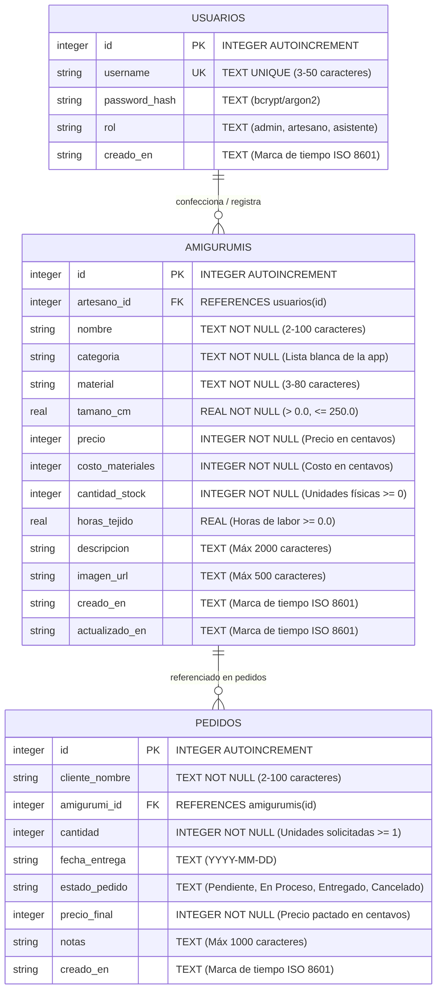

# Esquema de Base de Datos Relacional y Diccionario de Datos: Micro-ERP

Este documento define el esquema relacional de producción para el Micro-ERP de Creaciones de Amigurumi, abarcando autenticación (`usuarios`), catálogo de productos e inventario (`amigurumis`), y seguimiento de pedidos y encargos personalizados (`pedidos`).

---

## 1. Diagrama Entidad-Relación (ERD)



---

## 2. Especificación DDL de SQLite

```sql
-- Habilitar la integridad de claves foráneas en SQLite
PRAGMA foreign_keys = ON;

-- ========================================================
-- 1. Tabla: usuarios (Autenticación y Control de Acceso)
-- ========================================================
CREATE TABLE IF NOT EXISTS usuarios (
    id INTEGER PRIMARY KEY AUTOINCREMENT,
    username TEXT UNIQUE NOT NULL CHECK(length(trim(username)) >= 3 AND length(username) <= 50),
    password_hash TEXT NOT NULL,
    rol TEXT NOT NULL DEFAULT 'admin' CHECK(rol IN ('admin', 'artesano', 'asistente')),
    creado_en TEXT NOT NULL DEFAULT (datetime('now', 'localtime'))
);

-- ========================================================
-- 2. Tabla: amigurumis (Catálogo Central e Inventario)
-- ========================================================
CREATE TABLE IF NOT EXISTS amigurumis (
    id INTEGER PRIMARY KEY AUTOINCREMENT,
    artesano_id INTEGER NOT NULL,
    nombre TEXT NOT NULL CHECK(length(trim(nombre)) >= 2 AND length(nombre) <= 100),
    categoria TEXT NOT NULL CHECK(length(trim(categoria)) >= 2 AND length(categoria) <= 50),
    material TEXT NOT NULL CHECK(length(trim(material)) >= 3 AND length(material) <= 80),
    tamano_cm REAL NOT NULL CHECK(tamano_cm > 0.0 AND tamano_cm <= 250.0),
    precio INTEGER NOT NULL CHECK(precio >= 1 AND precio <= 9999999),
    costo_materiales INTEGER NOT NULL DEFAULT 0 CHECK(costo_materiales >= 0 AND costo_materiales <= 9999999),
    cantidad_stock INTEGER NOT NULL DEFAULT 0 CHECK(cantidad_stock >= 0 AND cantidad_stock <= 10000),
    horas_tejido REAL DEFAULT 0.0 CHECK(horas_tejido IS NULL OR (horas_tejido >= 0.0 AND horas_tejido <= 500.0)),
    descripcion TEXT CHECK(descripcion IS NULL OR length(descripcion) <= 2000),
    imagen_url TEXT CHECK(imagen_url IS NULL OR length(trim(imagen_url)) <= 500),
    creado_en TEXT NOT NULL DEFAULT (datetime('now', 'localtime')),
    actualizado_en TEXT DEFAULT NULL,
    FOREIGN KEY (artesano_id) REFERENCES usuarios(id) ON DELETE RESTRICT ON UPDATE CASCADE
);

-- ========================================================
-- 3. Tabla: pedidos (Seguimiento de Encargos y Ventas)
-- ========================================================
CREATE TABLE IF NOT EXISTS pedidos (
    id INTEGER PRIMARY KEY AUTOINCREMENT,
    cliente_nombre TEXT NOT NULL CHECK(length(trim(cliente_nombre)) >= 2 AND length(cliente_nombre) <= 100),
    amigurumi_id INTEGER NOT NULL,
    cantidad INTEGER NOT NULL DEFAULT 1 CHECK(cantidad >= 1 AND cantidad <= 1000),
    fecha_entrega TEXT CHECK(fecha_entrega IS NULL OR length(trim(fecha_entrega)) = 10),
    estado_pedido TEXT NOT NULL DEFAULT 'Pendiente' CHECK(estado_pedido IN (
        'Pendiente', 
        'En Proceso', 
        'Entregado', 
        'Cancelado'
    )),
    precio_final INTEGER NOT NULL CHECK(precio_final >= 1 AND precio_final <= 9999999),
    notas TEXT CHECK(notas IS NULL OR length(notas) <= 1000),
    creado_en TEXT NOT NULL DEFAULT (datetime('now', 'localtime')),
    FOREIGN KEY (amigurumi_id) REFERENCES amigurumis(id) ON DELETE RESTRICT ON UPDATE CASCADE
);

-- ========================================================
-- Índices para Optimización de Consultas
-- ========================================================
CREATE INDEX IF NOT EXISTS idx_usuarios_username ON usuarios(username);
CREATE INDEX IF NOT EXISTS idx_amigurumis_artesano ON amigurumis(artesano_id);
CREATE INDEX IF NOT EXISTS idx_amigurumis_categoria ON amigurumis(categoria);
CREATE INDEX IF NOT EXISTS idx_amigurumis_stock ON amigurumis(cantidad_stock);
CREATE INDEX IF NOT EXISTS idx_pedidos_amigurumi ON pedidos(amigurumi_id);
CREATE INDEX IF NOT EXISTS idx_pedidos_estado ON pedidos(estado_pedido);
```

---

## 3. Diccionarios de Datos

### 3.1 Tabla: `usuarios`
| Campo | Tipo Lógico | Clase SQLite | Nulable | Valor por Defecto | Restricciones | Descripción |
| :--- | :--- | :--- | :--- | :--- | :--- | :--- |
| `id` | Identificador | `INTEGER` | **No** | *Autoincremental* | `PRIMARY KEY AUTOINCREMENT` | Identificador único del usuario. |
| `username` | Texto | `TEXT` | **No** | *Ninguno* | `UNIQUE`, Longitud 3-50 | Nombre de usuario del artesano o administrador. |
| `password_hash` | Texto | `TEXT` | **No** | *Ninguno* | Cadena de hash válida | Generado por PHP `password_hash($pwd, PASSWORD_DEFAULT)`. |
| `rol` | Enumeración | `TEXT` | **No** | `'admin'` | En `admin`, `artesano`, `asistente` | Nivel de autorización y permisos en el sistema. |
| `creado_en` | Marca de tiempo | `TEXT` | **No** | `datetime('now', 'localtime')` | Formato ISO 8601 | Fecha y hora de creación de la cuenta. |

### 3.2 Tabla: `amigurumis`
| Campo | Tipo Lógico | Clase SQLite | Nulable | Valor por Defecto | Restricciones | Descripción |
| :--- | :--- | :--- | :--- | :--- | :--- | :--- |
| `id` | Identificador | `INTEGER` | **No** | *Autoincremental* | `PRIMARY KEY AUTOINCREMENT` | Identificador único de la pieza de amigurumi. |
| `artesano_id` | Clave Foránea | `INTEGER` | **No** | *Ninguno* | `REFERENCES usuarios(id)` | Usuario artesano creador de la pieza. Protegido con `ON DELETE RESTRICT`. |
| `nombre` | Texto | `TEXT` | **No** | *Ninguno* | Longitud 2-100 | Nombre de la creación o personaje tejido. |
| `categoria` | Texto | `TEXT` | **No** | *Ninguno* | Longitud 2-50 | Clasificación temática (validada en lista blanca de la app). |
| `material` | Texto | `TEXT` | **No** | *Ninguno* | Longitud 3-80 | Tipo de hilo o fibra principal (ej. 100% Algodón, Chenille). |
| `tamano_cm` | Decimal | `REAL` | **No** | *Ninguno* | `> 0.0 AND <= 250.0` | Altura o dimensión física de la pieza en centímetros. |
| `precio` | Moneda (Centavos) | `INTEGER` | **No** | *Ninguno* | `1` a `9999999` | Precio de venta al público en centavos ($150.50 MXN = 15050). |
| `costo_materiales`| Moneda (Centavos) | `INTEGER` | **No** | `0` | `0` a `9999999` | Inversión en insumos (hilo, ojos, vellón) en centavos. |
| `cantidad_stock` | Entero | `INTEGER` | **No** | `0` | `0` a `10000` | Unidades físicas disponibles en existencia. |
| `horas_tejido` | Decimal | `REAL` | **Sí** | `0.0` | `>= 0.0 AND <= 500.0` | Horas estimadas de trabajo manual invertidas en tejer la pieza. |
| `descripcion` | Texto Largo | `TEXT` | **Sí** | `NULL` | Longitud `<= 2000` | Notas de confección, cuidados de lavado y especificaciones. |
| `imagen_url` | URL Web | `TEXT` | **Sí** | `NULL` | Longitud `<= 500` | Enlace a la fotografía de la pieza o ruta local. |
| `creado_en` | Marca de tiempo | `TEXT` | **No** | `datetime('now', 'localtime')` | Formato ISO 8601 | Fecha y hora de registro de la pieza. |
| `actualizado_en` | Marca de tiempo | `TEXT` | **Sí** | `NULL` | Formato ISO 8601 | Auditoría de fecha de última modificación. |

### 3.3 Tabla: `pedidos`
| Campo | Tipo Lógico | Clase SQLite | Nulable | Valor por Defecto | Restricciones | Descripción |
| :--- | :--- | :--- | :--- | :--- | :--- | :--- |
| `id` | Identificador | `INTEGER` | **No** | *Autoincremental* | `PRIMARY KEY AUTOINCREMENT` | Identificador único del pedido o encargo. |
| `cliente_nombre` | Texto | `TEXT` | **No** | *Ninguno* | Longitud 2-100 | Nombre del cliente que solicitó el encargo. |
| `amigurumi_id` | Clave Foránea | `INTEGER` | **No** | *Ninguno* | `REFERENCES amigurumis(id)` | Creación solicitada. Protegida con `ON DELETE RESTRICT`. |
| `cantidad` | Entero | `INTEGER` | **No** | `1` | `1` a `1000` | Cantidad de piezas solicitadas en este pedido. |
| `fecha_entrega` | Fecha (Texto) | `TEXT` | **Sí** | `NULL` | Formato `YYYY-MM-DD` | Fecha estimada o pactada de entrega. |
| `estado_pedido` | Enumeración | `TEXT` | **No** | `'Pendiente'` | En `Pendiente`, `En Proceso`, `Entregado`, `Cancelado` | Estado del ciclo de vida del encargo. |
| `precio_final` | Moneda (Centavos) | `INTEGER` | **No** | *Ninguno* | `1` a `9999999` | Precio total pactado bloqueado al momento de la orden en centavos. |
| `notas` | Texto | `TEXT` | **Sí** | `NULL` | Longitud `<= 1000` | Instrucciones de personalización (color de accesorios, mensaje de regalo). |
| `creado_en` | Marca de tiempo | `TEXT` | **No** | `datetime('now', 'localtime')` | Formato ISO 8601 | Fecha y hora de alta del pedido. |

---

## 4. Reglas de Integridad Referencial y Negocio
- **Activación Forzosa de Claves Foráneas:** Ejecución de `PRAGMA foreign_keys = ON;` al inicializar cualquier conexión PDO.
- **Atribución de Autoría (`artesano_id`):** Cada amigurumi está vinculado al artesano que lo registró. Un usuario no puede eliminarse si tiene creaciones registradas en el catálogo (`ON DELETE RESTRICT`).
- **Protección contra Eliminaciones Accidentales (`ON DELETE RESTRICT`):** Un amigurumi no se puede eliminar de la base de datos si existen encargos (activos o históricos) asociados a su ID.
- **Inmutabilidad de Precios (`precio_final`):** El precio acordado con el cliente queda congelado en el registro del pedido, garantizando que futuras actualizaciones de precios en el catálogo no alteren el histórico contable.
- **Control de Cantidades (`cantidad`):** Cada pedido puede registrar múltiples unidades de un mismo diseño, permitiendo el cálculo exacto de ingresos e insumos requeridos.
