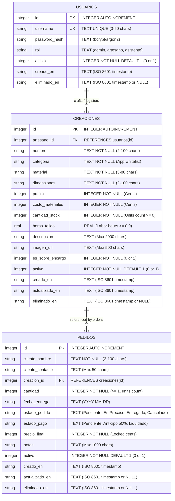

# Relational Database Schema & Data Dictionary: Crochet Creations Micro-ERP

This document defines the production relational schema for the Handmade Crochet Creations Micro-ERP, spanning authentication (`usuarios`), product catalog (`creaciones`), and custom commission/order tracking (`pedidos`).

---

## 1. Entity-Relationship Diagram (ERD)



---

## 2. Complete SQLite DDL Specification

```sql
-- Enable foreign key integrity constraints in SQLite
PRAGMA foreign_keys = ON;

-- ========================================================
-- 1. Table: usuarios (Authentication & Role-Based Access)
-- ========================================================
CREATE TABLE IF NOT EXISTS usuarios (
    id INTEGER PRIMARY KEY AUTOINCREMENT,
    username TEXT NOT NULL,
    password_hash TEXT NOT NULL,
    rol TEXT NOT NULL DEFAULT 'admin',
    activo INTEGER NOT NULL DEFAULT 1,
    creado_en TEXT NOT NULL DEFAULT (datetime('now', 'localtime')),
    eliminado_en TEXT DEFAULT NULL,
    -- Table Constraints
    CONSTRAINT uq_usuarios_username UNIQUE (username),
    CONSTRAINT chk_usuarios_username CHECK(length(trim(username)) >= 3 AND length(username) <= 50),
    CONSTRAINT chk_usuarios_rol CHECK(rol IN ('admin', 'artesano', 'asistente')),
    CONSTRAINT chk_usuarios_activo CHECK(activo IN (0, 1))
);

-- ========================================================
-- 2. Table: creaciones (Core Catalog & Inventory)
-- ========================================================
CREATE TABLE IF NOT EXISTS creaciones (
    id INTEGER PRIMARY KEY AUTOINCREMENT,
    artesano_id INTEGER NOT NULL,
    nombre TEXT NOT NULL,
    categoria TEXT NOT NULL,
    material TEXT NOT NULL,
    dimensiones TEXT NOT NULL,
    precio INTEGER NOT NULL,
    costo_materiales INTEGER NOT NULL DEFAULT 0,
    cantidad_stock INTEGER NOT NULL DEFAULT 0,
    horas_tejido REAL DEFAULT 0.0,
    descripcion TEXT,
    imagen_url TEXT,
    es_sobre_encargo INTEGER NOT NULL DEFAULT 0,
    activo INTEGER NOT NULL DEFAULT 1,
    creado_en TEXT NOT NULL DEFAULT (datetime('now', 'localtime')),
    actualizado_en TEXT DEFAULT NULL,
    eliminado_en TEXT DEFAULT NULL,
    -- Table Constraints
    CONSTRAINT fk_creaciones_artesano FOREIGN KEY (artesano_id) REFERENCES usuarios(id) ON DELETE RESTRICT ON UPDATE CASCADE,
    CONSTRAINT chk_creaciones_nombre CHECK(length(trim(nombre)) >= 2 AND length(nombre) <= 100),
    CONSTRAINT chk_creaciones_categoria CHECK(length(trim(categoria)) >= 2 AND length(categoria) <= 50),
    CONSTRAINT chk_creaciones_material CHECK(length(trim(material)) >= 3 AND length(material) <= 80),
    CONSTRAINT chk_creaciones_dimensiones CHECK(length(trim(dimensiones)) >= 2 AND length(dimensiones) <= 100),
    CONSTRAINT chk_creaciones_precio CHECK(precio >= 1 AND precio <= 9999999),
    CONSTRAINT chk_creaciones_costo_materiales CHECK(costo_materiales >= 0 AND costo_materiales <= 9999999),
    CONSTRAINT chk_creaciones_cantidad_stock CHECK(cantidad_stock >= 0 AND cantidad_stock <= 10000),
    CONSTRAINT chk_creaciones_horas_tejido CHECK(horas_tejido IS NULL OR (horas_tejido >= 0.0 AND horas_tejido <= 500.0)),
    CONSTRAINT chk_creaciones_descripcion CHECK(descripcion IS NULL OR length(descripcion) <= 2000),
    CONSTRAINT chk_creaciones_imagen_url CHECK(imagen_url IS NULL OR length(trim(imagen_url)) <= 500),
    CONSTRAINT chk_creaciones_es_sobre_encargo CHECK(es_sobre_encargo IN (0, 1)),
    CONSTRAINT chk_creaciones_activo CHECK(activo IN (0, 1))
);

-- ========================================================
-- 3. Table: pedidos (Order & Commission Tracking)
-- ========================================================
CREATE TABLE IF NOT EXISTS pedidos (
    id INTEGER PRIMARY KEY AUTOINCREMENT,
    cliente_nombre TEXT NOT NULL,
    cliente_contacto TEXT NOT NULL DEFAULT '',
    creacion_id INTEGER NOT NULL,
    cantidad INTEGER NOT NULL DEFAULT 1,
    fecha_entrega TEXT,
    estado_pedido TEXT NOT NULL DEFAULT 'Pendiente',
    estado_pago TEXT NOT NULL DEFAULT 'Pendiente',
    precio_final INTEGER NOT NULL,
    notas TEXT,
    activo INTEGER NOT NULL DEFAULT 1,
    creado_en TEXT NOT NULL DEFAULT (datetime('now', 'localtime')),
    actualizado_en TEXT DEFAULT NULL,
    eliminado_en TEXT DEFAULT NULL,
    -- Table Constraints
    CONSTRAINT fk_pedidos_creacion FOREIGN KEY (creacion_id) REFERENCES creaciones(id) ON DELETE RESTRICT ON UPDATE CASCADE,
    CONSTRAINT chk_pedidos_cliente_nombre CHECK(length(trim(cliente_nombre)) >= 2 AND length(cliente_nombre) <= 100),
    CONSTRAINT chk_pedidos_cantidad CHECK(cantidad >= 1 AND cantidad <= 1000),
    CONSTRAINT chk_pedidos_fecha_entrega CHECK(fecha_entrega IS NULL OR length(trim(fecha_entrega)) = 10),
    CONSTRAINT chk_pedidos_estado CHECK(estado_pedido IN ('Pendiente', 'En Proceso', 'Entregado', 'Cancelado')),
    CONSTRAINT chk_pedidos_precio_final CHECK(precio_final >= 1 AND precio_final <= 9999999),
    CONSTRAINT chk_pedidos_notas CHECK(notas IS NULL OR length(notas) <= 1000),
    CONSTRAINT chk_pedidos_cliente_contacto CHECK(length(trim(cliente_contacto)) <= 50),
    CONSTRAINT chk_pedidos_estado_pago CHECK(estado_pago IN ('Pendiente', 'Anticipo 50%', 'Liquidado')),
    CONSTRAINT chk_pedidos_activo CHECK(activo IN (0, 1))
);

-- ========================================================
-- Indexes for Query Optimization
-- ========================================================
CREATE INDEX IF NOT EXISTS idx_usuarios_username ON usuarios(username);
CREATE INDEX IF NOT EXISTS idx_usuarios_activo ON usuarios(activo);
CREATE INDEX IF NOT EXISTS idx_creaciones_artesano ON creaciones(artesano_id);
CREATE INDEX IF NOT EXISTS idx_creaciones_categoria ON creaciones(categoria);
CREATE INDEX IF NOT EXISTS idx_creaciones_stock ON creaciones(cantidad_stock);
CREATE INDEX IF NOT EXISTS idx_creaciones_activo ON creaciones(activo);
CREATE INDEX IF NOT EXISTS idx_pedidos_creacion ON pedidos(creacion_id);
CREATE INDEX IF NOT EXISTS idx_pedidos_estado ON pedidos(estado_pedido);
CREATE INDEX IF NOT EXISTS idx_pedidos_activo ON pedidos(activo);
```

---

## 3. Data Dictionaries

### 3.1 Table: `usuarios`
| Field | Type | SQLite Class | Nullable | Default | Constraints | Description |
| :--- | :--- | :--- | :--- | :--- | :--- | :--- |
| `id` | Identifier | `INTEGER` | **No** | *Autoincrement* | `PRIMARY KEY AUTOINCREMENT` | Unique user ID. |
| `username` | Text | `TEXT` | **No** | *None* | `UNIQUE`, Length 3-50 | Artisan or admin account username. |
| `password_hash` | Text | `TEXT` | **No** | *None* | Valid hash string | Generated by PHP `password_hash($pwd, PASSWORD_DEFAULT)`. |
| `rol` | Enum | `TEXT` | **No** | `'admin'` | In `admin`, `artesano`, `asistente` | Access authorization tier. |
| `activo` | Binary Flag | `INTEGER` | **No** | `1` | `CHECK(activo IN (0, 1))` | 1 = active account, 0 = soft-deleted / deactivated. |
| `creado_en` | Timestamp | `TEXT` | **No** | `datetime('now', 'localtime')` | ISO 8601 | Registration timestamp. |
| `eliminado_en` | Timestamp | `TEXT` | **Yes** | `NULL` | ISO 8601 | Soft deletion timestamp if deactivated. |

### 3.2 Table: `creaciones`
| Field | Type | SQLite Class | Nullable | Default | Constraints | Description |
| :--- | :--- | :--- | :--- | :--- | :--- | :--- |
| `id` | Identifier | `INTEGER` | **No** | *Autoincrement* | `PRIMARY KEY AUTOINCREMENT` | Unique creation ID. |
| `artesano_id` | Foreign Key | `INTEGER` | **No** | *None* | `REFERENCES usuarios(id)` | Artisan user who crafted/registered this item. Protected via `ON DELETE RESTRICT`. |
| `nombre` | Text | `TEXT` | **No** | *None* | Length 2-100 | Creation name / title. |
| `categoria` | Text | `TEXT` | **No** | *None* | Length 2-50 | Thematic grouping (e.g. Amigurumis & Figuras, Prendas & Ropa, Bolsos & Accesorios, Hogar & Decoración, Bebé & Infantil). |
| `material` | Text | `TEXT` | **No** | *None* | Length 3-80 | Primary yarn or fiber composition (e.g. 100% Algodón, Trapillo, Lana Merino). |
| `dimensiones` | Text | `TEXT` | **No** | *None* | Length 2-100 | Physical dimensions (2D/3D), clothing size (e.g. Talla M (95x58 cm)), or height. |
| `precio` | Currency (Cents) | `INTEGER` | **No** | *None* | `1` to `9999999` | Retail price in cents ($150.50 = 15050). |
| `costo_materiales`| Currency (Cents) | `INTEGER` | **No** | `0` | `0` to `9999999` | Raw materials cost in cents. |
| `cantidad_stock` | Integer | `INTEGER` | **No** | `0` | `0` to `10000` | Physical stock count. |
| `horas_tejido` | Float | `REAL` | **Yes** | `0.0` | `>= 0.0 AND <= 500.0` | Estimated manual crochet labor time. |
| `descripcion` | Text | `TEXT` | **Yes** | `NULL` | Length `<= 2000` | Craft notes, yarn care, and instructions. |
| `imagen_url` | Text | `TEXT` | **Yes** | `NULL` | Length `<= 500` | Image photo URL or local asset. |
| `es_sobre_encargo`| Binary Flag | `INTEGER` | **No** | `0` | In `0, 1` | 1 if made exclusively to order (on-demand without immediate stock). |
| `activo` | Binary Flag | `INTEGER` | **No** | `1` | `CHECK(activo IN (0, 1))` | 1 = active in catalog, 0 = soft-deleted / archived. |
| `creado_en` | Timestamp | `TEXT` | **No** | `datetime('now', 'localtime')` | ISO 8601 | Timestamp of item registration. |
| `actualizado_en` | Timestamp | `TEXT` | **Yes** | `NULL` | ISO 8601 | Audit timestamp on modification. |
| `eliminado_en` | Timestamp | `TEXT` | **Yes** | `NULL` | ISO 8601 | Soft deletion timestamp if deactivated. |

### 3.3 Table: `pedidos`
| Field | Type | SQLite Class | Nullable | Default | Constraints | Description |
| :--- | :--- | :--- | :--- | :--- | :--- | :--- |
| `id` | Identifier | `INTEGER` | **No** | *Autoincrement* | `PRIMARY KEY AUTOINCREMENT` | Unique order/commission ID. |
| `cliente_nombre` | Text | `TEXT` | **No** | *None* | Length 2-100 | Customer name who placed the order. |
| `cliente_contacto`| Text | `TEXT` | **No** | `''` | Length `<= 50` | Direct customer contact info (WhatsApp, phone, or email). |
| `creacion_id` | Foreign Key | `INTEGER` | **No** | *None* | `REFERENCES creaciones(id)` | Ordered catalog creation. Protected via `ON DELETE RESTRICT`. |
| `cantidad` | Integer | `INTEGER` | **No** | `1` | `1` to `1000` | Number of units requested in this order. |
| `fecha_entrega` | Date Text | `TEXT` | **Yes** | `NULL` | Format `YYYY-MM-DD` | Target delivery or completion date. |
| `estado_pedido` | Enum | `TEXT` | **No** | `'Pendiente'` | In `Pendiente`, `En Proceso`, `Entregado`, `Cancelado` | Operational fulfillment state. |
| `estado_pago` | Enum | `TEXT` | **No** | `'Pendiente'` | In `Pendiente`, `Anticipo 50%`, `Liquidado` | Financial settlement status of the commission order. |
| `precio_final` | Currency (Cents) | `INTEGER` | **No** | *None* | `1` to `9999999` | Locked total agreed price for the order in cents. |
| `notas` | Text | `TEXT` | **Yes** | `NULL` | Length `<= 1000` | Customization requests (e.g., color variants, gift note). |
| `activo` | Binary Flag | `INTEGER` | **No** | `1` | `CHECK(activo IN (0, 1))` | 1 = active order, 0 = soft-deleted / cancelled archive. |
| `creado_en` | Timestamp | `TEXT` | **No** | `datetime('now', 'localtime')` | ISO 8601 | Timestamp when order was booked. |
| `actualizado_en` | Timestamp | `TEXT` | **Yes** | `NULL` | ISO 8601 | Audit timestamp on order fulfillment or payment status change. |
| `eliminado_en` | Timestamp | `TEXT` | **Yes** | `NULL` | ISO 8601 | Soft deletion timestamp if deactivated. |

---

## 4. Referential Integrity Rules
- **Foreign Key Enforcement:** Enforced dynamically on every PDO connection via `PRAGMA foreign_keys = ON;`.
- **Universal Soft Deletes Standard (Zero Physical Deletes):** Across the entire database and API, **physical deletions (`DELETE FROM`) are strictly forbidden**. All deletion operations are performed as logical soft deletes:
  ```sql
  UPDATE <table> 
  SET activo = 0, 
      eliminado_en = datetime('now', 'localtime') 
  WHERE id = :id AND activo = 1;
  ```
  Default catalog lookups, directories, queries, and authentication check `activo = 1`. Inactive rows are retained indefinitely in SQLite, protecting audit history and preventing orphan referential cascades.
- **Artisan Attribution (`artesano_id`):** Every piece/creation is tied to the artisan who created it. A user account cannot be soft-deleted if active creations reference it.
- **Order Delete Protection (`ON DELETE RESTRICT`):** As records are never removed physically, historical commission records maintain 100% integrity.
- **Price Immutability (`precio_final`):** Calculated securely by the backend (`creaciones.precio * pedidos.cantidad`) and locked in `pedidos.precio_final` at order creation time. Subsequent price changes in the catalog do not alter historical orders.
- **Quantity Tracking (`cantidad`):** A single order can track multiple units of a creation, allowing accurate calculation of total revenue and material consumption.
- **Atomic Stock Deduction:** Creating an order requires an atomic transaction (`BEGIN TRANSACTION`). The backend validates that `cantidad <= creaciones.cantidad_stock` and decrements physical stock (`UPDATE creaciones SET cantidad_stock = cantidad_stock - :cantidad`).
- **Restocking on Order Cancellation (Idempotent):** Updating an order to `'Cancelado'` via `POST /api/pedidos/cancelar.php` verifies that the order is not already cancelled (preventing double restitution) and executes an atomic transaction restoring the reserved units back to `creaciones.cantidad_stock` while recording the timestamp in `actualizado_en`.
- **Physical Asset Lifecycle with Soft Deletes (Zero `unlink()` on Soft Delete):** When a creation is soft-deleted (`activo = 0`), **its uploaded image is NEVER unlinked or deleted from disk (`uploads/`)**. Historical client orders tied to that creation must continue rendering its thumbnail and details. The `unlink()` operation is **strictly reserved** for replacing an obsolete image file during an explicit creation update in `actualizar.php`.

