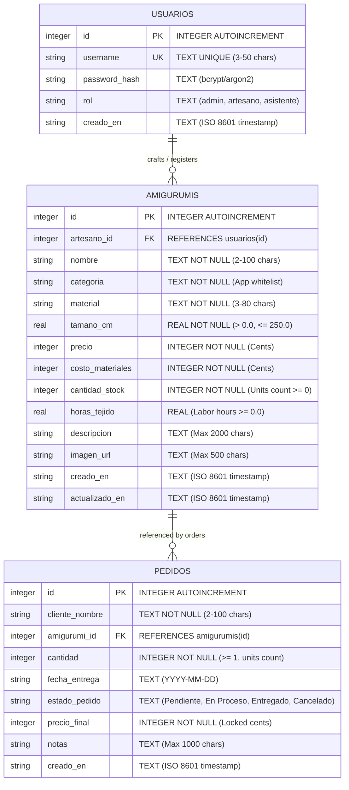

# Relational Database Schema & Data Dictionary: Micro-ERP

This document defines the production relational schema for the Amigurumi Craft Micro-ERP, spanning authentication (`usuarios`), product catalog (`amigurumis`), and custom commission/order tracking (`pedidos`).

---

## 1. Entity-Relationship Diagram (ERD)



---

## 2. Complete SQLite DDL Specification

```sql
-- Enable foreign key integrity constraints in SQLite
PRAGMA foreign_keys = ON;

-- ========================================================
-- 1. Table: usuarios (Authentication & Role-Based Access)
-- ========================================================
CREATE TABLE IF NOT EXISTS usuarios (
    id INTEGER PRIMARY KEY AUTOINCREMENT,
    username TEXT UNIQUE NOT NULL CHECK(length(trim(username)) >= 3 AND length(username) <= 50),
    password_hash TEXT NOT NULL,
    rol TEXT NOT NULL DEFAULT 'admin' CHECK(rol IN ('admin', 'artesano', 'asistente')),
    creado_en TEXT NOT NULL DEFAULT (datetime('now', 'localtime'))
);

-- ========================================================
-- 2. Table: amigurumis (Core Catalog & Inventory)
-- ========================================================
CREATE TABLE IF NOT EXISTS amigurumis (
    id INTEGER PRIMARY KEY AUTOINCREMENT,
    artesano_id INTEGER NOT NULL,
    nombre TEXT NOT NULL CHECK(length(trim(nombre)) >= 2 AND length(nombre) <= 100),
    categoria TEXT NOT NULL CHECK(length(trim(categoria)) >= 2 AND length(categoria) <= 50),
    material TEXT NOT NULL CHECK(length(trim(material)) >= 3 AND length(material) <= 80),
    tamano_cm REAL NOT NULL CHECK(tamano_cm > 0.0 AND tamano_cm <= 250.0),
    precio INTEGER NOT NULL CHECK(precio >= 1 AND precio <= 9999999),
    costo_materiales INTEGER NOT NULL DEFAULT 0 CHECK(costo_materiales >= 0 AND costo_materiales <= 9999999),
    cantidad_stock INTEGER NOT NULL DEFAULT 0 CHECK(cantidad_stock >= 0 AND cantidad_stock <= 10000),
    horas_tejido REAL DEFAULT 0.0 CHECK(horas_tejido IS NULL OR (horas_tejido >= 0.0 AND horas_tejido <= 500.0)),
    descripcion TEXT CHECK(descripcion IS NULL OR length(descripcion) <= 2000),
    imagen_url TEXT CHECK(imagen_url IS NULL OR length(trim(imagen_url)) <= 500),
    creado_en TEXT NOT NULL DEFAULT (datetime('now', 'localtime')),
    actualizado_en TEXT DEFAULT NULL,
    FOREIGN KEY (artesano_id) REFERENCES usuarios(id) ON DELETE RESTRICT ON UPDATE CASCADE
);

-- ========================================================
-- 3. Table: pedidos (Order & Commission Tracking)
-- ========================================================
CREATE TABLE IF NOT EXISTS pedidos (
    id INTEGER PRIMARY KEY AUTOINCREMENT,
    cliente_nombre TEXT NOT NULL CHECK(length(trim(cliente_nombre)) >= 2 AND length(cliente_nombre) <= 100),
    amigurumi_id INTEGER NOT NULL,
    cantidad INTEGER NOT NULL DEFAULT 1 CHECK(cantidad >= 1 AND cantidad <= 1000),
    fecha_entrega TEXT CHECK(fecha_entrega IS NULL OR length(trim(fecha_entrega)) = 10),
    estado_pedido TEXT NOT NULL DEFAULT 'Pendiente' CHECK(estado_pedido IN (
        'Pendiente', 
        'En Proceso', 
        'Entregado', 
        'Cancelado'
    )),
    precio_final INTEGER NOT NULL CHECK(precio_final >= 1 AND precio_final <= 9999999),
    notas TEXT CHECK(notas IS NULL OR length(notas) <= 1000),
    creado_en TEXT NOT NULL DEFAULT (datetime('now', 'localtime')),
    FOREIGN KEY (amigurumi_id) REFERENCES amigurumis(id) ON DELETE RESTRICT ON UPDATE CASCADE
);

-- ========================================================
-- Indexes for Query Optimization
-- ========================================================
CREATE INDEX IF NOT EXISTS idx_usuarios_username ON usuarios(username);
CREATE INDEX IF NOT EXISTS idx_amigurumis_artesano ON amigurumis(artesano_id);
CREATE INDEX IF NOT EXISTS idx_amigurumis_categoria ON amigurumis(categoria);
CREATE INDEX IF NOT EXISTS idx_amigurumis_stock ON amigurumis(cantidad_stock);
CREATE INDEX IF NOT EXISTS idx_pedidos_amigurumi ON pedidos(amigurumi_id);
CREATE INDEX IF NOT EXISTS idx_pedidos_estado ON pedidos(estado_pedido);
```

---

## 3. Data Dictionaries

### 3.1 Table: `usuarios`
| Field | Type | SQLite Class | Nullable | Default | Constraints | Description |
| :--- | :--- | :--- | :--- | :--- | :--- | :--- |
| `id` | Identifier | `INTEGER` | **No** | *Autoincrement* | `PRIMARY KEY AUTOINCREMENT` | Unique user ID. |
| `username` | Text | `TEXT` | **No** | *None* | `UNIQUE`, Length 3-50 | Artisan or admin account username. |
| `password_hash` | Text | `TEXT` | **No** | *None* | Valid hash string | Generated by PHP `password_hash($pwd, PASSWORD_DEFAULT)`. |
| `rol` | Enum | `TEXT` | **No** | `'admin'` | In `admin`, `artesano`, `asistente` | Access authorization tier. |
| `creado_en` | Timestamp | `TEXT` | **No** | `datetime('now', 'localtime')` | ISO 8601 | Registration timestamp. |

### 3.2 Table: `amigurumis`
| Field | Type | SQLite Class | Nullable | Default | Constraints | Description |
| :--- | :--- | :--- | :--- | :--- | :--- | :--- |
| `id` | Identifier | `INTEGER` | **No** | *Autoincrement* | `PRIMARY KEY AUTOINCREMENT` | Unique amigurumi ID. |
| `artesano_id` | Foreign Key | `INTEGER` | **No** | *None* | `REFERENCES usuarios(id)` | Artisan user who crafted/registered this item. Protected via `ON DELETE RESTRICT`. |
| `nombre` | Text | `TEXT` | **No** | *None* | Length 2-100 | Creation / character name. |
| `categoria` | Text | `TEXT` | **No** | *None* | Length 2-50 | Thematic grouping (app-level whitelist). |
| `material` | Text | `TEXT` | **No** | *None* | Length 3-80 | Primary yarn composition. |
| `tamano_cm` | Float | `REAL` | **No** | *None* | `> 0.0 AND <= 250.0` | Physical dimension in cm. |
| `precio` | Currency (Cents) | `INTEGER` | **No** | *None* | `1` to `9999999` | Retail price in cents ($150.50 = 15050). |
| `costo_materiales`| Currency (Cents) | `INTEGER` | **No** | `0` | `0` to `9999999` | Raw materials cost in cents. |
| `cantidad_stock` | Integer | `INTEGER` | **No** | `0` | `0` to `10000` | Physical stock count. |
| `horas_tejido` | Float | `REAL` | **Yes** | `0.0` | `>= 0.0 AND <= 500.0` | Estimated manual crochet labor time. |
| `descripcion` | Text | `TEXT` | **Yes** | `NULL` | Length `<= 2000` | Craft notes and instructions. |
| `imagen_url` | Text | `TEXT` | **Yes** | `NULL` | Length `<= 500` | Image photo URL or local asset. |
| `creado_en` | Timestamp | `TEXT` | **No** | `datetime('now', 'localtime')` | ISO 8601 | Timestamp of item registration. |
| `actualizado_en` | Timestamp | `TEXT` | **Yes** | `NULL` | ISO 8601 | Audit timestamp on modification. |

### 3.3 Table: `pedidos`
| Field | Type | SQLite Class | Nullable | Default | Constraints | Description |
| :--- | :--- | :--- | :--- | :--- | :--- | :--- |
| `id` | Identifier | `INTEGER` | **No** | *Autoincrement* | `PRIMARY KEY AUTOINCREMENT` | Unique order/commission ID. |
| `cliente_nombre` | Text | `TEXT` | **No** | *None* | Length 2-100 | Customer name who placed the order. |
| `amigurumi_id` | Foreign Key | `INTEGER` | **No** | *None* | `REFERENCES amigurumis(id)` | Ordered catalog item. Protected via `ON DELETE RESTRICT`. |
| `cantidad` | Integer | `INTEGER` | **No** | `1` | `1` to `1000` | Number of units of this amigurumi requested in this order. |
| `fecha_entrega` | Date Text | `TEXT` | **Yes** | `NULL` | Format `YYYY-MM-DD` | Target delivery or completion date. |
| `estado_pedido` | Enum | `TEXT` | **No** | `'Pendiente'` | In `Pendiente`, `En Proceso`, `Entregado`, `Cancelado` | Operational fulfillment state. |
| `precio_final` | Currency (Cents) | `INTEGER` | **No** | *None* | `1` to `9999999` | Locked total agreed price for the order in cents. |
| `notas` | Text | `TEXT` | **Yes** | `NULL` | Length `<= 1000` | Customization requests (e.g., color variants, gift note). |
| `creado_en` | Timestamp | `TEXT` | **No** | `datetime('now', 'localtime')` | ISO 8601 | Timestamp when order was booked. |

---

## 4. Referential Integrity Rules
- **Foreign Key Enforcement:** Enforced dynamically on every PDO connection via `PRAGMA foreign_keys = ON;`.
- **Artisan Attribution (`artesano_id`):** Every piece of amigurumi is tied to the artisan who created it. A user account cannot be deleted if active amigurumis reference it (`ON DELETE RESTRICT`).
- **Order Delete Protection (`ON DELETE RESTRICT`):** An amigurumi cannot be deleted if active or past orders reference its ID. This protects financial integrity and transaction history.
- **Price Immutability (`precio_final`):** Even if an artisan updates the catalog price of an amigurumi in `amigurumis.precio`, existing orders in `pedidos.precio_final` retain their historical purchase amount.
- **Quantity Tracking (`cantidad`):** A single order can track multiple units of an amigurumi, allowing accurate calculation of total revenue and material consumption.
