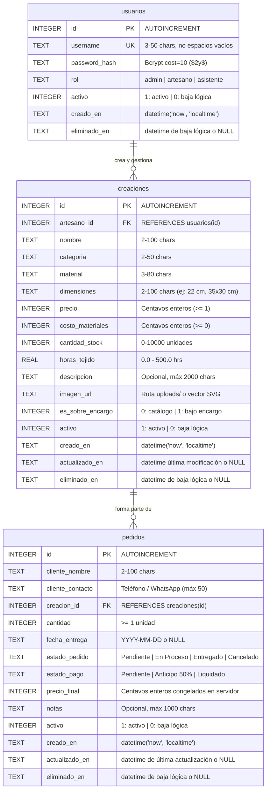

# Modelo de Datos & Base de Datos Relacional

[← Volver al Hub Principal de Documentación](../README.md)

Este directorio documenta el diseño relacional físico, las restricciones de integridad y las guías de verificación para la base de datos **SQLite 3** (`database/database.sqlite`) de **Crochet Manager**.

---

## 1. Documentos del Módulo

| Documento | Descripción |
| :--- | :--- |
| **[Esquema DDL & Diccionario de Datos](./schema.md)** | Sentencias SQL completas, restricciones `CHECK`, claves foráneas, índices y diccionarios de campos para `usuarios`, `creaciones` y `pedidos`. |
| **[Guía de Pruebas & Verificación CLI](./testing.md)** | Comandos reproducibles en terminal con `sqlite3`, scripts CLI `setup.php`, verificación de integridad y auditoría de claves foráneas. |

---

## 2. Diagrama Entidad-Relación Físico (ERD)

---

## 3. Principios y Salvaguardas Relacionales

1. **Claves Foráneas Activas:** Toda conexión PDO ejecuta obligatoriamente `PRAGMA foreign_keys = ON;`.
2. **Concurrencia Segura:** Se configura `PRAGMA busy_timeout = 5000;` para mitigar bloqueos bajo peticiones concurrentes.
3. **Cero Eliminaciones Físicas:** Universalmente gobernado por `activo = 1` y `eliminado_en`.
4. **Moneda en Enteros:** Todos los precios y costos se almacenan como centavos enteros (`INTEGER`).
5. **Aislamiento de Archivo:** El archivo físico `database/database.sqlite` se encuentra fuera de la raíz pública y está blindado contra acceso web por Apache `.htaccess` (`HTTP 403 Forbidden`).
