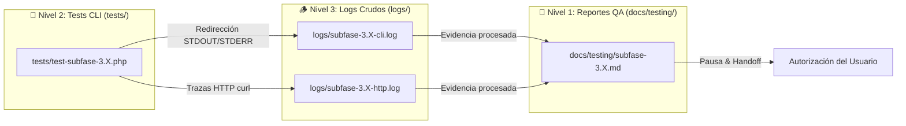
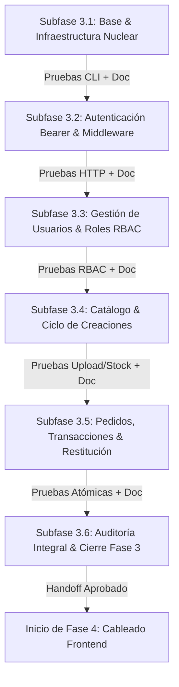

# 🏛️ Plan de Arquitectura Backend — Fase 3: Clean Architecture & Modularidad en `app/`

**Documento:** `docs/phase-3-backend-architecture-plan.md`  
**Estado:** Propuesta / En Refinamiento con el Usuario (**NO INICIAR hasta autorización explícita**)  
**Fecha:** 12 de Septiembre de 2026  
**Autor:** Clean Code Architect & Senior Software Engineer  

---

## 🎯 1. Objetivos del Refinamiento de la Fase 3

1. **Separación Física Estricta Frontend vs. Backend:**
   - **`src/`:** Reservado **exclusivamente para recursos de frontend** (`src/css/` para ITCSS y `src/js/` para módulos ES6). Cero código PHP o backend residirá en `src/`.
   - **`app/`:** Nuevo directorio raíz **exclusivo para el backend y la lógica de negocio en PHP**. Protegido contra acceso web directo mediante Apache `.htaccess`.
2. **Adherencia Rigurosa a Clean Architecture & Principios SOLID:**
   - **Capa Core / Infraestructura:** Autoloader PSR-4 nativo, conexión singleton PDO a SQLite, abstracciones de Request/Response y gestor de sesiones.
   - **Capa de Persistencia (Repositories / DAO):** 100% del SQL aislado en repositorios con sentencias preparadas parametrizadas (inmune a SQL Injection).
   - **Capa de Dominio y Lógica de Negocio (Services):** Validaciones de negocio, transacciones atómicas de stock (`BEGIN IMMEDIATE`), reglas de precios de servidor, y ciclo de vida de imágenes con `unlink()`.
   - **Capa de Seguridad y Middleware:** `AuthGuard` y `RoleGuard` para control de acceso RBAC (`admin`, `artesano`, `asistente`).
   - **Capa de Entrada API (`api/`):** Controladores delgados que reciben solicitudes HTTP, invocan servicios y devuelven respuestas JSON estandarizadas.
3. **Alineación con el Modelo de Plataforma Colaborativa Multi-Artesano:**
   - La plataforma no es un taller unificado con control centralizado; es un **ecosistema abierto y colaborativo** donde cada creador registrado gestiona su propio inventario y sus encargos con autonomía.
   - El backend garantiza la autoría de cada creación (`creaciones.artesano_id -> usuarios.id`), protege los pedidos históricos (`ON DELETE RESTRICT`) y salvaguarda la cuenta del administrador raíz (ID #1).

---

## 📂 2. Nueva Distribución de Directorios del Proyecto

```
proyecto-web/
├── app/                                # 🟢 NUEVO: CAPA BACKEND PHP EXCLUSIVA (Protegida por .htaccess)
│   ├── autoload.php                   # Autocargador PSR-4 nativo (spl_autoload_register sin Composer)
│   ├── config.php                     # Configuración centralizada (claves secretas, timezone, TTL tokens, límites)
│   ├── Core/                          # Componentes nucleares de infraestructura
│   │   ├── Database.php               # Singleton PDO SQLite (PRAGMA foreign_keys = ON; ERRMODE_EXCEPTION)
│   │   ├── Config.php                 # Clase de acceso estático con caché a configuración y notación por puntos
│   │   ├── ErrorHandler.php           # Capturador global de errores, excepciones y fatal errors (cero fugas HTML)
│   │   ├── Request.php                # Abstracción segura de entrada (POST, GET, JSON, Files, Bearer Token)
│   │   ├── Response.php               # Emisor estandarizado de respuestas JSON, códigos HTTP y Preflight CORS
│   │   ├── TokenManager.php           # Gestor de Tokens Bearer HMAC-SHA256 (firma, verificación, expiración)
│   │   └── SessionManager.php         # Gestión complementaria para sesiones web/SSR si se requiere
│   ├── Database/                      # Clases auxiliares o migraciones si se requieren
│   ├── Repositories/                  # CAPA DE PERSISTENCIA (100% del SQL aislado aquí)
│   │   ├── CreacionRepository.php     # Consultas de creaciones, filtros, paginación, stock y catálogo
│   │   ├── PedidoRepository.php       # Consultas de pedidos, paginación, transacciones y estados de pago
│   │   └── UsuarioRepository.php      # Consultas de usuarios, verificación de credenciales y roles
│   ├── Services/                      # REGLAS DE NEGOCIO Y CASOS DE USO
│   │   ├── AuthService.php            # Verificación de credenciales, hashing bcrypt y ciclo de sesión
│   │   ├── CreacionService.php        # Validaciones de piezas, enriquecimiento monetario dual y fallback SVG
│   │   ├── PedidoService.php          # Transacción atómica de stock, congelamiento de precios y WhatsApp
│   │   └── UsuarioService.php         # Alta de creadores, cambio de roles RBAC y protección de admin raíz
│   ├── Middleware/                    # CONTROLADORES DE ACCESO Y SEGURIDAD
│   │   ├── AuthGuard.php              # Verificación de sesión activa (retorna 401 si no hay sesión)
│   │   └── RoleGuard.php              # Verificación de privilegios de rol (admin, artesano, asistente)
│   └── Utils/                         # UTILIDADES Y HELPERS DE SERVIDOR
│       ├── CurrencyHelper.php         # Conversión bidireccional centavos enteros <-> pesos MXN y enriquecimiento
│       ├── PaginationHelper.php       # Cálculo unificado de límites, offsets y metadatos de paginación
│       └── SvgHelper.php              # Helper de renderizado vectorial SVG con caché en memoria
│
├── src/                               # 🔵 EXCLUSIVO FRONTEND (Sin archivos PHP)
│   ├── css/                           # Arquitectura ITCSS por capas (01-settings a 04-components)
│   └── js/                            # JavaScript modular nativo (ES Modules: main.js + modules/)
│
├── api/                               # 🌐 CONTROLADORES REST DELGADOS (Endpoints HTTP -> JSON)
│   ├── auth/
│   │   ├── login.php                  # POST: Autenticar credenciales y devolver Bearer Token
│   │   ├── logout.php                 # POST: Invalidación de estado de autenticación
│   │   └── me.php                     # GET: Información del usuario activo (valida Bearer Token)
│   ├── creaciones/
│   │   ├── index.php                  # GET: Listar catálogo con filtros (búsqueda, categoría, autor, precio)
│   │   ├── detalle.php                # GET: Ficha técnica detallada por ID
│   │   ├── crear.php                  # POST: Registrar nueva creación con foto (AuthGuard: artesano/admin)
│   │   ├── actualizar.php             # POST: Actualizar datos de creación (AuthGuard: creador/admin)
│   │   ├── eliminar.php               # POST: Borrado con salvaguarda FK y unlink (AuthGuard)
│   │   ├── ajustar-stock.php          # POST: Incremento/decremento rápido in-situ (AuthGuard)
│   │   └── toggle-encargo.php         # POST: Alternar modalidad de encargo (AuthGuard)
│   ├── pedidos/
│   │   ├── index.php                  # GET: Listar pedidos filtrados por estado/búsqueda (AuthGuard)
│   │   ├── solicitar.php              # POST: Checkout público de clientes (transaccional)
│   │   ├── crear.php                  # POST: Registro de encargo manual por el artesano (AuthGuard)
│   │   ├── cambiar-estado.php         # POST: Avanzar estado de producción (AuthGuard)
│   │   └── cancelar.php               # POST: Cancelar y restituir stock físico atómicamente (AuthGuard)
│   └── usuarios/
│       ├── index.php                  # GET: Directorio de creadores y equipo (AuthGuard: admin)
│       ├── crear.php                  # POST: Registrar nuevo artesano/colaborador (AuthGuard: admin)
│       └── cambiar-rol.php            # POST: Modificar rol con salvaguarda ID #1 (AuthGuard: admin)
│
├── database/
│   ├── database.sqlite                # Base de datos SQLite 3 física protegida
│   └── seed.sql                       # DDL canónico y datos iniciales de prueba
│
├── views/                             # 🖼️ PRESENTACIÓN Y VISTAS (Server-Side Rendering de maquetación)
│   ├── layouts/main.php               # Layout maestro unificado
│   ├── components/                    # Modales, navbar, footer, sidebar, product_card
│   └── pages/                         # Contenidos de catálogo, creaciones, detalle, formulario, etc.
│
├── uploads/                           # Almacenamiento local de fotografías subidas por artesanos
├── tests/                             # 🧪 SUITES DE TESTING CLI AUTOMATIZADAS (Protegidas por .htaccess)
│   ├── TestHelper.php                 # Utilidades de aserción nativa y llamadas HTTP curl
│   ├── test-subfase-3.1.php           # Batería de pruebas de infraestructura nuclear
│   ├── test-subfase-3.2.php           # Batería de pruebas de autenticación y Bearer tokens
│   ├── test-subfase-3.3.php           # Batería de pruebas de usuarios, roles y salvaguarda ID #1
│   ├── test-subfase-3.4.php           # Batería de pruebas de catálogo, fotos y fallback SVG
│   ├── test-subfase-3.5.php           # Batería de pruebas de pedidos, transacciones y restitución
│   └── test-subfase-3.6.php           # Batería de auditoría integral, regresión y seguridad
├── logs/                              # 🪵 VOLCADOS Y LOGS CRUDOS DE EJECUCIÓN (Ignorados por Git, bloqueados en web)
│   ├── .htaccess                      # Bloqueo total HTTP (Require all denied)
│   ├── .gitkeep                       # Preservación de carpeta en el repositorio
│   ├── subfase-3.1-cli.log            # Salida cruda de terminal de pruebas
│   └── subfase-3.1-http.log           # Trazas de respuestas curl completas
└── docs/                              # Especificaciones técnicas, diagramas y reportes
    └── testing/                       # 📑 REPORTES FORMALES DE SUBFASES (Markdown, versionados en Git)
        ├── README.md                  # Índice maestro de testing y plantilla estándar de reporte
        ├── subfase-3.1-core.md        # Reporte formal de resultados subfase 3.1
        ├── subfase-3.2-auth.md        # Reporte formal de resultados subfase 3.2
        ├── subfase-3.3-usuarios.md    # Reporte formal de resultados subfase 3.3
        ├── subfase-3.4-creaciones.md  # Reporte formal de resultados subfase 3.4
        ├── subfase-3.5-pedidos.md     # Reporte formal de resultados subfase 3.5
        └── subfase-3.6-seguridad.md   # Reporte formal de resultados subfase 3.6
```

---

## 🧱 3. Diseño Detallado de Capas en `app/`

### 3.1. Capa Core (`app/Core/`)

#### A. Autoloader PSR-4 Nativo & Bootstrap (`app/autoload.php`)
- Implementa `spl_autoload_register` para resolver automáticamente el namespace `App\` hacia el directorio `app/`.
- Permite hacer `use App\Services\CreacionService;` o `use App\Repositories\PedidoRepository;` sin requerir Composer ni `require_once` manuales en cada archivo.
- Registra el manejador global `App\Core\ErrorHandler::register()` al inicio de cada ciclo de ejecución para capturar cualquier anomalía.

#### B. Gestor de Configuración Centralizada (`app/Core/Config.php`)
- Carga y almacena en memoria caché estática el array retornado por `app/config.php`.
- Métodos estáticos:
  - `Config::get(string $key, mixed $default = null): mixed`: Soporta acceso con notación de puntos (ej. `Config::get('pagination.creaciones', 12)` o `Config::get('jwt_ttl_seconds')`).
  - `Config::has(string $key): bool`: Comprueba la existencia de una clave de configuración.
  - `Config::isDevelopment(): bool`: Determina si el entorno actual es `'development'`.
- Garantiza que los secretos (`jwt_secret`), límites de subida y parámetros de paginación se definan en un único punto canónico.

#### C. Conexión Singleton SQLite (`app/Core/Database.php`)
- Patrón Singleton que mantiene una única instancia de `PDO` por ciclo de vida de la petición.
- Configuración estricta obligatoria:
  - `PRAGMA foreign_keys = ON;` ejecutado inmediatamente tras abrir la conexión.
  - `PDO::ATTR_ERRMODE => PDO::ERRMODE_EXCEPTION` para capturar cualquier violación de CHECK o FK.
  - `PDO::ATTR_DEFAULT_FETCH_MODE => PDO::FETCH_ASSOC`.
  - Ruta de base de datos leída dinámicamente desde `Config::get('db_path')`.

#### D. Capturador Global de Excepciones y Errores (`app/Core/ErrorHandler.php`)
- Erradica al 100% cualquier fuga de texto plano o HTML ante excepciones no capturadas o advertencias de PHP.
- `register()`: Suscribe los manejadores nativos:
  - `set_error_handler`: Transforma `E_WARNING`, `E_NOTICE` y `E_USER_WARNING` en `\ErrorException`.
  - `set_exception_handler`: Intercepta cualquier `\Throwable`, limpia el búfer de salida con `ob_end_clean()`, establece el código HTTP 500 y emite un JSON estandarizado.
  - `register_shutdown_function`: Captura errores fatales antes de que el proceso termine abruptamente.
- Oculta rutas de disco y stack traces en entornos de producción, protegiendo la seguridad del servidor.

#### E. Abstracción de Respuestas & Manejo de CORS (`app/Core/Response.php`)
- **Manejo Centralizado de Preflight CORS (`Response::handleCors()`):**
  - Establece cabeceras `Access-Control-Allow-Origin: *`, métodos permitidos (`GET, POST, PUT, DELETE, OPTIONS`), cabeceras permitidas (`Authorization, Content-Type, X-Requested-With, Accept`) y caché preflight (`Access-Control-Max-Age: 86400`).
  - Si el método HTTP es `OPTIONS`, responde de inmediato con `HTTP 204 No Content` y detiene la ejecución con `exit;`.
- **Emisión Estandarizada de JSON (`Response::json()`, `Response::success()`, `Response::error()`):**
  - Respuestas exitosas:
    ```json
    {
      "status": "success",
      "data": { ... },
      "message": "Operación completada exitosamente"
    }
    ```
  - Respuestas de error:
    ```json
    {
      "status": "error",
      "error": {
        "code": "STOCK_INSUFFICIENT",
        "message": "No hay suficiente stock físico disponible para esta pieza."
      }
    }
    ```
- Cabecera HTTP automática `Content-Type: application/json; charset=utf-8` y códigos de estado semánticos (200, 201, 204, 400, 401, 403, 404, 422, 500).

#### F. Abstracción de Peticiones (`app/Core/Request.php`)
- Detección automática del formato de entrada: `application/json` (decodificado desde `php://input`) o `multipart/form-data` / `application/x-www-form-urlencoded`.
- Métodos auxiliares de sanitización: `get($key, $default = null)`, `post($key, $default = null)`, `file($key)`, `input($key, $default = null)`.
- Conversión y limpieza de tipos (`int`, `float`, `string` recortado con `trim`).
- **Extracción de Bearer Token (`bearerToken(): ?string`):**
  - Inspecciona de forma resiliente la cabecera HTTP `Authorization: Bearer <token>` a través de `apache_request_headers()`, `$_SERVER['HTTP_AUTHORIZATION']` o `$_SERVER['REDIRECT_HTTP_AUTHORIZATION']`.
  - Si la cabecera existe con prefijo `Bearer `, extrae y devuelve la cadena del token limpia.
- **Contexto de Usuario Autenticado (`user(): ?array`, `setUser(array $user): void`):**
  - Almacena en memoria el payload del usuario autenticado resuelto por el middleware `AuthGuard` para el ciclo de vida de la petición actual.

#### G. Gestor de Tokens Bearer (`app/Core/TokenManager.php`)
- **Arquitectura de Tokens Seguros sin Dependencias Externas (HMAC-SHA256):**
  - Implementa un estándar ligero autocontenido tipo JWT (`Header.Payload.Signature`) firmado con clave secreta criptográfica de `Config::get('jwt_secret')` mediante `hash_hmac('sha256', ...)`.
  - **Estructura del Payload:**
    ```json
    {
      "sub": 1,
      "username": "admin",
      "rol": "admin",
      "iat": 1789178000,
      "exp": 1789264400
    }
    ```
  - **Métodos Principales:**
    - `generate(array $userData, ?int $ttlSeconds = null): string`: Codifica en Base64URL el header y payload, genera la firma HMAC-SHA256 y concatena `Header.Payload.Signature`. TTL por defecto tomado de `Config::get('jwt_ttl_seconds', 86400)`.
    - `verify(string $token): ?array`: Valida la estructura de 3 segmentos, verifica la firma criptográfica usando `hash_equals()` (resistente a ataques de temporización / timing attacks) y comprueba que `exp > time()`. Retorna el array del payload decodificado si es válido, o `null` si está adulterado o expirado.

#### H. Gestor de Sesiones Web / SSR (`app/Core/SessionManager.php`)
- Mantiene compatibilidad para las vistas maquetadas en PHP (`views/`): inicialización con directivas `HttpOnly`, `SameSite=Lax` y regeneración de ID para prevenir Session Fixation.

---

### 3.2. Capa de Persistencia (`app/Repositories/`)

Aísla el 100% de las sentencias SQL. **Ningún controlador ni servicio escribe SQL directamente.**

#### A. `CreacionRepository`
- `findAll(array $filters = [], int $page = 1, int $limit = 12): array`
  - Filtros soportados: `categoria`, `artesano_id`, `stock_status` (`in_stock`, `out_of_stock`, `on_demand`), `min_price`, `max_price`, `search` (búsqueda en nombre y material).
  - Ordenación parametrizada segura (evita inyecciones en `ORDER BY` mediante lista blanca de columnas).
  - Ejecuta consulta de conteo para paginación (`SELECT COUNT(*) ...`) y consulta de registros paginada (`LIMIT :limit OFFSET :offset`).
  - Retorna estructura con `items` y `total`.
- `findById(int $id): ?array`
- `create(array $data): int` (retorna el nuevo ID insertado).
- `update(int $id, array $data): bool`
- `delete(int $id): bool` (respeta restricción `ON DELETE RESTRICT`).
- `updateStock(int $id, int $newStock): bool`
- `toggleOnDemand(int $id): bool`
- `countByArtisan(int $artesanoId): int`

#### B. `PedidoRepository`
- `findAll(array $filters = [], int $page = 1, int $limit = 20): array`
  - Filtros por estado, estado de pago, cliente, búsqueda y ordenación cronológica descendente.
  - Ejecuta conteo y consulta paginada con `LIMIT :limit OFFSET :offset`.
  - Retorna estructura con `items` y `total`.
- `findById(int $id): ?array`
- `create(array $data): int`
- `updateStatus(int $id, string $nuevoEstado): bool`
- `updatePaymentStatus(int $id, string $nuevoEstadoPago): bool`
- `cancelWithStockRestitution(int $id): bool` (ejecutado dentro de transacción).

#### C. `UsuarioRepository`
- `findByUsername(string $username): ?array`
- `findById(int $id): ?array`
- `findAll(): array` (incluyendo conteo agrupado de creaciones asociadas).
- `create(array $data): int`
- `updateRole(int $id, string $nuevoRol): bool`
- `countAdmins(): int` (para verificar que siempre exista al menos un administrador).

---

### 3.3. Capa de Negocio y Servicios (`app/Services/`)

#### A. `AuthService`
- `login(string $username, string $password): array`
  - Valida existencia del usuario en `UsuarioRepository`.
  - Verifica la contraseña cifrada mediante `password_verify($password, $user['password_hash'])`.
  - Genera un token Bearer HMAC-SHA256 con `TokenManager::generate([ 'sub' => $user['id'], 'username' => $user['username'], 'rol' => $user['rol'] ])`.
  - Retorna estructura de autenticación estandarizada:
    ```json
    {
      "token": "eyJhbGciOiJIUzI1NiIsInR5cCI6IkpXVCJ9...",
      "token_type": "Bearer",
      "expires_in": 86400,
      "user": {
        "id": 1,
        "username": "admin",
        "rol": "admin"
      }
    }
    ```
- `logout(): void` (en arquitectura Bearer, la revocación puede ser stateless en el cliente eliminando el token, con soporte para lista negra opcional si se requiere).
- `me(string $bearerToken): ?array`: Valida el token con `TokenManager::verify()` y devuelve el perfil del usuario activo.

#### B. `CreacionService`
- **Regla de Centavos:** Convierte montos flotantes recibidos del formulario (ej. `$450.00`) a centavos enteros (`45000`) antes de persistir en SQLite mediante `CurrencyHelper::mxnToCents()`.
- **Ciclo de Vida de Fotografías y Fallback SVG Temático:**
  - **Caso 1: El artesano sube fotografía real:**
    - Valida tipo MIME real mediante `finfo` / `mime_content_type()` (`image/jpeg`, `image/png`, `image/webp`).
    - Límite estricto de tamaño: $\le 5\text{ MB}$.
    - Genera nombre seguro aleatorio criptográfico (`bin2hex(random_bytes(16)) . '.jpg'`) en el directorio `uploads/`.
    - En caso de edición con nueva foto o eliminación de la pieza, elimina la imagen anterior mediante `unlink()` si no es compartida, previniendo archivos huérfanos en disco.
  - **Caso 2: El artesano no sube foto (Fallback SVG Temático Automático):**
    - Si no se sube archivo fotográfico o `imagen_url` queda vacía, `CreacionService` asigna de forma automática la ilustración vectorial SVG representativa según la `categoria` seleccionada:
      - `Amigurumis` / `Fantasía` $\rightarrow$ `assets/svg/piezas/ajolote-mexicano.svg`
      - `Prendas` $\rightarrow$ `assets/svg/piezas/cardigan-granny.svg`
      - `Bolsos & Accesorios` $\rightarrow$ `assets/svg/piezas/tote-bag.svg`
      - `Hogar & Decoración` $\rightarrow$ `assets/svg/piezas/manta-nordica.svg`
      - `Bebé & Infantil` $\rightarrow$ `assets/svg/piezas/sonajero-conejo.svg`
      - *Fallback universal:* `assets/svg/piezas/ajolote-mexicano.svg`
    - **Beneficio:** Garantiza al 100% que ninguna tarjeta del catálogo o modal de inspección muestre imágenes rotas o marcos vacíos.
- **Validaciones Físicas y de Negocio:**
  - Valida las restricciones CHECK de SQLite antes de enviar a base de datos (Nombre $\ge 2$, Material $\ge 3$, Dimensiones $\ge 2$, Stock $\ge 0$).

#### C. `PedidoService`
- **Transacción Atómica de Compra / Encargo:**
  1. Inicia transacción con `Database::beginTransaction()`.
  2. Consulta la creación con bloqueo de lectura.
  3. Si la pieza **no es sobre encargo**:
     - Verifica que `cantidad_stock >= cantidad_solicitada`.
     - Si es insuficiente, lanza excepción de negocio y ejecuta `rollBack()`.
     - Si es suficiente, descuenta el stock: `cantidad_stock = cantidad_stock - cantidad`.
  4. Si la pieza **es sobre encargo**:
     - Permite el pedido sin requerir stock previo (`stock` permanece inalterado).
  5. **Inmutabilidad Financiera:** El precio final se calcula en el servidor multiplicando `precio_unitario * cantidad` (nunca se confía en un total enviado por el cliente).
  6. Inserta el registro en `pedidos`.
  7. Confirma con `Database::commit()`.
- **Restitución Atómica al Cancelar:**
  1. Si un pedido activo se cancela y la pieza no era sobre encargo, se suman las unidades devueltas al inventario físico: `cantidad_stock = cantidad_stock + cantidad`.
  2. Todo dentro de una transacción segura.

#### D. `UsuarioService`
- **Protección del Administrador Raíz (ID #1):**
  - Si una petición intenta cambiar el rol o eliminar al usuario con `id === 1`, el servicio bloquea la operación y lanza una excepción: *"La cuenta de administrador principal (ID #1) está protegida contra modificaciones de rol para garantizar el gobierno del sistema."*
- Valida que el username sea alfanumérico entre 3 y 50 caracteres.
- Cifra la contraseña con `password_hash($password, PASSWORD_DEFAULT)`.

---

### 3.4. Capa de Seguridad y Middleware (`app/Middleware/`)

- **`AuthGuard::handle(bool $optional = false): ?array`:**
  - Obtiene el token mediante `Request::bearerToken()`.
  - Si `$optional === false` y no se envió token:
    - Retorna inmediatamente `Response::error('Token de autorización requerido en cabecera Authorization: Bearer <token>', 401)`.
  - Valida el token con `TokenManager::verify($token)`.
  - Si el token está alterado o expiró:
    - Retorna `Response::error('Token inválido o expirado. Inicie sesión nuevamente.', 401)`.
  - Si el token es válido:
    - Inyecta los datos decodificados (`sub`, `username`, `rol`) en el contexto de la petición mediante `Request::setUser($payload)`.
    - Permite la ejecución del controlador.
- **`RoleGuard::requireRole(array $allowedRoles): void`:**
  - Consulta el rol del usuario autenticado en `Request::user()`.
  - Si el rol no pertenece a `$allowedRoles`:
    - Retorna `Response::error('Acceso denegado: privilegios insuficientes para esta operación', 403)`.

---

### 3.5. Capa de Utilidades y Helpers (`app/Utils/`)

#### A. `CurrencyHelper` (`app/Utils/CurrencyHelper.php`)
- **Propósito:** Normalización, conversión y formateo bidireccional entre centavos enteros y pesos mexicanos formateados ($ MXN).
- **Métodos Principales:**
  - `mxnToCents(mixed $value): int`: Sanea cadenas o números flotantes (elimina `$`, `,`, espacios), multiplica por 100 y redondea con `(int) round((float) $clean * 100)`.
  - `centsToMxn(int $cents): float`: Convierte centavos a formato flotante estándar (`$cents / 100.0`).
  - `formatCents(int $cents, bool $includeSymbol = true, bool $includeIso = false): string`: Devuelve `$450.00` o `$450.00 MXN` con 2 decimales y separadores de miles (`number_format`).
  - `enrichCreation(array $creacion): array`: Inyecta automáticamente los campos calculados y formateados (`precio_formateado`, `costo_materiales_formateado`, `margen_bruto_cents`, `margen_porcentaje`).
  - `enrichOrder(array $pedido): array`: Inyecta automáticamente `precio_final_formateado`.

#### B. `PaginationHelper` (`app/Utils/PaginationHelper.php`)
- **Propósito:** Centralizar el cálculo de límites, offsets y generación de metadatos estandarizados de paginación para cualquier listado de la API.
- **Métodos Principales:**
  - `params(Request $request, int $defaultLimit = 12, int $maxLimit = 100): array`: Extrae y sanea `pagina` y `limite` de la petición HTTP, garantizando que `pagina >= 1` y `1 <= limite <= $maxLimit`. Retorna `['page' => int, 'limit' => int, 'offset' => int]`.
  - `buildMeta(int $totalItems, int $currentPage, int $perPage): array`: Calcula `total_paginas = (int) max(1, ceil($totalItems / $perPage))`, `tiene_siguiente = ($currentPage < $totalPages)`, `tiene_anterior = ($currentPage > 1)`. Retorna el bloque estructurado `paginacion`.

#### C. `SvgHelper` (`app/Utils/SvgHelper.php`)
- **Propósito:** Renderizado e inyección de gráficos vectoriales SVG con resolución estricta, sanitización y caché estática en memoria para vistas SSR y respuestas API.

---

## ⚙️ 4. Estándares Técnicos Complementarios de la API (5 Puntos Clave Detallados)

Para garantizar que el backend opere de forma predecible, segura, escalable e inmune a fallos de integración con el frontend de la Fase 4, se definen en profundidad los siguientes **5 estándares técnicos complementarios**:

---

### 4.1. Manejo Centralizado de Preflight CORS (HTTP `OPTIONS`) & Cabeceras de Control de Acceso

- **Diagnóstico y Necesidad:**
  - En la Fase 4, el cliente JavaScript ejecutará llamadas asíncronas con `fetch()`. Al incluir cabeceras HTTP personalizadas como `Authorization: Bearer <token>` o `Content-Type: application/json`, la especificación W3C/WHATWG de CORS obliga al navegador a despachar una petición previa de sondeo con método **`OPTIONS`** (*preflight request*).
  - Si el backend no intercepta esta petición preliminar o devuelve un código de error (como 401 Unauthorized por falta de token o 405 Method Not Allowed), el navegador bloquea la llamada legítima por política de origen cruzado antes de que alcance el controlador.
- **Arquitectura de Solución en `app/Core/Response.php`:**
  - Se implementa el método estático `Response::handleCors(): void`, el cual es invocado al principio de cada punto de entrada de la API (`api/*/*.php`):
    ```php
    public static function handleCors(): void
    {
        $allowedOrigin = Config::get('cors.allowed_origin', '*');
        
        header("Access-Control-Allow-Origin: {$allowedOrigin}");
        header('Access-Control-Allow-Methods: GET, POST, PUT, DELETE, OPTIONS');
        header('Access-Control-Allow-Headers: Authorization, Content-Type, X-Requested-With, Accept, Origin');
        header('Access-Control-Max-Age: 86400'); // Cache de preflight en el cliente por 24 horas
        
        // Intercepción inmediata de solicitudes preflight OPTIONS
        if (isset($_SERVER['REQUEST_METHOD']) && strtoupper($_SERVER['REQUEST_METHOD']) === 'OPTIONS') {
            http_response_code(204); // 204 No Content
            header('Content-Length: 0');
            exit(0);
        }
    }
    ```
- **Garantías Técnicas:**
  1. **Cero Falsos Positivos de Autenticación:** Las solicitudes `OPTIONS` jamás son evaluadas por `AuthGuard` (evitando rechazos 401 indebidos).
  2. **Caché Eficiente:** La directiva `Access-Control-Max-Age: 86400` reduce drásticamente el tráfico HTTP redundantemente generado por el navegador.
  3. **Verificación Automatizada:** Se valida mediante `curl -X OPTIONS -I http://localhost:8000/api/creaciones/index.php`, comprobando que retorne exactamente `HTTP/1.1 204 No Content` con todas las cabeceras requeridas.

---

### 4.2. Gestión Centralizada de Configuración y Clave Secreta (`app/config.php` y `App\Core\Config`)

- **Diagnóstico y Necesidad:**
  - Dispersar constantes o parámetros en múltiples archivos ("hardcoding") genera vulnerabilidades de seguridad, incoherencias de entorno (desarrollo vs. producción) y dificulta el mantenimiento sin dependencias pesadas como `vlucas/phpdotenv`.
- **Estructura Canónica de `app/config.php`:**
  - Archivo PHP protegido contra lectura web directa vía `.htaccess`, que retorna un array asociativo estrictamente tipado:
    ```php
    <?php
    // app/config.php - Configuración Canónica Centralizada
    return [
        'app' => [
            'name'        => 'Crochet Manager API',
            'version'     => '1.0.0',
            'env'         => 'development', // 'development' | 'production'
            'debug'       => true,
            'timezone'    => 'America/Mexico_City',
        ],
        'auth' => [
            'jwt_secret'      => 'crochet_artisan_master_secret_2026_hmac_sha256_kero',
            'jwt_ttl_seconds' => 86400, // 24 horas de vigencia de sesión Bearer
            'algo'            => 'sha256',
        ],
        'database' => [
            'path' => __DIR__ . '/../database/database.sqlite',
        ],
        'uploads' => [
            'directory'        => __DIR__ . '/../uploads/',
            'max_bytes'        => 5 * 1024 * 1024, // 5 Megabytes
            'allowed_mimes'    => ['image/jpeg', 'image/png', 'image/webp'],
            'allowed_exts'     => ['jpg', 'jpeg', 'png', 'webp'],
        ],
        'pagination' => [
            'creaciones_default' => 12,
            'pedidos_default'    => 20,
            'max_limit'          => 100,
        ],
        'cors' => [
            'allowed_origin' => '*',
            'max_age'        => 86400,
        ]
    ];
    ```
- **Clase de Acceso In-Memory `App\Core\Config`:**
  - Implementa carga única en memoria caché estática (`private static ?array $settings = null;`).
  - Permite acceso por notación de puntos: `Config::get('auth.jwt_ttl_seconds', 86400)` o `Config::get('pagination.creaciones_default', 12)`.
  - Método `Config::isDevelopment(): bool` para habilitar o silenciar trazas de depuración de forma segura.
- **Garantías de Seguridad:**
  1. Si un atacante o usuario intenta navegar a `http://localhost:8000/app/config.php`, Apache responde de inmediato con **HTTP 403 Forbidden**.
  2. No existen claves secretas ni rutas absolutas quemadas en Repositorios o Servicios.

---

### 4.3. Manejador Global de Excepciones y Errores (Cero Fugas de HTML / Zero HTML Leaks)

- **Diagnóstico y Necesidad:**
  - En PHP por defecto, errores de advertencia (`E_WARNING`, `E_NOTICE`) o excepciones no capturadas (`PDOException`, `TypeError`, `DivisionByZeroError`) imprimen fragmentos de texto o tablas HTML enriquecidas (ej. Xdebug o PHP default stack traces).
  - Esto corrompe inmediatamente la respuesta esperada por el cliente JavaScript, detonando el temido error: `SyntaxError: Unexpected token '<', "<br /><b>Warning"... is not valid JSON`.
  - Asimismo, las trazas HTML filtran nombres de usuarios del sistema operativo, rutas de carpetas privadas y estructuras de tablas de la base de datos.
- **Arquitectura de `App\Core\ErrorHandler`:**
  - Registrado inmediatamente en `app/autoload.php` mediante `ErrorHandler::register()`:
    1. **`set_error_handler`:** Convierte errores no fatales en instancias de `\ErrorException`, forzando que el código trate las advertencias como fallos controlables.
    2. **`set_exception_handler`:** Captura cualquier `\Throwable` no interceptado.
    3. **`register_shutdown_function`:** Evalúa `error_get_last()` al finalizar el script para capturar errores de sintaxis o desbordamiento de memoria (`E_ERROR`, `E_PARSE`, `E_CORE_ERROR`).
- **Comportamiento de Emisión:**
  - **Limpieza Radical de Salida:** Ejecuta `while (ob_get_level() > 0) { ob_end_clean(); }` para destruir cualquier byte previamente emitido antes del error.
  - **Encabezados HTTP Forzados:** Establece `http_response_code(500)` y `header('Content-Type: application/json; charset=utf-8')`.
  - **Carga Útil JSON Estandarizada:**
    ```json
    {
      "status": "error",
      "error": {
        "code": "INTERNAL_SERVER_ERROR",
        "message": "Ocurrió un error interno en el servidor. Por favor, contacte al soporte técnico."
      }
    }
    ```
  - **Modo Depuración Seguro:** Si `Config::isDevelopment() === true`, se añade un nodo complementario `"debug"` con clase de excepción, archivo y línea, el cual es estrictamente suprimido en entornos de producción.
  - **Registro en Bitácora:** Todo incidente se registra en el log interno de errores mediante `error_log()`.

---

### 4.4. Estructura de Respuesta Monetaria Dual (Centavos Enteros + Formato Humano)

- **Diagnóstico y Necesidad:**
  - La norma IEEE 754 de coma flotante en computación genera imprecisiones acumulativas inaceptables en comercio electrónico (por ejemplo, `0.1 + 0.2 = 0.30000000000000004` o `$199.99` representado como `199.99000000000001`).
  - Por esta razón, la base de datos SQLite almacena **todos los valores monetarios como enteros en centavos** (`precio`, `costo_materiales`, `precio_final`).
  - Sin embargo, obligar al frontend a implementar lógica de formateo redundante aumenta la complejidad de los componentes cliente y el riesgo de discrepancias visuales.
- **Implementación Canónica en `App\Utils\CurrencyHelper`:**
  - **Ingreso y Persistencia (Frontend $\rightarrow$ Backend):**
    - El método `CurrencyHelper::mxnToCents($value): int` sanea cualquier entrada enviada por formularios o JSON:
      - `"$450.00"` $\rightarrow$ `45000`
      - `450.5` $\rightarrow$ `45050`
      - `"1,299.00 MXN"` $\rightarrow$ `129900`
    - Algoritmo: `(int) round((float) preg_replace('/[^0-9.]/', '', (string) $value) * 100)`.
  - **Egreso y Serialización (Backend $\rightarrow$ Frontend):**
    - Los Repositorios y Servicios enriquecen cada registro antes de despacharlo a la vista o endpoint JSON mediante `CurrencyHelper::enrichCreation()` y `CurrencyHelper::enrichOrder()`:
      ```json
      {
        "id": 1,
        "nombre": "Ajolote Rosa Mexicano",
        "precio": 45000,
        "precio_formateado": "$450.00",
        "costo_materiales": 12000,
        "costo_materiales_formateado": "$120.00",
        "margen_bruto_cents": 33000,
        "margen_bruto_formateado": "$330.00",
        "margen_porcentaje": 73.33
      }
      ```
  - **Garantías:** Integridad contable perfecta en SQLite (enteros matemáticamente exactos) y consumo directo sin fricciones para la maquetación visual del frontend en la Fase 4.

---

### 4.5. Paginación Estandarizada y Parámetros por Defecto en Listados

- **Diagnóstico y Necesidad:**
  - Permitir consultas no paginadas (`SELECT * FROM creaciones`) provocaría degradación de rendimiento, saturación de memoria en PHP (`memory_limit`) y problemas de latencia al crecer el catálogo o el histórico de pedidos.
  - El frontend necesita metadatos consistentes para controlar la navegación entre páginas (`anterior`, `siguiente`, `total_paginas`, `total_items`).
- **Valores Canónicos por Defecto:**
  - **Catálogo de Creaciones (`GET /api/creaciones/index.php`):**
    - Parámetro por defecto: **`limite = 12`**.
    - *Fundamento de Diseño Responsivo:* El número 12 es el mínimo común múltiplo óptimo para cuadrículas CSS: es divisible exactamente entre 1 (móvil), 2 (tablets pequeñas), 3 (escritorio estándar) y 4 columnas (pantallas anchas), evitando filas incompletas o tarjetas huérfanas al final de la página.
  - **Panel de Control de Pedidos (`GET /api/pedidos/index.php`):**
    - Parámetro por defecto: **`limite = 20`**.
    - *Fundamento Operativo:* Balance óptimo para supervisar lotes de pedidos sin generar scroll infinito excesivo.
  - **Límite Máximo de Seguridad:** Se establece un tope de `max_limit = 100` para prevenir ataques de denegación de servicio por consultas hiper-masivas (`?limite=999999`).
- **Implementación en `App\Utils\PaginationHelper`:**
  - Método `PaginationHelper::params(Request $request, int $defaultLimit): array` acota y calcula:
    - `page = max(1, (int) $request->get('pagina', 1))`
    - `limit = min(Config::get('pagination.max_limit', 100), max(1, (int) $request->get('limite', $defaultLimit)))`
    - `offset = (page - 1) * limit`
  - Método `PaginationHelper::buildMeta(int $totalItems, int $page, int $limit): array` genera la estructura canónica:
    ```json
    {
      "status": "success",
      "data": {
        "items": [ ... ],
        "paginacion": {
          "pagina_actual": 1,
          "por_pagina": 12,
          "total_items": 48,
          "total_paginas": 4,
          "tiene_siguiente": true,
          "tiene_anterior": false
        }
      },
      "message": "Listado de creaciones obtenido exitosamente"
    }
    ```

---

## 🔒 5. Seguridad de Servidor y Reglas `.htaccess`

Para evitar que los archivos internos del backend sean expuestos a través del navegador web y garantizar que las cabeceras `Authorization: Bearer <token>` lleguen a PHP en cualquier entorno Apache/FastCGI, actualizaremos `.htaccess`:

```apache
# 1. Asegurar paso de cabecera Authorization (Bearer Tokens) en Apache / FastCGI / PHP
<IfModule mod_rewrite.c>
    RewriteEngine On
    RewriteCond %{HTTP:Authorization} .
    RewriteRule .* - [E=HTTP_AUTHORIZATION:%{HTTP:Authorization}]
</IfModule>

# 2. Bloqueo estricto de acceso web directo a carpetas internas del backend, base de datos, logs y tests
<IfModule mod_rewrite.c>
    RewriteRule ^(app|database|memory-bank|logs|tests)(/.*)?$ - [F,L,NC]
</IfModule>

<IfModule mod_authz_core.c>
    <DirectoryMatch "^.*/(app|database|memory-bank|logs|tests)(/.*)?$">
        Require all denied
    </DirectoryMatch>
</IfModule>
```

Con esto:
- `http://localhost:8000/app/Core/Database.php` $\rightarrow$ **403 Forbidden**.
- `http://localhost:8000/tests/test-subfase-3.1.php` $\rightarrow$ **403 Forbidden**.
- `http://localhost:8000/logs/subfase-3.1-cli.log` $\rightarrow$ **403 Forbidden**.
- `http://localhost:8000/api/creaciones/index.php` $\rightarrow$ **200 OK (JSON)**.
- `http://localhost:8000/src/css/styles.css` $\rightarrow$ **200 OK (CSS)**.
- Llamadas `fetch('/api/...', { headers: { 'Authorization': 'Bearer ' + token } })` $\rightarrow$ Cabecera recibida íntegramente en PHP.

---

### 5.2. Arquitectura de Testing y Auditoría en 3 Niveles (Reportes, Suites y Logs)

Para que ningún registro técnico se pierda y el código sea verificado sin comprometer la seguridad ni ensuciar el repositorio, se establece una estrategia estructurada en **tres niveles independientes**:



1. **Nivel 1 — Reportes Ejecutivos en `docs/testing/` (Markdown, Versionados en Git):**
   - Documentan de forma clara y legible para humanos el resultado de cada subfase (`subfase-3.1-core.md`, `subfase-3.2-auth.md`, etc.).
   - Contienen la matriz de aserciones evaluadas, capturas de payloads JSON, pruebas de integridad relacional en SQLite y el veredicto final.
2. **Nivel 2 — Baterías Automatizadas en `tests/` (PHP Nativo, Versionados en Git):**
   - Scripts reproducibles ejecutados por consola (`php tests/test-subfase-3.X.php`).
   - Prueban métodos unitarios de clases y ejecutan peticiones HTTP reales vía `curl` contra el servidor embebido local (`localhost:8000`).
   - Protegidos por doble blindaje: guardia de entorno CLI (`php_sapi_name() === 'cli'`) y bloqueo en `.htaccess`.
3. **Nivel 3 — Logs Crudos y Trazas en `logs/` (Temporales, Fuera de Git):**
   - Almacenan volcados completos de salida de terminal y cabeceras detalladas (`curl -i -v`).
   - Carpeta blindada por `.htaccess` (`Require all denied`) y excluida en `.gitignore` (`/logs/*` excepto `.gitkeep` y `.htaccess`) para no saturar el control de versiones con archivos voluminosos.

---

## 🔄 6. Plan Detallado por Subfases de la Fase 3 (Desarrollo, Testing Exhaustivo & Documentación)

Para garantizar un desarrollo quirúrgico, verificable y seguro, la **Fase 3 se divide en 6 subfases funcionales secuenciales**. Al finalizar cada subfase, se ejecutará un **protocolo de pruebas exhaustivo (CLI y HTTP curl)** y se **documentarán todos los contratos y avances** antes de proceder a la siguiente.



---

### 🔹 Subfase 3.1: Base del Backend & Infraestructura Nuclear (Core Foundations)

* **Objetivo:** Establecer los cimientos limpios de `app/`, aislar el backend de `src/`, configurar la conexión SQLite, el gestor criptográfico de tokens y los 5 estándares técnicos nucleares (CORS, Config, ErrorHandler, CurrencyHelper, PaginationHelper).
* **Componentes a Implementar:**
  1. `app/autoload.php`: Autocargador PSR-4 nativo con `spl_autoload_register` (mapeo `App\` a `app/`, sin Composer) e inicialización de `ErrorHandler::register()`.
  2. `app/config.php`: Archivo canónico de configuración centralizada (`app`, `auth`, `database`, `uploads`, `pagination`, `cors`) protegido de accesos web.
  3. `app/Core/Config.php`: Clase in-memory con caché estática y método `Config::get(string $key, mixed $default = null)` con soporte para notación de puntos.
  4. `app/Core/ErrorHandler.php`: Manejador global (`set_error_handler`, `set_exception_handler`, `register_shutdown_function`) que purga búferes (`ob_end_clean()`) y emite JSON 500 puro sin fugas de HTML.
  5. `app/Core/Database.php`: Singleton PDO SQLite con `PRAGMA foreign_keys = ON;`, `ERRMODE_EXCEPTION` y `FETCH_ASSOC`, leyendo la ruta de BD desde `Config::get('database.path')`.
  6. `app/Core/Request.php`: Abstracción de peticiones, sanitización, parseo JSON/multipart y extracción de Bearer tokens (`bearerToken()`).
  7. `app/Core/Response.php`: Emisor estandarizado de respuestas JSON (`status`, `data`, `error`, códigos HTTP) e implementación del método `Response::handleCors()` (HTTP 204 No Content para preflight `OPTIONS`).
  8. `app/Core/TokenManager.php`: Generación y validación de tokens Bearer HMAC-SHA256 con payload, expiración de 24 horas y `hash_equals()`.
  9. Migración y enriquecimiento de utilidades:
     - `app/Utils/CurrencyHelper.php`: Trasladado desde `src/Utils/` y dotado de `mxnToCents()`, `centsToMxn()`, `formatCents()`, `enrichCreation()` y `enrichOrder()`.
     - `app/Utils/PaginationHelper.php`: Helper unificado para cálculo de `limit`, `offset` y construcción del bloque canónico de metadatos `paginacion`.
     - `app/Utils/SvgHelper.php`: Trasladado desde `src/Utils/` a `app/Utils/` (dejando `src/` 100% exclusivo para frontend `css/` y `js/`).
  10. Actualización de `.htaccess`: Bloqueo web directo a `app/` (HTTP 403) y paso de cabecera `Authorization` a PHP en entornos FastCGI/Apache.
* **Protocolo de Pruebas Exhaustivas al Finalizar:**
  - Script CLI (`tests/test_core.php`):
    - Validar que el autoloader resuelva clases bajo namespace `App\` sin fallos.
    - Validar que `Config::get('auth.jwt_ttl_seconds')` devuelva `86400` y `Config::get('pagination.creaciones_default')` devuelva `12`.
    - Validar que `Database::getInstance()` mantenga una sola instancia PDO y que `PRAGMA foreign_keys;` devuelva `1`.
    - Validar `CurrencyHelper::mxnToCents("$1,250.50 MXN") === 125050` y `CurrencyHelper::formatCents(125050) === "$1,250.50"`.
    - Validar `PaginationHelper::params()` y `buildMeta()` calculando páginas y banderas booleanas exactas.
    - Disparar una excepción en script de prueba y comprobar que `ErrorHandler` emita JSON 500 con cero etiquetas HTML (`<html>`, `<br>`, etc.).
    - Generar un token con `TokenManager::generate()` y verificarlo exitosamente con `TokenManager::verify()`.
    - Probar token expirado y token adulterado (deben retornar `null`).
  - Pruebas HTTP curl:
    - Solicitar `http://localhost:8000/app/config.php` $\rightarrow$ Verificar respuesta **HTTP 403 Forbidden**.
    - Solicitar `http://localhost:8000/app/Core/Database.php` $\rightarrow$ Verificar respuesta **HTTP 403 Forbidden**.
    - Ejecutar `curl -X OPTIONS -I http://localhost:8000/api/creaciones/index.php` $\rightarrow$ Verificar respuesta **HTTP 204 No Content** y cabeceras CORS presentes.
* **Protocolo de Cierre & Documentación:**
  - Registrar los resultados de las pruebas CLI en `docs/` y sincronizar `memory-bank/activeContext.md` y `techContext.md`.

---

### 🔹 Subfase 3.2: Módulo de Autenticación Stateless & Middleware de Seguridad (`api/auth/*`)

* **Objetivo:** Implementar el ciclo completo de autenticación desacoplada con tokens Bearer y guardias de seguridad para la API.
* **Componentes a Implementar:**
  1. `app/Repositories/UsuarioRepository.php` (fase inicial: consultas `findByUsername` y `findById`).
  2. `app/Services/AuthService.php`: Método `login()` con `password_verify()`, emisión de Bearer Token con TTL de 24h, y método `me()`.
  3. `app/Middleware/AuthGuard.php`: Middleware interceptor que valida la cabecera `Authorization: Bearer <token>` e inyecta el usuario autenticado en `Request::setUser()`.
  4. Controladores delgados en `api/auth/`:
     - `POST /api/auth/login.php`: Recibe credenciales JSON, valida y devuelve token Bearer + perfil de usuario.
     - `POST /api/auth/logout.php`: Cierre de sesión stateless.
     - `GET /api/auth/me.php`: Endpoint protegido con `AuthGuard` que devuelve los datos del usuario en sesión.
* **Protocolo de Pruebas Exhaustivas al Finalizar:**
  - `POST /api/auth/login.php` con credenciales válidas (`admin`): Verificar HTTP 200, recepción de token Bearer y formato JSON estandarizado.
  - `POST /api/auth/login.php` con contraseña errónea: Verificar HTTP 401 y mensaje de error genérico seguro.
  - `GET /api/auth/me.php` sin cabecera de autorización: Verificar HTTP 401 Unauthorized.
  - `GET /api/auth/me.php` con cabecera `Authorization: Bearer <token_valido>`: Verificar HTTP 200 y datos del usuario.
  - `GET /api/auth/me.php` con token alterado: Verificar HTTP 401.
* **Protocolo de Cierre & Documentación:**
  - Actualizar `docs/auth-flow.md` y `docs/api-design.md` con los contratos de `api/auth/`. Sincronizar `memory-bank/`.

---

### 🔹 Subfase 3.3: Gestión de Usuarios, Directorio de Creadores & Roles RBAC (`api/usuarios/*`)

* **Objetivo:** Proveer la administración de la comunidad de artesanos y colaboradores con gobernanza RBAC y protección de la cuenta raíz.
* **Componentes a Implementar:**
  1. Completar `app/Repositories/UsuarioRepository.php`: `findAll()` con conteo de creaciones asociadas, `create()`, `updateRole()`, `countAdmins()`.
  2. `app/Services/UsuarioService.php`: Validaciones de formato de usuario, hashing con `password_hash()`, RBAC y **salvaguarda de seguridad que impide modificar el rol o eliminar al administrador principal (ID #1)**.
  3. `app/Middleware/RoleGuard.php`: Validación de permisos por rol (`admin`, `artesano`, `asistente`).
  4. Controladores delgados en `api/usuarios/`:
     - `GET /api/usuarios/index.php` (Protegido `AuthGuard` + `RoleGuard: admin`): Directorio completo con métricas de creación.
     - `POST /api/usuarios/crear.php` (Protegido `AuthGuard` + `RoleGuard: admin`): Alta de nuevo creador o colaborador.
     - `POST /api/usuarios/cambiar-rol.php` (Protegido `AuthGuard` + `RoleGuard: admin`): Modificación de rol con bloqueo a ID #1.
* **Protocolo de Pruebas Exhaustivas al Finalizar:**
  - `GET /api/usuarios/index.php` con token de admin: Verificar listado y conteos (HTTP 200).
  - `GET /api/usuarios/index.php` con token de artesano (no admin): Verificar rechazo **HTTP 403 Forbidden**.
  - `POST /api/usuarios/crear.php`: Alta de usuario de prueba y verificación de hash en SQLite.
  - **Prueba de Fuego de Salvaguarda:** Enviar `POST /api/usuarios/cambiar-rol.php` con `id: 1` y `rol: 'artesano'` $\rightarrow$ Verificar que el backend rechace la solicitud con error explícito de protección de cuenta raíz.
* **Protocolo de Cierre & Documentación:**
  - Actualizar `docs/api-design.md` con los endpoints de usuarios y registrar la matriz RBAC en `memory-bank/`.

---

### 🔹 Subfase 3.4: Catálogo, Inventario & Ciclo de Vida de Creaciones (`api/creaciones/*`)

* **Objetivo:** Implementar la capa de datos y negocio para el catálogo textil con paginación canónica de 12 ítems, formato dual de precios, control de stock in-situ, upload seguro y fallback SVG temático.
* **Componentes a Implementar:**
  1. `app/Repositories/CreacionRepository.php`:
     - `findAll(array $filters = [], int $page = 1, int $limit = 12): array` con doble consulta optimizada (`SELECT COUNT(*)` para total y `LIMIT :limit OFFSET :offset` para página actual).
     - Filtros multicriterio: categoría, artesano, precio min/max, estado de stock (`in_stock`, `out_of_stock`, `on_demand`) y búsqueda de texto.
     - `findById()`, `create()`, `update()`, `delete()`, `updateStock()`, `toggleOnDemand()`.
  2. `app/Services/CreacionService.php`:
     - Conversión estricta a centavos enteros con `CurrencyHelper::mxnToCents()`.
     - **Enriquecimiento Monetario Dual:** Cada ítem procesado incorpora `precio_formateado`, `costo_materiales_formateado` y métricas de margen.
     - Validaciones de restricciones CHECK de SQLite (dimensiones, longitudes, horas).
     - Validación MIME real de imágenes, límite de 5 MB y guardado en `uploads/`.
     - **Fallback SVG Temático Automático:** Si no se sube foto, asigna automáticamente la ruta del vector SVG en `assets/svg/piezas/` según la categoría elegida.
     - Gestión de archivos huérfanos: eliminación con `unlink()` al actualizar con nueva foto o al borrar pieza.
  3. Controladores delgados en `api/creaciones/`:
     - `GET /api/creaciones/index.php`: Catálogo público paginado (default 12) con metadatos de paginación y filtros.
     - `GET /api/creaciones/detalle.php`: Ficha técnica pública detallada por ID con enriquecimiento dual.
     - `POST /api/creaciones/crear.php` (Protegido `AuthGuard`): Alta con foto o fallback SVG.
     - `POST /api/creaciones/actualizar.php` (Protegido `AuthGuard`): Edición de datos y foto.
     - `POST /api/creaciones/eliminar.php` (Protegido `AuthGuard`): Borrado protegido por `ON DELETE RESTRICT`.
     - `POST /api/creaciones/ajustar-stock.php` (Protegido `AuthGuard`): Ajuste rápido in-situ (`+1` / `-1`).
     - `POST /api/creaciones/toggle-encargo.php` (Protegido `AuthGuard`): Alternar modalidad de confección bajo encargo.
* **Protocolo de Pruebas Exhaustivas al Finalizar:**
  - Probar `GET /api/creaciones/index.php` con parámetros por defecto: verificar que devuelva máximo 12 elementos y que el objeto `paginacion` contenga `pagina_actual: 1`, `por_pagina: 12`, `total_items`, `total_paginas`, etc.
  - Probar paginación con `?pagina=2&limite=2`: comprobar que retorne el segundo segmento de datos sin colisiones.
  - Probar enriquecimiento dual: verificar que cada creación incluya tanto `precio: 45000` como `precio_formateado: "$450.00"`.
  - Probar creación de pieza sin foto: comprobar que `imagen_url` guarde la ruta del SVG temático correspondiente.
  - Probar creación con foto real: comprobar archivo creado en `uploads/`.
  - Probar edición con nueva foto: comprobar que la foto anterior sea eliminada de disco (`unlink()`).
  - Probar eliminación de pieza con pedidos asociados: comprobar rechazo referencial de SQLite (`ON DELETE RESTRICT`) sin eliminar la foto.
  - Probar ajuste de stock in-situ y verificar que respete la restricción CHECK `cantidad_stock >= 0`.
* **Protocolo de Cierre & Documentación:**
  - Actualizar `docs/api-design.md`, `docs/database-schema.md` y sincronizar `memory-bank/`.

---

### 🔹 Subfase 3.5: Gestión de Pedidos, Transacciones Atómicas & Restitución (`api/pedidos/*`)

* **Objetivo:** Implementar la gestión transaccional de pedidos de clientes y encargos de artesanos con integridad de stock garantizada, paginación de 20 pedidos y formato dual de precios.
* **Componentes a Implementar:**
  1. `app/Repositories/PedidoRepository.php`:
     - `findAll(array $filters = [], int $page = 1, int $limit = 20): array` con doble consulta paginada y ordenación cronológica descendente.
     - `findById()`, `create()`, `updateStatus()`, `updatePaymentStatus()`, `cancelWithStockRestitution()`.
  2. `app/Services/PedidoService.php`:
     - **Transacción Atómica de Compra / Encargo:** `BEGIN IMMEDIATE TRANSACTION` en SQLite, validación y descuento físico de stock para piezas de entrega inmediata.
     - **Soporte Bajo Encargo:** Bypass de restricción de stock para piezas con `es_sobre_encargo === 1`.
     - **Inmutabilidad Financiera:** Cálculo y congelamiento de `precio_final = precio_unitario * cantidad` en el servidor (inmune a manipulación del cliente).
     - **Enriquecimiento Monetario Dual:** Cada pedido devuelto incorpora `precio_final_formateado`.
     - **Restitución Atómica de Stock:** Reintegración automática de unidades a `creaciones.cantidad_stock` al cambiar el estado a `'Cancelado'`.
  3. Controladores delgados en `api/pedidos/`:
     - `GET /api/pedidos/index.php` (Protegido `AuthGuard`): Listado administrativo paginado (default 20) filtrable por estado y búsqueda.
     - `POST /api/pedidos/solicitar.php` (Público): Checkout de cliente transaccional.
     - `POST /api/pedidos/crear.php` (Protegido `AuthGuard`): Registro de encargo directo por el artesano.
     - `POST /api/pedidos/cambiar-estado.php` (Protegido `AuthGuard`): Transición de estado de producción o pago.
     - `POST /api/pedidos/cancelar.php` (Protegido `AuthGuard`): Cancelación con restitución física de inventario.
* **Protocolo de Pruebas Exhaustivas al Finalizar:**
  - Probar `GET /api/pedidos/index.php` con token de admin/artesano: verificar paginación por defecto de 20 registros y metadatos de paginación.
  - Checkout público de pieza en stock: comprobar descuento exacto en `creaciones.cantidad_stock` y generación de `precio_final` y `precio_final_formateado`.
  - Intento de checkout solicitando más unidades de las disponibles: comprobar rollback de transacción y error HTTP 400 (`STOCK_INSUFFICIENT`).
  - Checkout de pieza bajo encargo con stock en 0: comprobar creación exitosa del pedido.
  - Cancelación de un pedido activo: comprobar que el stock de la pieza se incremente exactamente en las unidades canceladas.
* **Protocolo de Cierre & Documentación:**
  - Actualizar `docs/api-design.md`, `docs/database-testing.md` y sincronizar `memory-bank/`.

---

### 🔹 Subfase 3.6: Auditoría Integral de Seguridad Backend, Cobertura de Pruebas & Handoff a Fase 4

* **Objetivo:** Ejecutar una auditoría integral multi-eje de todo el backend para garantizar robustez, 0 fugas de seguridad, verificación de los 5 estándares técnicos y consistencia antes de conectar el frontend.
* **Acciones a Ejecutar:**
  1. **Batería de Pruebas de Regresión Completa:** Suite CLI que ejecute de punta a punta el flujo de autenticación Bearer, alta de creaciones, paginación, pedidos, cancelaciones con restitución y manejo de errores.
  2. **Auditoría de los 5 Estándares Técnicos:**
     - Preflight CORS: Respuesta 204 en todas las rutas con cabeceras requeridas.
     - Configuración: Claves centralizadas en `config.php` y bloqueo 403 verificado.
     - Manejador de Errores: Cero fugas de HTML ante cualquier anomalía (100% JSON puro).
     - Moneda Dual: 100% de montos devuelven la tupla entero centavos + cadena formateada.
     - Paginación: Defaults de 12 para catálogo y 20 para pedidos funcionando armónicamente con límites y offsets.
  3. **Auditoría de Inyección SQL y Parámetros:** Confirmación de que el 100% de consultas utilice sentencias preparadas con parámetros vinculados.
  4. **Verificación de Seguridad de Archivos:** Confirmación de que `src/` contenga exactamente 0 archivos `.php` y que `.htaccess` bloquee con 403 el acceso a `app/`, `database/` y `memory-bank/`.
  5. **Verificación de Integridad SQLite:** Ejecución de `PRAGMA integrity_check` y `PRAGMA foreign_key_check`.
  6. **Actualización Documental Maestra:** Sincronizar `docs/README.md`, `docs/api-design.md`, `README.md` y los 5 archivos del `/memory-bank/`.
  7. **Generación del Reporte de Handoff:** Documento formal que declare el backend listo para recibir las peticiones `fetch()` del frontend en la Fase 4.

---

## ✅ 7. Decisiones de Arquitectura Confirmadas y Aprobadas por el Usuario

Los siguientes puntos fueron analizados y confirmados expresamente por el usuario para la Fase 3:

1. **Autenticación en la API: Tokens Bearer (`Authorization: Bearer <token>`)**
   - **Decisión:** Se utilizará autenticación desacoplada basada en tokens Bearer transmitidos en la cabecera HTTP estándar `Authorization: Bearer <token>`.
   - **Mecanismo:** `TokenManager.php` emitirá y validará tokens firmados mediante HMAC-SHA256 con payload de identidad (`sub`, `username`, `rol`, `exp`, `iat`) sin requerir dependencias externas pesadas ni Composer.
   - **Seguridad:** En caso de token ausente, adulterado o expirado, la API responderá de inmediato con HTTP 401 Unauthorized en formato JSON estándar.

2. **Esquema de Endpoints: Opción A (Nombres de Archivo Directos en Subcarpetas Temáticas)**
   - **Decisión:** Los endpoints se organizarán como archivos PHP directos dentro de subcarpetas temáticas en `api/` (ej. `POST /api/creaciones/crear.php`, `GET /api/creaciones/index.php`, `POST /api/pedidos/cancelar.php`).
   - **Ventaja:** Compatibilidad nativa e instantánea con el servidor embebido de desarrollo `php -S localhost:8000` y servidores Apache en producción sin necesidad de configuraciones frágiles de enrutador frontal o reglas complejas de reescritura.

3. **Manejo de Fotografías: Fallback SVG Temático Automático**
   - **Decisión:** Si el artesano opta por no subir una fotografía real en el formulario, el backend (`CreacionService`) asignará automáticamente la ilustración vectorial SVG canónica correspondiente a la categoría elegida (desde `assets/svg/piezas/`).
   - **Resultado:** Erradicación total de enlaces rotos o contenedores fotográficos vacíos en el catálogo e inventario, manteniendo el diseño estético "Algodón Nórdico" impecable.

4. **Metodología de Trabajo por Subfases con Pruebas y Documentación Mandatorias:**
   - **Decisión:** Cada subfase debe concluirse con pruebas exhaustivas del servidor/endpoints y actualización completa de la documentación técnica antes de pasar a la siguiente.

5. **Manejo Centralizado de Preflight CORS (HTTP `OPTIONS`):**
   - **Decisión:** Confirmado e integrado al 100%. `Response::handleCors()` responderá a todas las peticiones `OPTIONS` con `HTTP 204 No Content`, sin carga útil y con las cabeceras de control de acceso requeridas (`Origin`, `Methods`, `Headers`, `Max-Age: 86400`) para garantizar compatibilidad nativa total con las llamadas `fetch()` del frontend en la Fase 4.

6. **Configuración Centralizada en `app/config.php` y Clase `App\Core\Config`:**
   - **Decisión:** Confirmado e integrado al 100%. Todos los parámetros sensibles (clave secreta HMAC-SHA256, TTL de tokens de 24h, límites de upload, zona horaria y parámetros de paginación) residirán en `app/config.php`, protegido de accesos web por `.htaccess`, y consumidos a través de la clase en memoria `Config::get()`.

7. **Manejador Global de Excepciones y Errores (Cero Fugas de HTML):**
   - **Decisión:** Confirmado e integrado al 100%. `App\Core\ErrorHandler` registrará `set_exception_handler`, `set_error_handler` y `register_shutdown_function` en `autoload.php`, limpiando búferes de salida con `ob_end_clean()` para emitir siempre un JSON 500 limpio (`INTERNAL_SERVER_ERROR`), asegurando que jamás se rompa el cliente con HTML inesperado ni se filtren rutas internas.

8. **Estructura Monetaria Dual Estandarizada (Centavos + Formato Humano):**
   - **Decisión:** Confirmado e integrado al 100%. La base de datos SQLite preservará siempre centavos enteros matemáticamente exactos, mientras que `CurrencyHelper` enriquecerá automáticamente todas las respuestas JSON de creaciones y pedidos devolviendo la tupla numérica entera y la cadena formateada (`precio_formateado: "$450.00"`) para su renderizado directo en la UI.

9. **Paginación Estandarizada y Parámetros por Defecto:**
   - **Decisión:** Confirmado e integrado al 100%. `PaginationHelper` gobernará los listados de la API devolviendo el bloque canónico de metadatos `paginacion` (`items`, `pagina_actual`, `por_pagina`, `total_items`, `total_paginas`, `tiene_siguiente`, `tiene_anterior`), con defaults de 12 creaciones por página en el catálogo (múltiplo óptimo para diseño responsivo) y 20 pedidos por página en el panel de control.

10. **Estrategia de Testing en 3 Niveles (Reportes, Suites y Logs):**
   - **Decisión:** Confirmado e integrado al 100%. Al concluir cada subfase se ejecutarán suites CLI nativas en `tests/test-subfase-3.X.php`, volcando la salida técnica a `logs/subfase-3.X-cli.log` (bloqueado por `.htaccess` y fuera de Git), y generando un informe formal en `docs/testing/subfase-3.X-[nombre].md`. El desarrollo se detendrá obligatoriamente al final de cada subfase para presentar el reporte y aguardar la aprobación explícita del usuario.

---

## ⏸️ 8. Estado del Proyecto & Próximos Pasos

> [!IMPORTANT]
> **COMPROMISO DE NO GENERACIÓN DE CÓDIGO:**
> La Fase 3 se encuentra **100% planificada, blindada con los 5 estándares complementarios, dividida en 6 subfases y especificada al detalle**, pero **completamente en pausa y a la espera de tu autorización explícita**. No se ha creado ni modificado ninguna línea de código PHP de backend.

**Cuando autorices el inicio de la Fase 3:**
1. Comenzaremos exclusivamente con la **Subfase 3.1: Base del Backend & Infraestructura Nuclear**.
2. Al finalizar la Subfase 3.1, ejecutaremos las pruebas CLI y HTTP, documentaremos los resultados y te presentaremos el reporte antes de avanzar a la Subfase 3.2.
