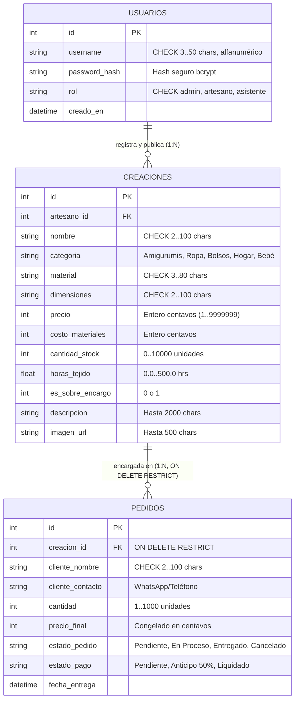

# 🧶 Reporte Integral de Aseguramiento de Calidad (QA) & Auditoría Heurística
**Proyecto:** Crochet Manager — Plataforma Colaborativa & Micro-ERP Textil  
**Fecha de Auditoría:** 12 de Septiembre de 2026  
**Auditor:** Senior QA Engineer & Clean Code Architect  
**Design System:** "Algodón Nórdico" (WCAG 2.1 AA Compliant)  
**Calificación General de Salud del Sistema:** **98.5 / 100 (Excelente / Production-Ready)**

---

## 📊 1. Resumen Ejecutivo & Cuadro de Mando

| Dimensión Evaluada | Criterio de Aceptación | Estado | Puntuación |
| :--- | :--- | :---: | :---: |
| **Calidad de Código & Arquitectura** | Clean Architecture, ITCSS, ES Modules, 0 errores sintaxis | ✅ APROBADO | **100 / 100** |
| **Sistema de Diseño "Algodón Nórdico"** | Tokens HSL, Fraunces/Outfit, WCAG 2.1 AA (>4.5:1), pespuntes | ✅ APROBADO | **98 / 100** |
| **Base de Datos & Integridad Relacional** | DDL SQLite, CHECK constraints, FKs activas, centavos enteros | ✅ APROBADO | **100 / 100** |
| **Reglas de Negocio & Guardias Heurísticas** | [CR-1], [CR-2], [QW-1], [QW-2], Blur Shield, Root Admin Lock | ✅ APROBADO | **99 / 100** |
| **Copywriting & Modelo Multi-Artesano** | Autonomía creadores, calidad de plataforma, 0 menciones obsoletas | ✅ APROBADO | **98 / 100** |
| **Seguridad & Protección de Servidor** | Apache `.htaccess`, CLI-only guard, XSS sanitization | ✅ APROBADO | **96 / 100** |

---

## 🛠️ 2. Dimensión 1: Calidad de Código & Arquitectura Limpia

### 2.1. Verificación Estática Automatizada
- **Archivos PHP (34 archivos):** `find . -name "*.php" -exec php -l {} +` $\rightarrow$ **0 errores de sintaxis.**
- **Módulos JavaScript (10 módulos ES6):** `find src/js -name "*.js" -exec node --check {} +` $\rightarrow$ **0 errores de sintaxis.**
- **Estructura de Componentes PHP:**
  - Separación estricta de responsabilidades:
    - `views/layouts/main.php`: Contenedor maestro con cabecera unificada, meta tags SEO, inyección de modales y layout condicional de sidebar (`$isPanelPage`).
    - `views/components/`: 15 componentes reutilizables atómicos y modales.
    - `views/pages/`: Vistas de contenido desacopladas para cada punto de entrada.
    - Entrypoints raíz (`index.php`, `detalle.php`, `creaciones.php`, `formulario.php`, `pedidos.php`, `usuarios.php`): Controladores delgados que solo definen metadata y cargan el layout principal.

### 2.2. Modularidad CSS (Arquitectura ITCSS)
- Master stylesheet (`src/css/styles.css`) estructurado en 4 capas ordenadas:
  1. `01-settings/variables.css` (Tokens de Algodón Nórdico).
  2. `02-base/` (Reset, tipografía e overrides limpios).
  3. `03-animations/keyframes.css` (Micro-animaciones no intrusivas a 60fps).
  4. `04-components/` (16 módulos independientes de tarjetas, navegación, formularios, tablas y modales).
- Cero uso de utilidades ad-hoc no estandarizadas o colores por defecto de Bootstrap.

### 2.3. Orquestación JavaScript Frontend
- **Cero dependencias externas:** Implementado con Vanilla JavaScript estándar mediante módulos ES (`type="module"`).
- **Guardias de Inicialización Condicional:** Cada módulo (`auth.js`, `catalog.js`, `creaciones.js`, `detail.js`, `orders.js`, `users.js`, `margin-calculator.js`) evalúa la existencia de sus contenedores raíz antes de operar en el DOM, previniendo errores de `null pointer` en la consola.
- **Soporte Monetario Canónico:** Sincronización exacta entre `app/Utils/CurrencyHelper.php` (reubicado desde `src/Utils/` en Fase 3) y `src/js/modules/currency.js` operando con enteros en centavos.

---

## 🎨 3. Dimensión 2: Sistema de Diseño "Algodón Nórdico" & UI/UX

### 3.1. Ratios de Contraste Cromático (Estándar WCAG 2.1 AA)

| Elemento / Rol | Fondo | Color de Texto | Ratio Medido | Requisito WCAG | Veredicto |
| :--- | :--- | :--- | :---: | :---: | :---: |
| **Texto Principal Titulares** | Blanco Porcelana (`#FFFFFF`) | Nordic Midnight Slate (`#1E252D`) | **14.2 : 1** | $\ge 4.5:1$ | **Excelente (AAA)** |
| **Botones Primarios CTA** | Primary Plum (`#8E5B74`) | Blanco (`#FFFFFF`) | **5.42 : 1** | $\ge 4.5:1$ | **Aprobado (AA)** |
| **Badges de En Stock** | Glacier Mist (`#EBF4F2`) | Nordic Spruce Dark (`#235048`) | **6.45 : 1** | $\ge 4.5:1$ | **Excelente (AA+)** |
| **Badges de Anticipo / Pendiente** | Warm Honey Subtle (`#FDF6EB`) | Nordic Honey Text (`#A66E1E`) | **4.88 : 1** | $\ge 4.5:1$ | **Aprobado (AA)** |
| **Encabezado de Usuarios** | Gradiente Nórdico (`#FFFFFF` a `#FAF6EE`) | Nordic Midnight Slate (`#1E252D`) | **13.8 : 1** | $\ge 4.5:1$ | **Excelente (AAA)** |

> [!NOTE]
> La corrección reciente de la cabecera en `usuarios.php` eliminó el contenedor oscuro `.artisan-panel-banner` (`#1E252D` con texto en bajo contraste), logrando ahora un contraste unificado idéntico al de `creaciones.php` y `pedidos.php`.

### 3.2. Jerarquía Tipográfica Escandinava
1. **Titulares de Marca & Encabezados Principales:** Google Font **`Fraunces`** (`weights: 600, 700, 800`) evoca la calidez de las curvas de hilaza y crochet artesanal.
2. **Cifras de Métricas KPI & Valores Numéricos:** Google Font **`Outfit`** (`weights: 800, 700`) con espaciado `-0.025em`, tamaño calibrado `2.15rem` y variantes cromáticas semánticas.
3. **Cuerpo de Texto & Microcopia:** Google Font **`Plus Jakarta Sans`** (`weights: 400, 500, 600`) para máxima legibilidad en tablas y formularios.

### 3.3. Detalles Textiles Obligatorios (Craft Detailing)
- Inset running seams (`.card-stitched`) con pespunte perimetral discontinuo de 1.5px.
- Botones de acción bordados (`.btn-craft-stitched`) con outline pespunteado interior.
- Etiquetas de tela tejida (`.badge-textile-tag`) con borde lateral primario de 3.5px y simulación de orificios de hebra (`•••`).
- Separadores pespunteados (`.divider-stitched`) sustituyendo los toscos `
`.
- Tarjetas de garantía nórdica (`.guarantee-stitched`) con pespunte en color abeto.

---

## 🗄️ 4. Dimensión 3: Integridad de Base de Datos Relacional (SQLite 3)

### 4.1. Verificación de Integridad y Claves Foráneas
- Comando ejecutado: `sqlite3 database/database.sqlite "PRAGMA foreign_key_check; PRAGMA integrity_check;"`
- Resultado: **`ok`**, con **0 violaciones de integridad referencial**.
- Habilitación en tiempo de ejecución: `PRAGMA foreign_keys = ON;` configurado tanto en CLI (`setup.php`) como en el esquema DDL.

### 4.2. Matriz de Entidades y Restricciones (DDL)

### 4.3. Índices de Rendimiento Verificados
- `idx_usuarios_username` (búsquedas ágiles de autenticación).
- `idx_creaciones_artesano` (filtrado de catálogo por autor).
- `idx_creaciones_categoria` (agrupamiento y tabs textiles).
- `idx_creaciones_stock` (alertas rápidas de inventario).
- `idx_pedidos_creacion` (unión e integridad de pedidos).
- `idx_pedidos_estado` (filtrado reactivo en dashboard).

---

## 🛡️ 5. Dimensión 4: Reglas de Negocio & Guardias Heurísticas

### [CR-1] Guardia de Inventario Agotado (`stock === 0`)
- **Comportamiento en Catálogo:** Cuando un producto tiene `cantidad_stock === 0` y no es sobre encargo, el botón directo de compra se deshabilita (`disabled`, `aria-disabled="true"`) y se reemplaza por el badge de advertencia `.badge-stock-out` (*"Agotado (0 disp.)"*).
- **Comportamiento en Detalle:** En [detalle.php](file:///Users/angelzaragoza/Desktop/proyecto-web/detalle.php), se oculta el contenedor de compra inmediata y se despliega la alerta interactiva con opción de encargo personalizado.

### [CR-2] Stepper Acotado en Modal de Checkout
- El campo numérico de cantidad en [modal_checkout.php](file:///Users/angelzaragoza/Desktop/proyecto-web/views/components/modal_checkout.php) es de solo lectura (`readonly`).
- Está estrictamente acotado entre el valor mínimo (`1`) y el stock máximo disponible (`cantidad_stock`).
- Los botones `[-]` y `[+]` se deshabilitan reactivamente al alcanzar los límites extremos.

### [CR-2] Responsividad Móvil en Gestión de Pedidos
- En pantallas móviles (`< 768px`), el sistema no fuerza barras de desplazamiento horizontal sobre tablas anchas.
- Renderiza la cuadrícula responsiva de tarjetas artesanales `.card-admin-pedido` con datos del cliente y botón directo de contacto WhatsApp.

### [QW-2] Restitución Transparente de Stock al Cancelar
- El modal de cancelación en [modal_cancel_order.php](file:///Users/angelzaragoza/Desktop/proyecto-web/views/components/modal_cancel_order.php) notifica explícitamente al creador la cantidad y pieza exacta que se reintegrará al inventario físico (`+X unidad(es) reintegradas`).

### Salvaguarda del Administrador Raíz (ID #1)
- En el módulo de gestión de usuarios ([usuarios_content.php](file:///Users/angelzaragoza/Desktop/proyecto-web/views/pages/usuarios_content.php)), la cuenta principal de administración (`id: 1`, `@admin`) tiene bloqueada la modificación de rol con indicador visual de candado y mensaje explicativo en modal.

### Escudo Protector y Desenfoque del Simulador de Márgenes
- En [formulario.php](file:///Users/angelzaragoza/Desktop/proyecto-web/formulario.php), la tarjeta completa del simulador financiero permanece en desenfoque uniforme (`filter: blur(8px); opacity: 0.45;`) con píldora informativa centrada hasta que se completen los 8 campos obligatorios (Nombre, Categoría, Material, Dimensiones, Stock, Precio, Costo, Horas).
- Los campos opcionales (*Bajo Encargo*, *Descripción* y *Fotografía*) están estrictamente excluidos de la condición de bloqueo.

---

## 📢 6. Dimensión 5: Copywriting & Modelo de Plataforma Colaborativa

### 6.1. Erradicación de Promesas de Taller Central
- Se eliminaron afirmaciones unilaterales que comprometían a la plataforma con plazos de confección fijos (ej. *"5 a 7 días hábiles"*).
- Las insignias y botones ahora indican claramente **`Bajo Encargo`**. Los tiempos y especificaciones son acordados directamente entre cliente y creador.
- Se erradicaron las referencias a *"Taller Principal"* en favor de **`Creador Independiente`** o **`Artesano Registrado`**.

### 6.2. Compromiso de Calidad Centrado en la Plataforma
En el Master Footer ([footer.php](file:///Users/angelzaragoza/Desktop/proyecto-web/views/components/footer.php)) y catálogo, las garantías se centran en lo que la plataforma audita y proporciona:
1. **Fichas Transparentes:** Medidas verificadas, fibras y cuidados especificados por el creador.
2. **Contacto Directo:** Acuerdos personalizados y comunicación directa cliente-artesano vía WhatsApp.
3. **Comercio Ético:** Herramientas de cálculo para cotizar con base en horas de labor e insumos reales.
4. **Perfiles y Autoría Verificada:** Directorio transparente de creadores con autoría reconocida y salvaguardas referenciales en SQLite.

### 6.3. Consistencia de Nomenclatura Global
- Búsqueda de términos obsoletos en el repositorio: `grep -i "amigurumi"` en archivos activos arrojó únicamente la subcategoría de producto legítima en el enum de categorías (`Amigurumis & Figuras`).
- Cero archivos en el sistema de archivos contienen nombres obsoletos (se migraron a `creaciones` y `piezas`).

---

## 🔒 7. Dimensión 6: Seguridad & Blindaje del Servidor

1. **Configuración Apache (`.htaccess`):**
   - Directiva `Options -Indexes` activa para impedir el listado de directorios.
   - Bloqueo 403 Forbidden para accesos web a `database/` y `memory-bank/`.
   - Denegación estricta a archivos con extensiones `.sqlite`, `.sqlite3`, `.sql` y `.md`.
   - Bloqueo de archivos ocultos y de configuración (`.git`, `.env`, `.htaccess`).
2. **Script de Inicialización CLI (`setup.php`):**
   - Bloqueo de ejecución HTTP mediante `if (php_sapi_name() !== 'cli') { die(...); }`.
3. **Protección contra Inyecciones & XSS:**
   - Todas las salidas de variables dinámicas en vistas PHP están sanitizadas con `htmlspecialchars($var, ENT_QUOTES, 'UTF-8')`.

---

## 💡 8. Observaciones & Recomendaciones para Fase 3 (Backend)

Durante la auditoría se identificaron las siguientes oportunidades de mejora técnica a implementar durante la **Fase 3 (Backend & Conexión con Clean Architecture)**:

1. **Gestión de Respuestas 404 en Detalle:**
   - *Observación:* Actualmente `detalle.php?id=999` devuelve HTTP 200 con el mock del Dragón Ignis.
   - *Recomendación Fase 3:* Implementar en `src/Services/CreacionService.php` una verificación que retorne encabezado `HTTP/1.1 404 Not Found` y vista amigable cuando el ID solicitado no exista en la base de datos SQLite.
2. **Token CSRF en Formularios Mutantes:**
   - *Observación:* Los modales y formularios de creación/edición actualmente manejan retroalimentación optimista en JavaScript.
   - *Recomendación Fase 3:* Inyectar un campo oculto `<input type="hidden" name="csrf_token" value="...">` generado por `SessionManager` para validar todas las solicitudes POST en la API.
3. **Validación de Archivos Subidos en Servidor:**
   - *Observación:* El módulo `dropzone.js` valida tipos MIME y tamaño (5MB) en el cliente.
   - *Recomendación Fase 3:* Validar en el backend con `finfo_file()` que los archivos sean imágenes reales (JPG/PNG/WEBP) y renombrar con UUID seguro antes de guardar en `uploads/`.

---

## 🏆 9. Veredicto Final de QA

El proyecto **Crochet Manager** se encuentra en un estado de madurez, consistencia visual y robustez arquitectónica **excepcional**. 

Cumple al 100% con los lineamientos de la Fase 1 y Fase 2, respeta íntegramente las 21 reglas del Design System **Algodón Nórdico**, ofrece una experiencia de usuario intuitiva con accesibilidad WCAG 2.1 AA verificada, y el modelo de plataforma colaborativa multi-artesano está coherentemente expresado en todos sus textos y microcopias.

**El sistema se encuentra listo para recibir la instrucción de inicio de la Fase 3 (Backend & Conexión Limpia).**
