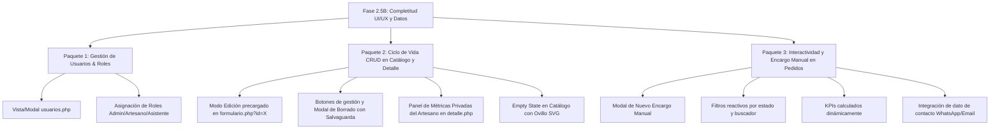

# Informe de Auditoría y Brechas: Base de Datos, Documentación y UI/UX
**Proyecto:** Handmade Amigurumi Micro-ERP & Catalog System  
**Fecha:** Septiembre 2026  
**Objetivo:** Analizar exhaustivamente la concordancia entre los cimientos relacionales (`database/seed.sql`), la documentación técnica (`docs/`) y las interfaces de usuario actuales (`views/`), identificando qué falta por **añadir**, **ajustar** y **eliminar** antes de proceder con el Backend (Fase 3).

---

## 1. Matriz de Correspondencia: Base de Datos vs. Interfaces UI/UX

| Entidad / Tabla BD | Campos en Base de Datos | Cobertura en Documentación | Estado en UI/UX Frontend Actual | Brecha / Diagnóstico |
| :--- | :--- | :--- | :--- | :--- |
| **`usuarios`** | `id`, `username`, `password_hash`, `rol` (`admin`, `artesano`, `asistente`), `creado_en`. | Diseñado en `auth-flow.md` y `api-design.md` con RBAC y endpoints CRUD en `/api/usuarios.php`. | **Inexistente / Ciego**. En `navbar.php` existe un enlace `"Gestión de Usuarios (Admin)"` con `href="#"`. | **FALTA VISTA/MODAL COMPLETO**. No hay pantalla para listar artesanos, registrar nuevo usuario, asignar roles ni dar de baja. |
| **`amigurumis`** | `id`, `artesano_id`, `nombre`, `categoria`, `material`, `tamano_cm`, `precio`, `costo_materiales`, `cantidad_stock`, `horas_tejido`, `descripcion`, `imagen_url`, `creado_en`, `actualizado_en`. | CRUD completo en `api/crear.php`, `leer.php`, `actualizar.php`, `eliminar.php`. Política de eliminación con salvaguarda `ON DELETE RESTRICT` y borrado físico de imagen (`unlink`). | - **Alta:** Excelente en `formulario.php`.<br>- **Catálogo:** Excelente en `index.php`.<br>- **Ficha:** Excelente en `detalle.php`.<br>- **Edición:** Falta flujo `?id=X`.<br>- **Eliminación:** Falta botón y modal de confirmación. | **FALTA GESTIÓN DE CICLO DE VIDA**. El artesano autenticado no puede editar ni eliminar piezas desde el catálogo o detalle. No hay modal de advertencia de integridad referencial. |
| **`pedidos`** | `id`, `cliente_nombre`, `amigurumi_id`, `cantidad`, `fecha_entrega`, `estado_pedido`, `precio_final`, `notas`, `creado_en`. | Diseñado en `api/solicitar_pedido.php`, `api/pedidos.php`, `api/actualizar_pedido.php`. Máquina de 4 estados y restitución transaccional de stock. | - **Checkout público:** Excelente en `modal_checkout.php`.<br>- **Dashboard:** Tabla y tarjetas en `pedidos.php`.<br>- **Inspección:** Modal notas.<br>- **Cancelación:** Modal con aviso de restitución [QW-2]. | **FALTA INTERACCIÓN Y ENCARGO MANUAL**.<br>1. No hay botón para que el artesano registre un encargo manual.<br>2. Filtros por estado no filtran la tabla.<br>3. Cambio de estado en dropdown no es reactivo.<br>4. Falta dato de contacto del cliente. |

---

## 2. Diagnóstico Detallado de Faltantes y Oportunidades

### 2.1. Lo que Falta por AÑADIR (Nuevas Funcionalidades y Vistas)

#### A. Módulo de Gestión de Usuarios y Equipo del Taller (`usuarios.php`)
- **Problema:** La base de datos y la arquitectura definen 3 roles (`admin`, `artesano`, `asistente`) y una relación estricta `amigurumis.artesano_id -> usuarios.id`. Sin embargo, en el frontend no existe ninguna pantalla para administrar usuarios.
- **Propuesta de Adición:**
  1. Crear la vista o modal de **Gestión de Artesanos y Usuarios** accesible solo para administradores (`@admin`).
  2. Componentes necesarios:
     - Tabla o tarjetas de usuarios con su avatar artesanal, nombre de usuario, rol asignado mediante badges textiles (`Admin`, `Artesano`, `Asistente`) y fecha de registro.
     - Modal de "Registrar Nuevo Artesano / Asistente" con validación de nombre (3-50 caracteres) y asignación de contraseña inicial.
     - Indicador de creaciones activas asociadas a cada artesano (para entender por qué SQLite bloquea el borrado con `ON DELETE RESTRICT`).

#### B. Modal / Flujo de Creación de Encargo Manual por el Artesano
- **Problema:** Actualmente los pedidos solo se originan en el modal de checkout del cliente. Pero en la vida real, muchos clientes encargan por WhatsApp, Instagram o en persona en ferias artesanales.
- **Propuesta de Adición:**
  - Agregar en `pedidos.php` el botón principal `+ Nuevo Encargo Manual`.
  - Desplegar un modal donde el artesano selecciona el amigurumi del catálogo (o lo deja como encargo libre), cliente, teléfono/correo, fecha de entrega programada, notas especiales y anticipo.

#### C. Acciones de Gestión en Catálogo y Detalle para el Artesano Autenticado
- **Problema:** Cuando el artesano inicia sesión, el catálogo y la ficha de detalle siguen luciendo casi idénticos al modo público. No hay botones para **Editar** ni **Eliminar** la pieza.
- **Propuesta de Adición:**
  1. En `index.php` (tarjetas) y `detalle.php` (barra superior o cabecera): mostrar barra de herramientas contextual del artesano (`d-none` en modo visitante, visible con sesión activa):
     - Botón `Editar Creación` $\rightarrow$ Redirige a `formulario.php?id=1` precargando los datos.
     - Botón `Eliminar Pieza` $\rightarrow$ Abre el modal de confirmación de eliminación segura.
  2. **Modal de Eliminación Segura de Amigurumi:**
     - Alerta visual que notifica al artesano: *"Si la pieza tiene pedidos históricos registrados, el sistema impedirá su eliminación para proteger la integridad contable. Si no tiene pedidos, se eliminará el registro y se borrará la imagen física del servidor para evitar archivos huérfanos"*.

#### D. Estado Vacío ("Empty State") con Estética "Algodón Nórdico"
- **Problema:** Si el visitante busca un término inexistente en el buscador del catálogo o filtra por una combinación sin resultados (ej. Animales + Agotados), la cuadrícula queda vacía en blanco sin feedback visual.
- **Propuesta de Adición:**
  - Un componente de estado vacío con un ovillo de lana flotante SVG, texto empático (*"No encontramos ninguna pieza con esos filtros..."*) y un botón de *"Restablecer Filtros"*.

---

### 2.2. Lo que Falta por AJUSTAR (Refinamientos e Interactividad)

#### A. Formulario en Modo Edición (`formulario.php`)
- **Ajuste:** Conectar el parámetro de URL `?id=1` para que `formulario.php` lea los datos de la pieza, cambie el título a *"Editar Creación Artesanal"*, cambie el badge a *"Modo: Edición"*, precargue los valores, y muestre la imagen actual con la opción de reemplazarla.

#### B. Panel de Métricas Privadas en `detalle.php` para el Artesano
- **Ajuste:** En `detalle.php`, un visitante solo debe ver el precio público ($450) y especificaciones físicas. Pero cuando el artesano está autenticado, debe mostrarse una tarjeta colapsable de **"Métricas de Rentabilidad del Taller"**:
  - Costo de materiales invertido: `$120.00 MXN`.
  - Horas de confección: `6.5 hrs`.
  - Ganancia neta por unidad: `$330.00 MXN` (Margen: `73.3%`).
  - Retorno por hora de trabajo: `$50.77 MXN/hr`.
  - Fecha de registro en catálogo y autoría (`@admin`).

#### C. Interactividad Completa en `pedidos.php`
- **Ajustes:**
  1. **Filtros por Estado Reactivos:** Hacer que los botones `Todos (2)`, `Pendientes (1)`, `En Proceso (1)`, `Entregados (0)`, `Cancelados (0)` filtren inmediatamente las filas de la tabla y las tarjetas móviles.
  2. **Actualizador de Estado Dinámico:** Reemplazar los `alert()` del dropdown de estado por una acción reactiva que actualice el badge de la fila (`badge-order-proceso`, `badge-order-pendiente`, etc.) y sincronice los KPIs superiores.
  3. **KPIs Reactivos:** Que las tarjetas superiores ("Total Pedidos", "Pendientes", "En Proceso", "Ingresos Totales") calculen sus totales en tiempo real a partir de las filas presentes.

#### D. Búsqueda Avanzada en Catálogo (`index.php`)
- **Ajustes:**
  - Agregar filtro por rango de precio (ej. control deslizante o inputs Min / Max).
  - Permitir filtrar por artesano autor (cuando haya más de un usuario registrado).

---

### 2.3. Lo que Falta por ELIMINAR o SIMPLIFICAR (Limpieza de Deuda Técnica)

1. **Enlaces Ciegos (`href="#"`):**
   - En `navbar.php`: el enlace `Gestión de Usuarios (Admin)` debe apuntar a la nueva vista o disparar el modal de usuarios, eliminando el `#`.
2. **Hardcoding de Datos en Vistas:**
   - En `pedidos.php`, el valor `$1,090.00` de ingresos totales está escrito a mano en el HTML en lugar de calcularse dinámicamente sumando los precios de los pedidos activos.
3. **Discrepancia en Formato de Moneda (Centavos vs. Decimales):**
   - La base de datos almacena números enteros en centavos (`45000` = `$450.00`). Es vital unificar en las vistas helpers de presentación claros para que la conversión `centavos / 100` sea universal y transparente.

---

## 3. Propuestas de Mejora sobre los Cimientos de la Base de Datos

Los cimientos de la base de datos en `database/seed.sql` son sólidos, normalizados y cuentan con restricciones estrictas de integridad referencial. Sin embargo, para responder a las necesidades reales de UI/UX de un Micro-ERP, se proponen las siguientes mejoras no disruptivas:

### Propuesta 1: Campo de Contacto del Cliente en `pedidos`
- **Motivación:** Actualmente la tabla `pedidos` solo tiene `cliente_nombre` y `notas`. En el mockup móvil de pedidos mostramos un correo electrónico (`mariana.g@example.com`), pero no existe una columna en la base de datos para guardar el teléfono/WhatsApp o email del cliente.
- **Ajuste sugerido en DDL:**
  ```sql
  ALTER TABLE pedidos ADD COLUMN cliente_contacto TEXT;
  -- O añadirlo directamente en seed.sql:
  -- cliente_contacto TEXT NOT NULL DEFAULT ''
  ```
- **Impacto en UI/UX:** Permite al cliente dejar su WhatsApp o email en el modal de checkout y al artesano tener un botón de acceso directo *"Contactar por WhatsApp"* en el dashboard de pedidos.

### Propuesta 2: Indicador de Anticipo / Estado de Cobro en `pedidos`
- **Motivación:** En encargos artesanales personalizados, el artesano típicamente cobra un 50% de anticipo para comprar materiales antes de empezar a tejer y el 50% restante a la entrega.
- **Ajuste sugerido en DDL:**
  ```sql
  ALTER TABLE pedidos ADD COLUMN estado_pago TEXT NOT NULL DEFAULT 'Pendiente'
      CHECK(estado_pago IN ('Pendiente', 'Anticipo 50%', 'Liquidado'));
  ```
- **Impacto en UI/UX:** Añade un badge financiero en la tabla de pedidos que diferencia pedidos liquidados de aquellos con anticipo pendiente.

### Propuesta 3: Distintivo de "Creación Exclusiva sobre Pedido" en `amigurumis`
- **Motivación:** Ciertos amigurumis complejos (ej. dragones gigantes de 50 cm o vestidos de novia) nunca tienen stock físico listo para entrega inmediata (`stock = 0`), pero no están "Agotados", sino que su modelo de negocio es 100% "Confección sobre Encargo".
- **Ajuste sugerido en DDL:**
  ```sql
  ALTER TABLE amigurumis ADD COLUMN es_sobre_encargo INTEGER NOT NULL DEFAULT 0
      CHECK(es_sobre_encargo IN (0, 1));
  ```
- **Impacto en UI/UX:** En lugar de mostrar un badge rojo/apagado de *"Agotado"*, se muestra un distintivo morado o dorado de *"Pieza Exclusiva Bajo Encargo (5-7 días)"*, mejorando sustancialmente la experiencia del cliente y la tasa de conversión comercial.

---

## 4. Plan de Acción Recomendado (Hoja de Ruta UI/UX)

Para dejar el frontend completamente impecable antes de iniciar la Fase 3, proponemos abordar las tareas en 3 paquetes secuenciales:



### Resumen de Prioridades:
1. **Prioridad 1 (Crítica para Integridad de Datos):** Implementar la vista/modal de **Gestión de Usuarios** (`usuarios.php`) y la pantalla de **Edición** (`formulario.php?id=X`) con modal de **Eliminación Segura** que refleje la regla `ON DELETE RESTRICT`.
2. **Prioridad 2 (Flujo de Negocio del Artesano):** Agregar el **Modal de Encargo Manual** en `pedidos.php` y activar los filtros reactivos por estado (`Pendiente`, `En Proceso`, `Entregado`, `Cancelado`).
3. **Prioridad 3 (Perfeccionamiento Heurístico y Visual):** Agregar las **Métricas Privadas del Artesano** en `detalle.php`, el **Estado Vacío** en `index.php` y el campo de contacto (WhatsApp/Email) en el checkout.
